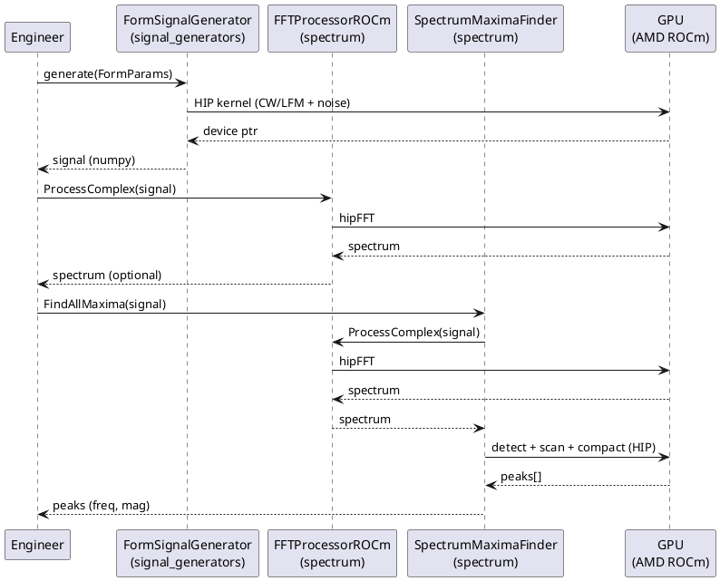
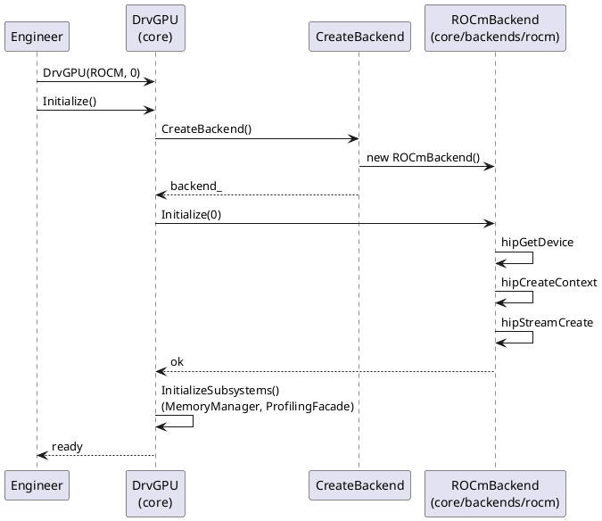

# DSP-GPU — C4 Model (полный проект)

> **Дата**: 2026-04-22
> **Организация**: `github.com/dsp-gpu`
> **Ветка**: `main` (Linux / AMD / ROCm 7.2+ / HIP)
> **Референс**: [c4model.com](https://c4model.com)
> **Предшественник**: GPUWorkLib (монолит) — разбит на 10 репо

**Содержание**: C1–C4 | **DFD** (потоки данных) | **Seq** (диаграммы последовательности)

---

## C1: Context (Системный контекст)

**Система DSP-GPU** — модульная GPU-библиотека ЦОС (FFT, фильтры, генераторы сигналов,
гетеродин, LCH Farrow, линейная алгебра, радар-пайплайны), распределённая по 10
независимым git-репозиториям `github.com/dsp-gpu/*`.

```
                    ┌─────────────────────────────────────────────────────────┐
                    │                                                         │
  Engineer ────────►│                DSP-GPU System                            │
  (C++/Python)      │  ЦОС на GPU: FFT, фильтры, генераторы, гетеродин,       │
                    │  LCH Farrow, линалгебра, радар-пайплайны                 │
                    │                                                         │
                    └──────────────┬──────────────────────┬───────────────────┘
                                   │                      │
                                   ▼                      ▼
                    ┌──────────────────────┐   ┌──────────────────────┐
                    │   GPU Hardware       │   │   Внешние ресурсы     │
                    │   AMD RDNA3/RDNA4    │   │   configGPU.json      │
                    │   (gfx1100/gfx1201)  │   │   Logs/DRVGPU_XX/      │
                    │   ROCm 7.2+ / HIP    │   │   Results/Plots/      │
                    └─────────────────────┘   │   Results/Profiler/   │
                                              └───────────────────────┘
```

| Актор / Система | Описание |
|-----------------|----------|
| **Engineer** | Разработчик или инженер — использует C++ приложение или Python (`gpuworklib`) |
| **DSP-GPU System** | 10 репо: core + 7 compute + strategies + DSP (мета+Python) |
| **GPU Hardware** | AMD ROCm (main) — RDNA3/RDNA4. Ветка `nvidia` — OpenCL на Windows |
| **configGPU.json** | Конфигурация GPU, выбор устройств, `is_prof` |
| **Logs/** | Per-GPU логи (plog) |
| **Results/** | Графики, JSON, Markdown отчёты профилирования |

---

## C2: Containers (Контейнеры = git-репозитории)

Внутри DSP-GPU System — **10 git-репо** (каждый самостоятелен, версионируется
независимо, подключается через FetchContent `git@smi100.local:{repo}.git`):

```
┌────────────────────────────────────────────────────────────────────────────────────┐
│                            DSP-GPU System (github.com/dsp-gpu)                      │
├────────────────────────────────────────────────────────────────────────────────────┤
│                                                                                     │
│  ┌──────────────────┐                                                               │
│  │   core           │  DrvGPU ядро: ROCmBackend, MemoryManager,                     │
│  │   (C++ lib)      │  ProfilingFacade, GpuBenchmarkBase, ScopedHipEvent             │
│  └────────┬─────────┘                                                               │
│           │ IBackend*                                                               │
│           ▼                                                                         │
│  ┌────────────────────────────────────────────────────────────────────────┐        │
│  │  Compute repos (C++ libs, зависят от core)                              │        │
│  │                                                                         │        │
│  │  ┌───────────┐  ┌─────────┐  ┌────────────────┐  ┌──────────┐          │        │
│  │  │ spectrum   │  │  stats   │  │signal_generators│ │ linalg   │          │        │
│  │  │FFT+filters │  │Welford   │  │ CW/LFM/Noise   │ │rocBLAS+  │          │        │
│  │  │+lch_farrow │  │+SNR      │  │ +FormSignal    │ │rocSOLVER │          │        │
│  │  └─────┬──────┘  └────┬────┘  └───────┬────────┘  └────┬─────┘          │        │
│  │        │              │                │                │                │        │
│  │        ▼              ▼                ▼                ▼                │        │
│  │  ┌──────────────┐  ┌──────────┐  ┌──────────────────────────┐           │        │
│  │  │  heterodyne  │  │  radar   │  │     strategies            │           │        │
│  │  │ Dechirp+NCO  │  │range_ang+│  │  Pipeline (v1, v2, ...)   │           │        │
│  │  │ +Mix         │  │fm_corr   │  │  композирует всё выше      │           │        │
│  │  └──────────────┘  └──────────┘  └──────────────────────────┘           │        │
│  └────────────────────────────────────────────────────────────────────────┘        │
│           │                                                                         │
│           ▼                                                                         │
│  ┌──────────────────────────────────────────────────────────────────────┐          │
│  │               DSP (мета-репо + Python API)                            │          │
│  │  DSP/Python/gpuworklib.py  ← фасад                                    │          │
│  │  dsp_core, dsp_spectrum, dsp_stats, ... ← pybind11 модули из каждого  │          │
│  │  репо (core/python/, spectrum/python/, ...)                           │          │
│  └──────────────────────────────────────────────────────────────────────┘          │
│                                                                                     │
│  ┌──────────────────────────────────────────────────────────────────────┐          │
│  │               workspace (CLAUDE.md, MemoryBank, ~!Doc, .vscode)       │          │
│  │  Не содержит C++ кода — только управляющие данные и документация      │          │
│  └──────────────────────────────────────────────────────────────────────┘          │
│                                                                                     │
└────────────────────────────────────────────────────────────────────────────────────┘
```

| Репо (контейнер) | Технология | Назначение |
|------------------|------------|------------|
| `core` | C++ | DrvGPU ядро: бэкенды, память, очереди, profiler v2, RAII |
| `spectrum` | C++ + hipFFT | FFT, filters (FIR/IIR/Kalman/SMA...), LchFarrow, SpectrumMaximaFinder |
| `stats` | C++ + rocprim | StatisticsProcessor (Welford, median, radix sort), SNREstimator |
| `signal_generators` | C++ | CW, LFM, Noise, Script, FormSignal, DelayedFormSignal |
| `heterodyne` | C++ + hipFFT | HeterodyneDechirp, NCO, Mix (stretch-processing ЛЧМ) |
| `linalg` | C++ + rocBLAS/rocSOLVER | VectorAlgebra, CaponProcessor (MVDR) |
| `radar` | C++ + hipFFT | RangeAngleProcessor, FMCorrelator |
| `strategies` | C++ | Pipeline + PipelineBuilder, композиция модулей |
| `DSP` | Python (pybind11) | `gpuworklib.py` фасад + интеграционные тесты + Doc/ |
| `workspace` | — | CLAUDE.md, MemoryBank, ~!Doc, .vscode/, .claude/ |

---

## C3: Components (Компоненты по контейнерам)

### 3.1 `core` (DrvGPU Core)

| Компонент | Файлы | Назначение |
|-----------|-------|------------|
| **DrvGPU** | `core/include/core/drv_gpu.hpp` | Фасад, единая точка входа |
| **GPUManager** | `core/include/core/gpu_manager.hpp` | Multi-GPU, балансировка |
| **Backend Layer** | `core/include/core/backends/{rocm,hybrid,opencl}/` | `IBackend` + реализации (Bridge) |
| **MemoryManager** | `core/include/core/memory/memory_manager.hpp` | `GPUBuffer`, `SVMBuffer`, `StreamPool` |
| **ModuleRegistry** | `core/include/core/module_registry.hpp` | Регистр compute-репо |
| **Profiling v2** | `core/include/core/services/profiling/` | `ProfilingFacade::BatchRecord()`, `ProfileStore`, `ReportPrinter`, `JSONExporter`, `MarkdownExporter` |
| **GpuBenchmarkBase** | `core/include/core/services/gpu_benchmark_base.hpp` | Базовый класс бенчмарков (warmup + measure) |
| **ScopedHipEvent** | `core/include/core/services/scoped_hip_event.hpp` | **RAII для hipEvent_t (обязателен!)** |
| **Services** | `core/include/core/services/` | KernelCacheService, ServiceManager, BatchManager, AsyncServiceBase |
| **Logger** | `core/include/core/logger/` | plog, per-GPU логи |

### 3.2 Compute repos

| Репо | Основные классы | Назначение |
|------|-----------------|------------|
| **spectrum** | `FFTProcessorROCm`, `ComplexToMagPhaseROCm`, `FirFilterROCm`, `IirFilterROCm`, `KalmanFilterROCm`, `KaufmanFilterROCm`, `MovingAverageFilterROCm`, `LchFarrow`, `SpectrumMaximaFinder`, `SpectrumProcessorFactory` | FFT (hipFFT) + filters + дробная задержка + поиск максимумов |
| **stats** | `StatisticsProcessor`, `WelfordOnline`, `RadixSortGPU`, `SNREstimator` | mean/median/variance/std, sort, оценка SNR |
| **signal_generators** | `SignalGenerator`, `LfmGenerator`, `CwGenerator`, `NoiseGenerator`, `ScriptGenerator`, `FormSignalGenerator`, `DelayedFormSignalGenerator` | Синтез сигналов |
| **heterodyne** | `HeterodyneDechirp`, `NCO`, `Mix` | Stretch-processing ЛЧМ-радара |
| **linalg** | `VectorAlgebra`, `CaponProcessor`, `CholeskyInverter` | Линейная алгебра (rocBLAS+rocSOLVER), Capon MVDR |
| **radar** | `RangeAngleProcessor`, `FMCorrelator` | Range-angle обработка, FM-корреляция |
| **strategies** | `Pipeline`, `PipelineBuilder`, `IPipelineStep` | Композиция FFT + statistics + kernels |

### 3.3 Python API (репо `DSP` + `{repo}/python/`)

| Python модуль | C++ репо-источник | Файл pybind11 |
|---------------|-------------------|---------------|
| `dsp_core` | core | `core/python/dsp_core_module.cpp` |
| `dsp_spectrum` | spectrum | `spectrum/python/dsp_spectrum_module.cpp` |
| `dsp_stats` | stats | `stats/python/dsp_stats_module.cpp` |
| `dsp_signal_generators` | signal_generators | `signal_generators/python/dsp_signal_generators_module.cpp` |
| `dsp_heterodyne` | heterodyne | `heterodyne/python/dsp_heterodyne_module.cpp` |
| `dsp_linalg` | linalg | `linalg/python/dsp_linalg_module.cpp` |
| `dsp_radar` | radar | `radar/python/dsp_radar_module.cpp` |
| `dsp_strategies` | strategies | `strategies/python/dsp_strategies_module.cpp` |
| `gpuworklib` (фасад) | DSP | `DSP/Python/gpuworklib.py` |

### 3.4 Tests (в каждом репо)

| Компонент | Расположение | Назначение |
|-----------|--------------|-----------|
| **main** | `{repo}/tests/main.cpp` | Точка входа тестов каждого репо |
| **all_test** | `{repo}/tests/all_test.hpp` | Агрегатор тестов репо |
| **Benchmark tests** | `{repo}/tests/*_benchmark_rocm.hpp` | Наследники GpuBenchmarkBase |
| **Python tests** | `DSP/Python/{repo}/`, `DSP/Python/integration/` | Python-тесты по репо + интеграция |

---

## C4: Code (Уровень кода — ключевые примеры)

### 4.1 DrvGPU (фасад в `core`)

```cpp
namespace drv_gpu_lib {

class DrvGPU {
public:
    DrvGPU(BackendType type, int device_index);    // ROCm (main), Hybrid
    void Initialize();
    void Cleanup();

    IBackend* GetBackend() const;
    ProfilingFacade& GetProfiler() const;
    MemoryManager& GetMemory() const;

private:
    std::unique_ptr<IBackend> backend_;
    void InitializeSubsystems();   // MemoryManager, ModuleRegistry, ProfilingFacade
};

}
```

### 4.2 Pipeline: Signal → FFT → Maxima (репо `spectrum` + `signal_generators`)

```
Caller     FormSignalGenerator    FFTProcessorROCm    SpectrumMaximaFinder
  │                 │                   │                    │
  │──generate()────►│                   │                    │
  │                 │──HIP kernel──────►│                    │
  │                 │◄──device ptr──────│                    │
  │◄────────────────│                   │                    │
  │                 │                   │                    │
  │──ProcessComplex()──────────────────►│                    │
  │                 │                   │──hipFFT──────────► │
  │                 │                   │◄───────────────────│
  │                 │                   │──FindAllMaxima()──►│
  │                 │                   │◄───────────────────│
  │◄────────────────────────────────────────────────────────│
```

### 4.3 HeterodyneDechirp (репо `heterodyne`)

```cpp
namespace heterodyne {

class HeterodyneDechirp {
public:
    HeterodyneResult process(const InputData& input);
    // Вход: complex<float>[antennas × samples]
    // Выход: f_beat, R (дальность), SNR per antenna

private:
    void dechirp_multiply();   // s_rx × conj(s_tx) → HIP kernel
    void dechirp_correct();    // коррекция фазы
    // Использует: signal_gen::LfmGenerator, spectrum::SpectrumMaximaFinder
};

struct HeterodyneResult {
    std::vector<float> f_beat;
    std::vector<float> range_m;
    std::vector<float> snr_db;
};

}
```

### 4.4 FirFilterROCm (репо `spectrum`)

```cpp
namespace filters {

class FirFilterROCm {
public:
    void set_coefficients(const std::vector<float>& h);
    void process(const GPUBuffer& input, GPUBuffer& output,
                 ROCmProfEvents* prof_events = nullptr);    // opt профилирование

private:
    // Kernel: fir_filter_cf32 (HIP)
    // Параллелизм: (num_channels, num_samples)
};

}
```

### 4.5 LchFarrow (репо `spectrum`)

```cpp
namespace lch_farrow {

class LchFarrow {
public:
    void process(const GPUBuffer& input,
                 const std::vector<float>& delays_us,
                 GPUBuffer& output,
                 ROCmProfEvents* prof_events = nullptr);
    // Lagrange 48×5, задержки в микросекундах per-antenna

private:
    // Таблица коэффициентов 48×5 (предвычислена)
    // Kernel: lch_farrow (HIP)
};

}
```

### 4.6 Зависимости репо (C4 — уровень кода)

```
                    core (IBackend*, ProfilingFacade, ScopedHipEvent)
                           │
    ┌──────────────────────┼──────────────────────┐
    │                      │                      │
    ▼                      ▼                      ▼
signal_generators    spectrum          linalg
    │            (FFT+Filters+     (rocBLAS+rocSOLVER,
    │             LchFarrow+        VectorAlgebra,
    │             Maxima)           CaponProcessor)
    │                 │                  │
    │                 │                  │
    └────────┬────────┤                  │
             │        │                  │
             ▼        ▼                  │
       heterodyne   stats                │
       (Dechirp+    (Welford,            │
        NCO+Mix)    RadixSort,           │
                    SNR)                 │
             │        │                  │
             │        │                  │
             └────────┴──────┬───────────┤
                             │           │
                             ▼           ▼
                          radar      strategies
                       (RangeAngle+  (Pipeline +
                        FMCorr)       композиция)
```

---

## DFD: Data Flow Diagrams (Диаграммы потоков данных)

### DFD Level 0 — Контекст системы

```
                    ┌─────────────────────────────────────────────────────────────┐
                    │                    DSP-GPU System                            │
                    │                                                              │
  FormParams ──────►│                                                              │
  (freq, fs, ...)   │   ┌─────────────────┐  complex[]  ┌──────────────────┐      │
                    │   │ signal_generators│────────────►│    spectrum /    │      │
  Coefficients ────►│   │  (LFM/CW/Noise) │              │    heterodyne    │      │
  (h[], SOS)        │   └────────┬────────┘              │    (FFT+filters) │      │
                    │            │                       └────────┬─────────┘      │
  configGPU.json ──►│            │ complex[]                      │                │
                    │            ▼                                │ spectrum, peaks│
                    │   ┌─────────────────┐                       │                │
                    │   │ spectrum/       │──────────────────────►│ Results        │
                    │   │ LchFarrow       │                       │ (f_beat, R, SNR)│
                    │   │ (delays_us)     │                       │                │
                    │   └─────────────────┘                       └────────┬───────┘
                    │                                                      │
                    └──────────────────────────────────────────────────────┼────────┘
                                                                           │
                                                                           ▼
                                                                   Engineer (numpy, plots)
```

### DFD Level 1 — Основные процессы и репо

```
  ┌──────────────┐
  │ configGPU    │
  │ .json       │
  └──────┬───────┘
         │ config
         ▼
┌────────────────────┐     hipMalloc / GPUBuffer    ┌────────────────────────┐
│ 1.0 core/DrvGPU    │◄─────────────────────────────│ 2.0 signal_generators  │
│ Initialize         │                              │ (FormParams)           │
│ (ROCmBackend,      │─────────────────────────────►│                        │
│  MemoryManager)     │     IBackend*                └───────────┬────────────┘
└────────┬───────────┘                                           │ complex[]
         │                                                       ▼
         │                                             ┌─────────────────────┐
         │                                             │ 3.0 spectrum/        │
         │                                             │  LchFarrow (delays) │
         │                                             └──────────┬──────────┘
         │                                                        │ delayed[]
         │                                                        ▼
         │     coefficients                            ┌─────────────────────┐
         │◄───────────────────────────────────────────│ 4.0 spectrum/       │
         │                                             │  filters (FIR/IIR)  │
         │                                             └──────────┬──────────┘
         │                                                        │ filtered[]
         │                                                        ▼
         │                                             ┌─────────────────────┐
         │                                             │ 5.0 spectrum/       │
         │                                             │  FFTProcessorROCm   │
         │                                             │  (hipFFT)           │
         │                                             └──────────┬──────────┘
         │                                                        │ spectrum[]
         │                                                        ▼
         │                                             ┌─────────────────────┐
         │                                             │ 6.0 spectrum/        │
         │                                             │  SpectrumMaxima     │
         │                                             │  Finder             │
         │                                             └──────────┬──────────┘
         │                                                        │ peaks[]
         │                                                        ▼
         │                                             ┌─────────────────────┐
         │                                             │ D1 Results          │
         │                                             │ (freq, R, SNR)      │
         └────────────────────────────────────────────►└─────────────────────┘
```

### DFD Level 2 — Pipeline Heterodyne (stretch-processing)

```
  s_rx[antennas×samples]      HeterodyneParams
         │                            │
         ▼                            ▼
┌──────────────────────┐     ┌─────────────────┐
│ P1 signal_generators/│     │ ref chirp       │
│    LfmGenerator     │◄────│ (f0, B, T)      │
│    (conjugate)      │     └─────────────────┘
└───────────┬──────────┘
            │ s_tx_conj[]
            ▼
┌──────────────────────┐
│ P2 heterodyne/       │  s_rx × conj(s_tx) → s_beat
│    dechirp_multiply  │  (HIP kernel)
└───────────┬──────────┘
            │ s_beat[]
            ▼
┌──────────────────────┐
│ P3 spectrum/         │  hipFFT
│    FFTProcessorROCm │
└───────────┬──────────┘
            │ spectrum[]
            ▼
┌──────────────────────┐
│ P4 spectrum/         │  parabolic interpolation
│    SpectrumMaxima   │
└───────────┬──────────┘
            │ f_beat, magnitude
            ▼
┌──────────────────────┐
│ P5 heterodyne/       │  R = c·T·f_beat / (2·B)
│    compute_range     │
└───────────┬──────────┘
            │
            ▼
  HeterodyneResult { f_beat[], range_m[], snr_db[] }
```

### DFD Level 2 — Pipeline Filter (FIR) в репо `spectrum`

```
  coefficients h[]          input[channels×samples]
         │                            │
         ▼                            ▼
┌─────────────────┐          ┌─────────────────┐
│ D1 Host         │          │ D2 GPU Buffer    │
│ (scipy/JSON)    │──hipMemcpy│ (device ptr)    │
└─────────────────┘          └────────┬────────┘
                                       │
                                       ▼
                              ┌─────────────────┐
                              │ P1 fir_filter_  │
                              │     cf32 kernel │
                              │ (HIP, 2D grid)  │
                              └────────┬────────┘
                                       │
                                       ▼
                              ┌─────────────────┐
                              │ D3 Output       │
                              │ filtered[]      │
                              └─────────────────┘
```

### DFD Level 2 — Profiling v2 (BatchRecord)

```
  MyModuleROCm::Process(data, &prof_events)
         │
         │ собирает ROCmProfilingData по каждому этапу
         │ (ScopedHipEvent для RAII)
         ▼
  ROCmProfEvents = [
     ("Upload",   {elapsed_ns, kind=copy}),
     ("Kernel",   {elapsed_ns, kind=kernel}),
     ("Download", {elapsed_ns, kind=copy}),
  ]
         │
         │ ExecuteKernelTimed() в Benchmark-классе
         ▼
  ProfilingFacade::BatchRecord(gpu_id, "spectrum/fft", events)
         │  ← одно сообщение в async queue (меньше contention)
         ▼
  AsyncServiceBase queue  →  ProfileStore
         │                         │
         │                         ▼
         │                  ReportPrinter / JSONExporter / MarkdownExporter
         │                         │
         ▼                         ▼
  profiler.WaitEmpty()       Results/Profiler/GPU_NN_ModuleName_ROCm/
```

---

## Seq: Sequence Diagrams (Диаграммы последовательности)

### Seq-1: DrvGPU::Initialize() (ветка main, ROCmBackend)

```
Engineer       main.cpp        DrvGPU         CreateBackend()    ROCmBackend
   │               │               │                 │                  │
   │──new DrvGPU──►│               │                 │                  │
   │   (ROCM, 0)  │               │                 │                  │
   │               │──Initialize()►│                 │                  │
   │               │               │──CreateBackend()►│                  │
   │               │               │                 │──new ROCm─────►  │
   │               │               │                 │◄─────────────────│
   │               │               │                 │                  │
   │               │               │──Initialize(0)────────────────────►│
   │               │               │                 │  hipGetDevice    │
   │               │               │                 │  hipCreateContext│
   │               │               │                 │  hipStreamCreate │
   │               │               │◄────────────────────────────────────│
   │               │               │                                    │
   │               │               │──InitializeSubsystems()            │
   │               │               │  (MemoryManager, ProfilingFacade,  │
   │               │               │   ModuleRegistry)                  │
   │               │               │                                    │
   │               │◄──────────────│                                    │
   │◄──────────────│               │                                    │
```

### Seq-2: GPUManager Multi-GPU (Round-Robin)

```
Engineer       GPUManager      DrvGPU[0]     DrvGPU[1]     GPU Hardware
   │               │               │               │               │
   │──InitializeAll│               │               │               │
   │   (ROCM)     ►│               │               │               │
   │               │──DiscoverGPUs()──────────────►│               │
   │               │               │  ROCmCore     │               │
   │               │──InitializeGPU(0)────────────►│               │
   │               │               │  hipCreateContext              │
   │               │──InitializeGPU(1)────────────────────────────►│
   │               │               │               │ hipCreateContext
   │               │◄──────────────│               │               │
   │               │               │               │               │
   │──GetNextGPU()►│               │               │               │
   │               │──round_robin++►│               │               │
   │               │──return &gpus_[0]►│           │               │
   │◄──────────────│               │               │               │
   │──GetNextGPU()►│               │               │               │
   │               │──return &gpus_[1]────────────────────────────►│
   │◄──────────────│               │               │               │
```

### Seq-3: HeterodyneDechirp::process() (репо `heterodyne`)

```
Caller      HeterodyneDechirp   LfmGenerator   FFTProcessorROCm   SpectrumMaxima   GPU
   │               │                │                  │                  │
   │──process()────►│                │                  │                  │
   │               │──generate_ref()►│                  │                  │
   │               │                │──HIP kernel──────────────────────────►│
   │               │◄──s_tx_conj────│                  │                  │
   │               │                │                  │                  │
   │               │──dechirp_multiply()─────────────────────────────────►│
   │               │   s_rx × conj(s_tx)                                  │
   │               │◄─────────────────────────────────────────────────────│
   │               │                │                  │                  │
   │               │──ProcessComplex()──────────────────►│                  │
   │               │                │                  │──hipFFT──────────►│
   │               │                │                  │◄──────────────────│
   │               │                │                  │                  │
   │               │──FindAllMaxima()───────────────────────────────────►│
   │               │◄──f_beat, mag─────────────────────────────────────────│
   │               │                │                  │                  │
   │               │──compute_range()                  │                  │
   │               │   R = c·T·f/(2B)                  │                  │
   │               │                │                  │                  │
   │◄──HeterodyneResult─────────────│                  │                  │
```

### Seq-4: Python API — генерация и FFT (через фасад `gpuworklib`)

```
Python      GPUContext       SignalGenerator    FFTProcessorROCm
  │               │                   │               │
  │──GPUContext()►│                   │               │
  │               │──DrvGPU(ROCM,0)   │               │
  │               │──Initialize()     │               │
  │◄──────────────│                   │               │
  │               │                   │               │
  │──SignalGenerator(ctx)─────────────►│               │
  │               │──DrvGPU&          │               │
  │◄──────────────│                   │               │
  │               │                   │               │
  │──generate_lfm()───────────────────►│               │
  │               │                   │──HIP kernel   │
  │◄──numpy array─────────────────────│               │
  │               │                   │               │
  │──FFTProcessor(ctx)────────────────────────────────►│
  │◄──────────────────────────────────────────────────│
  │               │                   │               │
  │──process(data)───────────────────────────────────►│
  │               │                   │  hipFFT       │
  │◄──spectrum────────────────────────────────────────│
```

### Seq-5: Benchmark с профилированием (profiler v2, BatchRecord)

```
Test runner    GpuBenchmarkBase     MyModuleROCm    ProfilingFacade    GPU
    │                 │                  │                  │
    │──bench.Run()───►│                  │                  │
    │                 │──[warmup × 5]───►│                  │
    │                 │   ExecuteKernel  │──HIP kernels─────►
    │                 │   (prof_events = nullptr, zero overhead)
    │                 │                  │                  │
    │                 │──Reset()────────────────────────────►│
    │                 │                  │                  │
    │                 │──[measure × 20]─►│                  │
    │                 │   ExecuteKernelTimed()              │
    │                 │                  │                  │
    │                 │                  │──Process(data,   │
    │                 │                  │   &prof_events)──►│  HIP kernels
    │                 │                  │   hipEvent_t     │  + hipEventRecord
    │                 │                  │   (ScopedHipEvent)│
    │                 │                  │◄─────────────────│
    │                 │                  │                  │
    │                 │                  │──BatchRecord(   │
    │                 │                  │  gpu_id, tag,    │
    │                 │                  │  events)─────────►│ (одно сообщение в queue)
    │                 │◄─────────────────│                  │
    │                 │                  │                  │
    │──bench.Report()►│                  │                  │
    │                 │──WaitEmpty()─────────────────────────►│
    │                 │──PrintReport()                       │
    │                 │──ExportJSON() + ExportMarkdown()     │
    │◄────────────────│                                      │
```

### PlantUML: Sequence — Signal → FFT → Maxima



### PlantUML: Sequence — DrvGPU Init (ROCmBackend, main branch)



---

## Связь уровней C1–C4

| Уровень | Объект |
|---------|--------|
| **C1** | DSP-GPU System — ЦОС на GPU для Engineer (10 репо org `dsp-gpu`) |
| **C2** | 10 репо-контейнеров: core + 7 compute + strategies + DSP + workspace |
| **C3** | Компоненты внутри репо: DrvGPU, ProfilingFacade, FFTProcessorROCm, HeterodyneDechirp, CaponProcessor... |
| **C4** | Классы, методы, kernel pipelines |
| **DFD** | Потоки данных: Level 0 (контекст), Level 1 (процессы через репо), Level 2 (Heterodyne, Filter, Profiling v2) |
| **Seq** | DrvGPU Init, GPUManager Multi-GPU, Heterodyne, Python API, Benchmark+Profiler v2 |

---

## PlantUML: C2 Containers (репо-уровень)

```plantuml
@startuml DSPGPU_C2
!include https://raw.githubusercontent.com/plantuml-stdlib/C4-PlantUML/master/C4_Context.puml
!include https://raw.githubusercontent.com/plantuml-stdlib/C4-PlantUML/master/C4_Container.puml

Person(engineer, "Engineer", "C++/Python developer")
System_Boundary(dspgpu, "DSP-GPU System (github.com/dsp-gpu)") {
    Container(core, "core", "C++ / HIP", "DrvGPU, ROCmBackend, ProfilingFacade, ScopedHipEvent")
    Container(spectrum, "spectrum", "C++ / hipFFT", "FFT, filters, LchFarrow, Maxima")
    Container(stats, "stats", "C++ / rocprim", "Statistics, SNR")
    Container(siggen, "signal_generators", "C++ / HIP", "CW/LFM/Noise/FormSignal")
    Container(het, "heterodyne", "C++ / hipFFT", "Dechirp, NCO, Mix")
    Container(linalg, "linalg", "C++ / rocBLAS+rocSOLVER", "VectorAlgebra, Capon")
    Container(radar, "radar", "C++ / hipFFT", "RangeAngle, FMCorrelator")
    Container(strat, "strategies", "C++", "Pipeline composition")
    Container(dsp, "DSP", "Python / pybind11", "gpuworklib facade + tests")
    Container(ws, "workspace", "—", "CLAUDE.md, MemoryBank, ~!Doc")
}
System_Ext(gpu, "AMD GPU (ROCm 7.2+)", "gfx1100 / gfx1201")
System_Ext(config, "configGPU.json", "Runtime config")

Rel(engineer, dsp, "Uses (Python)")
Rel(engineer, spectrum, "Uses (C++)")
Rel(engineer, siggen, "Uses (C++)")
Rel(core, gpu, "Runs on")
Rel(spectrum, core, "IBackend*")
Rel(stats, core, "IBackend*")
Rel(siggen, core, "IBackend*")
Rel(het, core, "IBackend*")
Rel(het, siggen, "uses")
Rel(het, spectrum, "uses")
Rel(linalg, core, "IBackend*")
Rel(radar, core, "IBackend*")
Rel(radar, spectrum, "uses")
Rel(radar, stats, "uses")
Rel(strat, core, "IBackend*")
Rel(strat, spectrum, "uses")
Rel(strat, stats, "uses")
Rel(dsp, core, "wraps (pybind11)")
Rel(dsp, spectrum, "wraps")
Rel(dsp, stats, "wraps")
Rel(core, config, "reads")
@enduml
```

---

## Ссылки

- [MemoryBank/MASTER_INDEX.md](../MemoryBank/MASTER_INDEX.md) — индекс проекта
- [CLAUDE.md](../CLAUDE.md) — конфигурация проекта и правила
- [MemoryBank/.architecture/CMake-GIT/](../CMake-GIT/) — архитектура CMake + Git (DSP-GPU ↔ SMI100 ↔ LocalProject)
- [~!Doc/~Разобрать/DSP-GPU_Architecture_Analysis.md](DSP-GPU_Architecture_Analysis.md) — статистика и граф зависимостей
- [~!Doc/~Разобрать/GPU_Profiling_Mechanism.md](GPU_Profiling_Mechanism.md) — механизм профилирования v2
- [c4model.com](https://c4model.com) — C4 Model

---

*Updated: 2026-04-22 | Source: по образцу старого GPUWorkLib C4, переписано под репо-архитектуру DSP-GPU*
*Changes from GPUWorkLib C4: "модули" → "репо-контейнеры" (C2); пути `DrvGPU/…` → `core/…`; OpenCL вынесен в ветку `nvidia`; добавлен Profiler v2 (BatchRecord) + ScopedHipEvent; Python API распределён по репо + фасад в `DSP`.*
