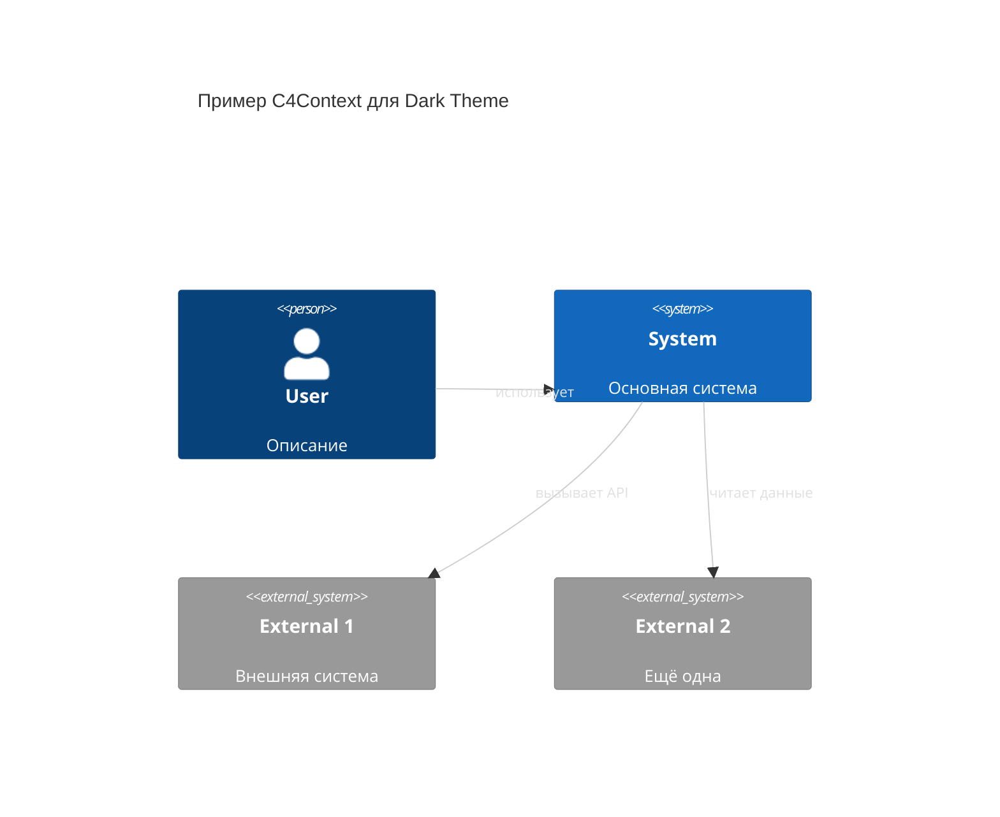
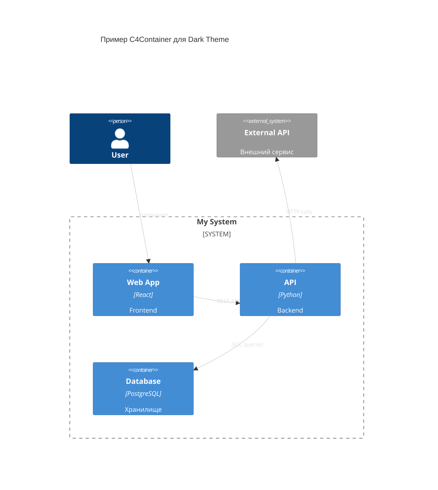
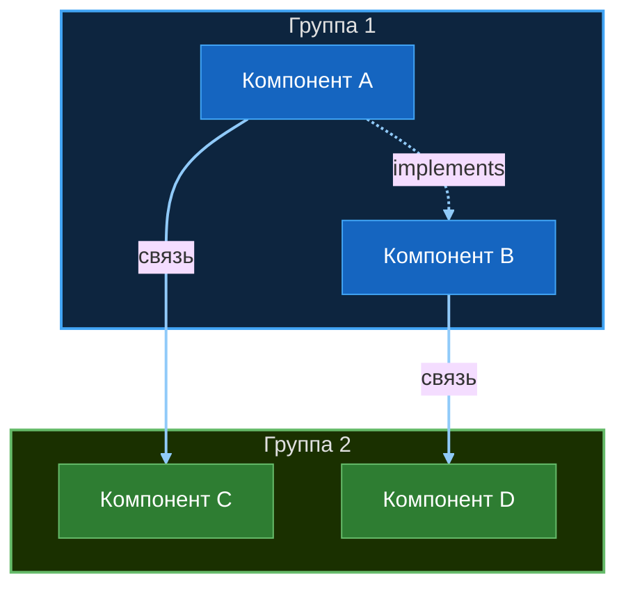
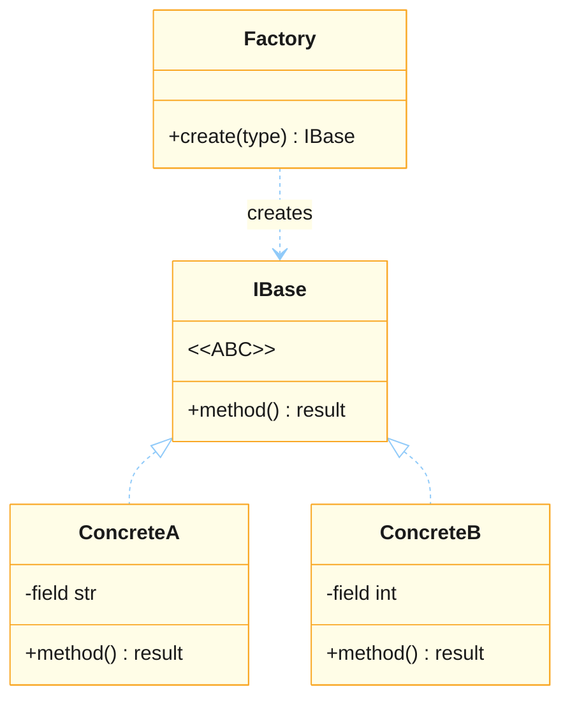
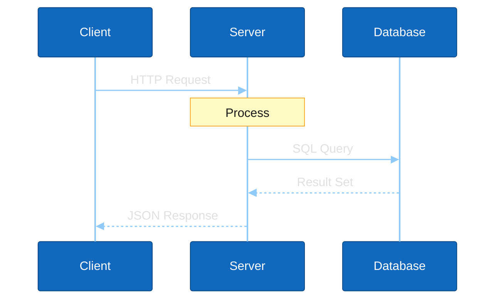

# 🎨 Mermaid — Стилизация диаграмм для VS Code Dark Theme

> **Проверено**: Mermaid 10.9.5 (VS Code extension "Markdown Preview Mermaid Support")
> **Дата**: 2026-03-21
> **Источник**: Context7 docs + эксперименты GPUWorkLib

---

## ⚠️ Ключевые правила

1. **Frontmatter `---config---` НЕ работает** в Mermaid 10.9.5 → используй `%%{init}%%`
2. **C4 диаграммы** (C4Context, C4Container, C4Component) **игнорируют `themeVariables`** → стилизация ТОЛЬКО через `UpdateElementStyle` + `UpdateRelStyle`
3. **flowchart / graph / classDiagram / sequenceDiagram** — `themeVariables` работают нормально
4. **Связи по умолчанию тёмные** → на dark theme не видны! Всегда задавай `lineColor` или `linkStyle`

---

## 📋 Палитра для Dark Theme

| Элемент | Цвет | Hex | Назначение |
|---------|------|-----|-----------|
| Связи / линии | Светло-голубой | `#90caf9` | Хорошо виден на тёмном фоне |
| Текст на связях | Светло-серый | `#e0e0e0` | Читаемый на тёмном |
| Person (C4) | Тёмно-синий | `#08427b` | Стандарт C4 Simon Brown |
| System (C4) | Синий | `#1168bd` | Стандарт C4 |
| External (C4) | Серый | `#999999` | Стандарт C4 |
| Container (C4) | Голубой | `#438dd5` | Стандарт C4 |
| Component (C4) | Светло-голубой | `#85bbf0` | Стандарт C4 (чёрный текст!) |
| Заметки (notes) | Жёлтый | `#fff9c4` / `#f9a825` | Контраст с синими блоками |
| Текст в блоках | Белый | `#ffffff` | На тёмных заливках |
| Текст в светлых блоках | Чёрный | `#000000` | На светлых заливках |

---

## 1️⃣ C4 диаграммы (C4Context, C4Container)

### Синтаксис стилизации

```
UpdateElementStyle(имя, $bgColor="цвет", $fontColor="цвет", $borderColor="цвет")
UpdateRelStyle(от, до, $textColor="цвет", $lineColor="цвет")
```

### Готовый шаблон — C4Context



### Готовый шаблон — C4Container



---

## 2️⃣ flowchart / graph — `%%{init}%%` + `linkStyle`

### Готовый шаблон



### Правила

- `linkStyle default stroke:#90caf9,stroke-width:2px` — делает ВСЕ связи голубыми
- `style NODE fill:...,stroke:...,color:...` — стилизация конкретного узла
- `color` в `style` — цвет ТЕКСТА внутри узла
- Subgraph: тёмная заливка + яркая рамка + светлый текст

---

## 3️⃣ classDiagram — `%%{init}%%`

### Готовый шаблон



### Правила

- `<<ABC>>` → пишем `&lt;&lt;ABC&gt;&gt;` (HTML entities)
- НЕ используй `**kwargs*`, `dict[str, Type]$` — ломает парсер 10.9.5
- `primaryColor` = фон классов (жёлтый `#fffde7` — хорошо виден)
- `lineColor` = цвет связей (`#90caf9` — голубой)
- `classText` = цвет текста внутри классов

---

## 4️⃣ sequenceDiagram — `%%{init}%%`

### Готовый шаблон



### Ключевые переменные

| Переменная | Назначение | Значение |
|-----------|-----------|---------|
| `actorBkg` | Фон заголовков участников | `#1168bd` (синий) |
| `actorTextColor` | Текст в заголовках | `#ffffff` |
| `signalColor` | Цвет стрелок (связей!) | `#90caf9` (голубой) |
| `signalTextColor` | Текст над стрелками | `#e0e0e0` |
| `actorLineColor` | Вертикальные линии жизни | `#90caf9` |
| `noteBkgColor` | Фон заметок | `#fff9c4` (жёлтый) |
| `noteTextColor` | Текст заметок | `#1a1a1a` (тёмный) |
| `activationBkgColor` | Фон блоков активации | `#1a3a5c` |

---

## 5️⃣ Чеклист — новая диаграмма

- [ ] Тип диаграммы определён (C4 / flowchart / class / sequence)?
- [ ] C4 → `UpdateElementStyle` + `UpdateRelStyle` для КАЖДОГО элемента
- [ ] Не-C4 → `%%{init: {'theme': 'base', 'themeVariables': {...}}}%%`
- [ ] `lineColor: '#90caf9'` — голубые связи
- [ ] flowchart/graph → `linkStyle default stroke:#90caf9,stroke-width:2px`
- [ ] Блоки: тёмная/яркая заливка + белый текст `color:#ffffff`
- [ ] Нет frontmatter `---config---` (не работает в 10.9.5)
- [ ] Нет спецсимволов `*`, `$`, `**` в classDiagram (ломают парсер)
- [ ] `<<ABC>>` → `&lt;&lt;ABC&gt;&gt;`
- [ ] Проверить в VS Code Preview (Ctrl+Shift+V)

---

## ❌ Что НЕ работает в Mermaid 10.9.5

| Не работает | Альтернатива |
|------------|-------------|
| Frontmatter `---config:theme---` | `%%{init: {...}}%%` |
| `themeVariables` для C4 | `UpdateElementStyle` / `UpdateRelStyle` |
| `dict[str, Type]$` в classDiagram | `dict` (без generic) |
| `+method(**kwargs)*` в classDiagram | `+method(kwargs)` |
| `<<ABC>>` напрямую | `&lt;&lt;ABC&gt;&gt;` |
| `theme: 'default'` в frontmatter | `%%{init: {'theme': 'default'}}%%` |

---

*Создано: 2026-03-21 | Кодо | Проверено на реальных диаграммах GPUWorkLib*
