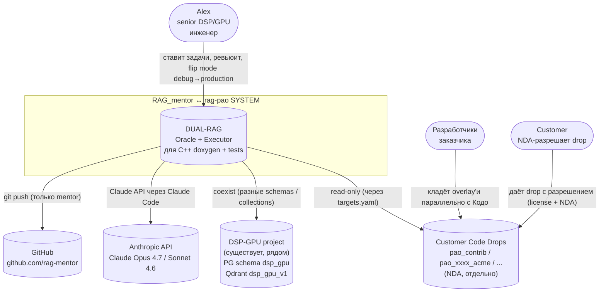
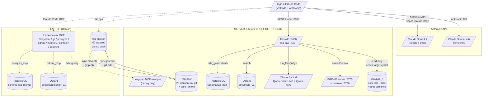
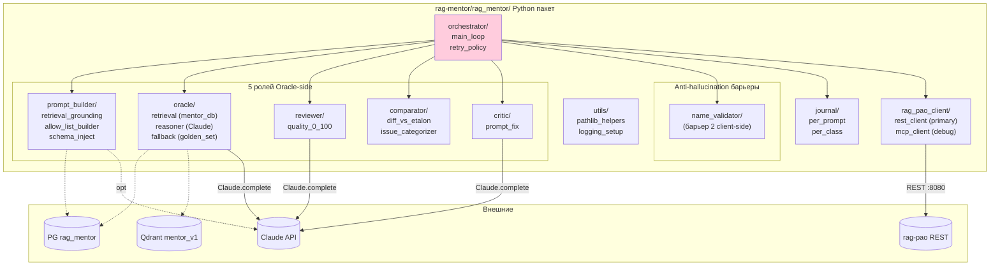
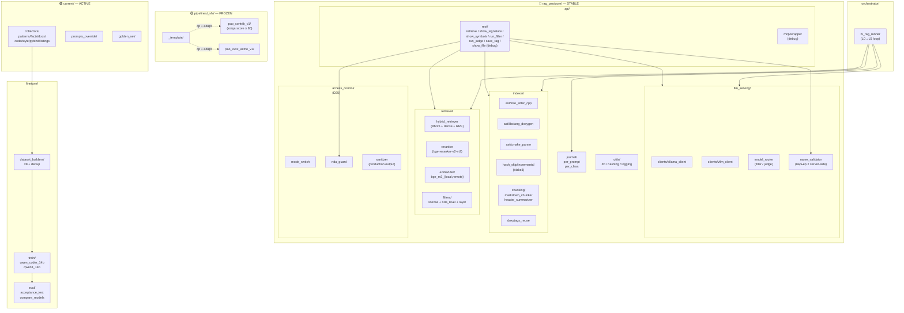

# Архитектура C1-C4 — rag-mentor ↔ rag-pao

> **Метод**: C4 model (Simon Brown). Каждый уровень увеличивает детализацию.
> **Версия**: 0.3 · **Дата**: 2026-05-23
> **Дополняет**: `01_architecture_v0.3.md` (overview + ADR + Risk Register), `02_structure_v0.3.md` (детальная структура каталогов).

---

## C1 — System Context (внешний мир)

**Кто пользуется, кто соседи, кто внешние системы.**



**Ключевые внешние решения**:
- **Anthropic API** для Claude (oracle/reviewer/critic) — единственная online-зависимость.
- **GitHub** только для rag-mentor (private). rag-pao = локальный git + bare remote (D18 + D29).
- **Customer drops** живут **снаружи** rag-pao (D21) — никаких копий внутрь.
- **DSP-GPU** coexist через namespace-разделение (D23) — разные PG schemas / Qdrant collections.

---

## C2 — Containers (deployable units + хранилища)

**Какие процессы / БД / file systems участвуют.**



**Containers таблица**:

| # | Контейнер | Тип | Назначение | Где |
|---|-----------|-----|------------|-----|
| 1 | `rag-mentor` git repo | git + Python пакет | Oracle harness + mentor_db + 7 MCP | Laptop |
| 2 | PG schema `rag_mentor` | DB schema | методика + prompts + golden_sets + sessions + eval_runs | Laptop PG |
| 3 | Qdrant `mentor_v1` | Vector collection | методика embeddings (DSPy / RAPTOR / прошлые удачные промпты) | Laptop Qdrant |
| 4 | 7 MCP servers | stdio processes | filesystem + git + postgres_mcp + qdrant_mcp + memory + context7 + seqthink | Laptop |
| 5 | `rag-pao` git repo | git + Python пакет | Executor + 3 слоя (core/pipelines/current) | Server |
| 6 | FastAPI `:8080` | REST service | основной канал mentor↔pao | Server |
| 7 | MCP wrapper | stdio process | debug-канал для Claude Code | Server |
| 8 | PG schema `rag_pao_<target>` | DB schema per-target | symbols + deps + sessions + eval_runs | Server PG |
| 9 | Qdrant `<target>_v1` | Vector collection per-target | dense vectors target кода | Server Qdrant |
| 10 | Ollama / vLLM | LLM serving | Qwen-Coder-14B + Qwen-35B | Server (RX 9070) |
| 11 | BGE-M3 + reranker | inference services | embed + rerank | Server |
| 12 | `/srv/pao_<name>/` | filesystem mount | customer drops (external roots) | Server |

**Технологии в C2**:
- **REST** (FastAPI) — primary канал, через SSH tunnel `-L 8080:8080`.
- **MCP** — secondary для debug-режима Claude Code.
- **git bare remote** `/srv/git-remotes/rag-pao.git` — sync артефактов.
- **Symlinks** в `rag-pao/targets/<name>/` → `/srv/pao_<name>/` (без копирования).

---

## C3 — Components (внутри каждого контейнера)

### C3.1 rag-mentor — внутренние компоненты



**Компоненты mentor**:
- **Orchestrator** (Controller) — координирует cycle of self-correction
- **5 ролей** (см. `04_policies §A.2`)
- **Журнал** — 2 уровня (per_prompt + per_class)
- **rag_pao_client** — Adapter к REST + MCP

### C3.2 rag-pao — внутренние компоненты (3 слоя)



**Принципы 3-слойной модели**:
- `core/` — общий код, меняется редко, под OK Alex
- `pipelines/<name>_vN/` — frozen snapshots per-target (не правятся обратно)
- `current/` — active development (новый target до freeze'а)

---

## C4 — Code (ключевые классы + контракты)

> Полного кода ещё нет — это **проектные классы**, что должны существовать. Помечены `// TBD Phase XX`.

### C4.1 Mentor Orchestrator (Controller pattern)

```python
# rag_mentor/orchestrator/main_loop.py    # TBD Phase 04

class MentorOrchestrator:
    """Controller (GRASP). Координирует cycle of self-correction для одного класса."""

    def __init__(
        self,
        config: StackConfig,
        oracle: OracleReasoner,
        builder: PromptBuilder,
        reviewer: Reviewer,
        comparator: Comparator,
        critic: Critic,
        pao_client: RagPaoClient,           # Bridge interface: REST | MCP
        validator: NameValidator,
        journal: JournalWriter,
    ):
        self.config = config
        # all deps injected (DIP — depend on abstractions)
        ...

    def process_class(self, class_fqn: str, target: str) -> Outcome:
        ctx = self.pao_client.search(target=target, query=class_fqn)
        etalon = self.oracle.build_etalon(class_fqn, ctx)
        prompt = self.builder.build(class_fqn, ctx, etalon)

        for attempt in range(self.config.policy.max_retries):
            qwen_out = self.pao_client.run_filler(target, prompt)

            # 4 anti-hallucination барьера (Chain of Responsibility):
            if not self.validator.check(qwen_out, ctx).ok:
                prompt = self.critic.fix_hallucination(prompt, ...)
                continue
            if not SchemaValidator.check(qwen_out).ok:
                prompt = self.critic.fix_schema(prompt, ...)
                continue

            judge = self.pao_client.run_judge(target, qwen_out)
            review = self.reviewer.score(qwen_out, ctx)
            diff = self.comparator.diff(etalon, qwen_out)

            if judge.score >= 80 and review.score >= 80 and diff.score >= 80:
                self.pao_client.save_rag(target, class_fqn, qwen_out)
                self.journal.finalize(class_fqn, prompt, qwen_out, judge, review, diff)
                return Outcome.SAVED

            prompt = self.critic.improve(prompt, qwen_out, judge.delta, review.notes, diff.issues)

        self.journal.escalate_to_human(class_fqn)
        return Outcome.ESCALATED
```

### C4.2 Oracle (Strategy + Information Expert)

```python
# rag_mentor/oracle/reasoner.py    # TBD Phase 04

class OracleReasoner:
    """Information Expert (GRASP) — знает как формировать эталон.
       Strategy (GoF) — может быть заменена FrozenGoldenSetFallback."""

    def __init__(
        self,
        retrieval: MentorDbRetriever,
        claude: ClaudeClient,
        fallback: GoldenSetFallback,
    ):
        self.retrieval = retrieval
        self.claude = claude
        self.fallback = fallback

    def build_etalon(self, class_fqn: str, ctx: SearchContext) -> EtalonAnswer:
        # 1. Retrieve methodology + similar prompts из mentor_db
        methodology = self.retrieval.search_methodology(class_fqn)
        similar_prompts = self.retrieval.search_similar_prompts(class_fqn, score_min=0.7)

        # 2. Build «mудрый» эталон через Claude
        prompt = self._build_oracle_prompt(class_fqn, ctx, methodology, similar_prompts)
        try:
            etalon_text = self.claude.complete(prompt, temperature=0.2)
            return EtalonAnswer(text=etalon_text, source="oracle")
        except (RateLimitError, NetworkError):
            return self.fallback.lookup(class_fqn)            # Strategy fallback
```

### C4.3 Comparator (Visitor pattern)

```python
# rag_mentor/comparator/diff_vs_etalon.py    # TBD Phase 04

class Comparator:
    """Сравнивает Oracle эталон с Qwen output. Score + issues."""

    def __init__(self, categorizer: IssueCategorizer):
        self.categorizer = categorizer    # Visitor (GoF)

    def diff(self, etalon: EtalonAnswer, qwen_out: QwenOutput) -> DiffResult:
        # Multiple criteria — split via SRP в IssueCategorizer
        name_diff   = self._compare_names(etalon, qwen_out)
        struct_diff = self._compare_structure(etalon, qwen_out)
        param_diff  = self._compare_params(etalon, qwen_out)
        throws_diff = self._compare_throws(etalon, qwen_out)

        issues = self.categorizer.visit_all([name_diff, struct_diff, param_diff, throws_diff])
        score = self._aggregate_score(issues)

        return DiffResult(score=score, issues=issues)


class IssueCategorizer:
    """Visitor pattern: типы issues расширяются без правки Comparator."""

    def visit_hallucination_name(self, issue: NameIssue) -> CategorizedIssue: ...
    def visit_generic_placeholder(self, issue: TextIssue) -> CategorizedIssue: ...
    def visit_wrong_param_order(self, issue: ParamIssue) -> CategorizedIssue: ...
    # OCP: добавить новый тип = новый visit_* метод
```

### C4.4 Pao Client (Bridge + Adapter)

```python
# rag_mentor/rag_pao_client/base.py    # TBD Phase 04

class RagPaoClient(Protocol):
    """Bridge (GoF) — интерфейс отделён от реализации (REST/MCP).
       LSP — обе реализации взаимозаменяемы."""

    def search(self, target: str, query: str, **filter) -> SearchContext: ...
    def run_filler(self, target: str, prompt: str) -> QwenOutput: ...
    def run_judge(self, target: str, output: QwenOutput) -> JudgeResult: ...
    def save_rag(self, target: str, class_fqn: str, content: dict) -> None: ...
    def show_signature(self, target: str, class_fqn: str) -> str: ...
    def show_symbols(self, target: str, module: str) -> list[str]: ...
    # show_file НЕ в Protocol — только в RestClient (debug-only)
```

```python
# rag_mentor/rag_pao_client/rest_client.py    # TBD Phase 04

class RestClient(RagPaoClient):
    """Adapter (GoF) — адаптирует HTTP вызовы под RagPaoClient интерфейс."""

    def __init__(self, config: PaoEndpointConfig, mode: AccessMode):
        self.http = httpx.Client(base_url=config.url, timeout=config.timeout)
        self.mode = mode
        self.target_default = config.target

    @retry(stop=stop_after_attempt(3), wait=wait_exponential(min=1, max=10))
    def search(self, target: str, query: str, **filter) -> SearchContext:
        resp = self.http.post("/search", json={"target": target, "query": query, **filter})
        resp.raise_for_status()
        return SearchContext.from_dict(resp.json())

    def show_file(self, target: str, path: str) -> str:
        """Debug-only. В production 403 — сервер блокирует через nda_guard."""
        if self.mode == AccessMode.PRODUCTION:
            raise NotAllowedInProduction("show_file disabled")
        resp = self.http.get("/show_file", params={"target": target, "path": path})
        resp.raise_for_status()
        return resp.text
```

### C4.5 Pao Access Control (Guard + Strategy)

```python
# rag_pao/core/access_control/nda_guard.py    # TBD Phase 01

class NDAGuard:
    """Guard pattern (server-side). Single source of truth для разрешений."""

    SAFE_ENDPOINTS = frozenset({
        "/health", "/search",
        "/show_signature", "/show_symbols",
        "/run_filler", "/run_judge", "/save_rag",
    })

    DEBUG_ONLY = frozenset({"/show_file", "/show_journal", "/dump_target"})

    def __init__(self, targets_config: TargetsConfig):
        self.targets = targets_config

    def check_access(self, target: str, endpoint: str, mode: str) -> bool:
        # Production: forced safe-only для ВСЕХ targets
        if mode == "production":
            return endpoint in self.SAFE_ENDPOINTS

        # Debug: per-target codo_access решает
        cfg = self.targets.get(target)
        if cfg.codo_access == "full":
            return True

        return endpoint in self.SAFE_ENDPOINTS
```

### C4.6 Pao LLM Serving (Factory + Strategy)

```python
# rag_pao/core/llm_serving/model_router.py    # TBD Phase 01

class LLMClient(Protocol):
    """LSP — все клиенты взаимозаменяемы через generate()."""
    def generate(self, prompt: str, **kwargs) -> str: ...


class ModelRouter:
    """Factory (GoF) + Strategy. Создаёт клиента по config.backend."""

    @staticmethod
    def create(role: Literal["filler", "judge"], config: StackConfig) -> LLMClient:
        model_cfg = config.qwen_models[role]
        if model_cfg.backend == "ollama":
            return OllamaClient(model=model_cfg.name, base_url=config.ollama_url)
        elif model_cfg.backend == "vllm":
            return VLLMClient(model=model_cfg.name, base_url=config.vllm_url)
        raise UnknownBackend(model_cfg.backend)


class OllamaClient(LLMClient): ...
class VLLMClient(LLMClient): ...
```

### C4.7 Pao Indexer (Template Method + Chain of Responsibility)

```python
# rag_pao/core/indexer/base.py    # TBD Phase 02

class LayerIndexer(ABC):
    """Template Method (GoF). Скелет одинаков, шаги — для override."""

    def index(self, target: Target) -> IndexReport:
        files = self._collect_files(target)
        for path in files:
            if not self._should_reindex(target, path):       # incremental
                continue
            chunks = self._extract(path)
            vectors = self._embed(chunks)
            self._persist(target, path, chunks, vectors)
            self._mark_indexed(target, path)
        return self._report()

    @abstractmethod
    def _extract(self, path: Path) -> list[Chunk]: ...
    @abstractmethod
    def _layer_name(self) -> str: ...


class L2SymbolsIndexer(LayerIndexer):
    def _extract(self, path: Path) -> list[Chunk]:
        # tree-sitter + libclang
        return [...]


class L3DescriptionsIndexer(LayerIndexer):
    def _extract(self, path: Path) -> list[Chunk]:
        # Qwen-generated doxygen
        return [...]
```

---

## Контракты между containers

### Mentor → Pao (REST)

| Endpoint | Request | Response |
|----------|---------|----------|
| `POST /search` | `{target, query, filter: {layer, license, nda_level}, top_k}` | `SearchContext{chunks: [...], symbols: [...]}` |
| `GET /show_signature?target=...&class=...` | — | `{signature: "...", params: [...], throws: [...]}` |
| `GET /show_symbols?target=...&module=...` | — | `["dsp::ClassA", "dsp::ClassB", ...]` |
| `POST /run_filler` | `{target, prompt, schema?}` | `QwenOutput{json: {...}, latency_ms: 1234}` |
| `POST /run_judge` | `{target, output}` | `JudgeResult{score: 0-100, delta: {...}}` |
| `POST /save_rag` | `{target, class_fqn, layer: "L3", content}` | `{saved: true, path: ".rag/..."}` |
| `GET /show_file?target=...&path=...` | — (debug only) | raw text or **403** |

### Pao DB schema (rag_pao_<target>)

```sql
-- 7 таблиц per-target
symbols          (fqn, kind, signature, file_path, line, doxy_tags[])
dependencies     (from_fqn, to_fqn, kind: include|inherits|composes)
doc_blocks       (id, fqn, layer, content_md, source: doxygen|usecase|arch)
test_params      (id, fqn, name, input, expected, edge_case)
pybind_bindings  (id, py_class, cpp_fqn, methods)
sessions         (id, class_fqn, prompt_version, total_retries, scores, human_verified, ts)
eval_runs        (id, golden_set, layer, recall_at_5, mrr, ts)
file_hashes      (path, hash_blake3, indexed_at)
```

### Mentor DB schema (rag_mentor)

```sql
-- 5 таблиц cross-target
prompts          (id, version, role, content_md, ts, used_count)
golden_sets      (id, layer, query, expected, difficulty)
sessions         (id, target, class_fqn, prompt_id, ts, outcome)
target_metadata  (target, nda_level, pipeline, codo_access, modules[], created)
eval_runs        (id, target, layer, metric, value, ts)
```

---

## Boundary diagram (Bounded Context, DDD-style)

```mermaid
flowchart LR
    subgraph BC_Methodology["BC: Methodology (mentor)"]
        Prompts
        GoldenSets
        Sessions_mentor
        Critic
    end

    subgraph BC_Target["BC: Target Knowledge (pao per-target)"]
        Symbols
        DocBlocks
        Pipeline
        Sessions_pao
    end

    subgraph BC_Inference["BC: LLM Inference (pao)"]
        Filler
        Judge
        Embedder
        Reranker
    end

    subgraph BC_AntiHall["BC: Anti-Hallucination (cross-cutting)"]
        NameValidator
        SchemaLint
        Comparator
        ForbiddenTerms
    end

    BC_Methodology -.->|формирует prompt| BC_Inference
    BC_Inference -.->|использует context| BC_Target
    BC_AntiHall -.->|проверяет output| BC_Inference
    BC_Methodology -.->|сравнивает с эталон| BC_AntiHall
```



**4 Bounded Contexts** (Domain-Driven Design):
1. **Methodology** — про **как** Кодо ведёт себя (Claude + mentor_db)
2. **Target Knowledge** — про **что** в конкретном customer drop (PG + Qdrant per-target)
3. **LLM Inference** — про **как генерировать** (Qwen + BGE-M3)
4. **Anti-Hallucination** — **cross-cutting** проверки на всех 4 барьерах

Каждый BC может развиваться независимо. Контракты между ними — через REST + структуры данных.

---

*v0.3 final.*
