# Design Patterns Applied — rag-mentor / rag-pao

> **Назначение**: описание применённых принципов и паттернов в проекте.
> Не «что надо исправить», а **«вот как мы строим»** — референс для будущей разработки.
>
> **Версия**: 0.3 · **Дата**: 2026-05-23
> **Дополняет**: `architecture_C1_C4.md` (диаграммы) + `specs/02_structure_v0.3.md` (раскладка кода).

---

## 1. ООП — фундаментальные принципы

### 1.1 Encapsulation

| Где | Как |
|-----|-----|
| `mentor_db` доступ | только через `oracle/retrieval.py` — не голый SQL в orchestrator |
| `pao_db` per-target | через `rag_pao/core/utils/db.py` connection pool |
| `nda_guard.check_access()` | middleware FastAPI — единая точка проверки доступа |
| Claude API | сокрыт в `oracle/reasoner.py` + `reviewer/` + `critic/` — нет `anthropic.Client()` в orchestrator |
| Anti-hallucination логика | shared `common/anti_hallucination/` — обе стороны (mentor + pao) импортируют |
| Secrets | через `os.environ` / `pydantic.Settings` — `config/secrets.env` не утекает в код |

### 1.2 Abstraction (Protocols)

| Компонент | Интерфейс | Реализации |
|-----------|-----------|------------|
| `LLMClient` | `generate(prompt) -> str` | `OllamaClient`, `VLLMClient` |
| `RagPaoClient` | `search / run_filler / run_judge / save_rag / show_*` | `RestClient`, `MCPClient` |
| `LayerIndexer` (ABC) | Template Method: `index()` + abstract `_extract()` | `L0CorpusIndexer`, `L2SymbolsIndexer`, `L3DescriptionsIndexer` |
| `Retriever` | `search(query, filter) -> ChunkList` | `HybridRetriever`, `BM25Retriever`, `DenseRetriever` |
| `Collector` | `collect(sources) -> CollectionResult` | 10 коллекторов P0/P1/P2 |
| `DataSource` | `fetch(query) -> list[Record]` | `PgDataSource`, `MarkdownDataSource`, `GitLogDataSource` |
| `IssueCategorizer` (Visitor) | `visit_<type>()` | Hallucination / Structure / Param / Throws |

### 1.3 Inheritance — Composition over Inheritance

| Иерархия | Глубина | Стиль |
|----------|---------|-------|
| `LayerIndexer` ABC → L0/L2/L3 indexers | 1 уровень | Template Method |
| `LLMClient` Protocol → ollama/vllm | 1 уровень | Composition через Protocol |
| `RagPaoClient` Protocol → rest/mcp | 1 уровень | Composition + AccessAwareMixin |

Принцип: **никаких deep hierarchies** (> 2 уровней). Protocol вместо ABC где не нужны default methods.

### 1.4 Polymorphism

| Тип | Где |
|-----|-----|
| Subtype (LSP) | `LLMClient` → ollama/vllm взаимозаменяемы |
| Subtype через mixin | `AccessAwareMixin` пре-чек одинаково в rest+mcp |
| Visitor | `IssueCategorizer.visit_*` |
| Duck typing | Python через Protocol (`runtime_checkable`) |

---

## 2. SOLID — пять принципов

### 2.1 **S**ingle Responsibility Principle

Каждый файл = одна ответственность:

| Файл | Ответственность |
|------|-----------------|
| `oracle/retrieval.py` | retrieval из mentor_db |
| `oracle/reasoner.py` | формирование эталона через Claude |
| `oracle/fallback.py` | fallback на golden_set |
| `comparator/diff_vs_etalon.py` | вычисление diff |
| `comparator/issue_categorizer.py` | категоризация diff'ов в issues |
| `critic/prompt_fix.py` | правка промпта |
| `access_control/mode_switch.py` | переключение режима |
| `access_control/nda_guard.py` | проверка доступа |
| `access_control/sanitizer.py` | санация output (production) |
| `journal/per_prompt.py` | append в `prompts/v1/*.journal.md` |
| `journal/per_class.py` | append в `.rag/<t>/sessions/*.md` |

### 2.2 **O**pen-Closed Principle

| Точка расширения | Как |
|------------------|-----|
| Новый LLM backend (Triton/TGI/…) | `@ModelRouter.register("triton")` + новый client class |
| Новый collector | положить `.py` в `pipelines/<target>_v1/collectors/<category>/` + регистрация в `pipeline.yaml` |
| Новый layer (L6 ML predictions?) | extend `LayerIndexer` + добавить в `orchestrator/hi_rag_runner.py` |
| Новый тип issue | добавить `visit_<new_type>()` в `IssueCategorizer` |
| Новый target | `cp pipelines/_template/ pipelines/<new>_v1/` + adapt |
| Новый safe endpoint | правка `config/access_policy.yaml`, не кода (D35) |
| Новое правило для Кодо | положить `.md` в `.claude/rules/` |
| Новый MCP server | добавить в `mcp_servers.yaml` |

### 2.3 **L**iskov Substitution Principle

`AccessAwareMixin` (D36) гарантирует одинаковое поведение клиентов:

```python
class RestClient(AccessAwareMixin, RagPaoClient):
    def show_file(self, path):
        self._check_access("show_file")    # fail fast в обоих
        return self._http_get(...)

class MCPClient(AccessAwareMixin, RagPaoClient):
    def show_file(self, path):
        self._check_access("show_file")    # тот же pre-check
        return self._mcp_call(...)
```

Оба возвращают/бросают одинаково → можно подменять без surprise.

### 2.4 **I**nterface Segregation Principle

`RagPaoClient` Protocol разбит на 4 узких интерфейса (clean DI + лёгкий моккинг в тестах):

```python
class SearchClient(Protocol):       def search(...); def show_signature(...); def show_symbols(...)
class GenerationClient(Protocol):   def run_filler(...); def run_judge(...)
class PersistenceClient(Protocol):  def save_rag(...)
class DebugClient(Protocol):        def show_file(...); def show_journal(...)       # debug-mode only

class RestClient(SearchClient, GenerationClient, PersistenceClient, DebugClient, AccessAwareMixin): ...

class MentorOrchestrator:
    def __init__(self, search: SearchClient, gen: GenerationClient, persist: PersistenceClient):
        # получает только то что нужно — не знает о DebugClient
```

`LLMClient` Protocol — только `generate()`. Не пытается быть `Tokenizer + Embedder + Generator`.

### 2.5 **D**ependency Inversion Principle

`MentorOrchestrator` зависит от **Protocols**, не от конкретных классов:

```python
class MentorOrchestrator:
    def __init__(
        self,
        oracle:      OracleReasoner,
        builder:     PromptBuilder,
        reviewer:    Reviewer,
        comparator:  Comparator,
        critic:      Critic,
        pao_client:  RagPaoClient,        # Protocol — Bridge
        validator:   NameValidator,
        journal:     JournalWriter,
    ):
        # Constructor Injection — depends on abstractions, not concretions
```

`ModelRouter` через Registry pattern — клиенты регистрируются декоратором, фабрика возвращает по строке:

```python
@ModelRouter.register("ollama")
class OllamaClient(LLMClient): ...

@ModelRouter.register("vllm")
class VLLMClient(LLMClient): ...

client = ModelRouter.create(role="filler", config=stack)
```

---

## 3. GRASP — General Responsibility Assignment Patterns

### 3.1 Information Expert

**«Назначить ответственность тому, у кого есть информация».**

| Ответственность | Эксперт |
|-----------------|---------|
| Сборка allow-list | `PromptBuilder` (имеет ctx.symbols) |
| Валидация имени | `NameValidator` (имеет ctx.symbols + forbidden_terms) |
| Diff эталон vs Qwen | `Comparator` (имеет оба) |
| Выбор pipeline для target | `targets.yaml` parser → `Orchestrator` |
| Проверка доступа к endpoint | `NDAGuard` (имеет policy + targets_config) |
| Скоринг train примера | `JournalReader` (имеет judge/reviewer scores) → `dataset_builders/v8.py` |

### 3.2 Creator

| Объект | Создатель |
|--------|-----------|
| `MentorOrchestrator` | `bootstrap.py` entry point |
| `OracleReasoner` | `bootstrap.py` (передаётся в Orchestrator) |
| `LLMClient` | `ModelRouter.create()` (Factory) |
| `RagPaoClient` | `bootstrap.py` (выбирает Rest или MCP по config) |
| `LayerIndexer` per layer | `HiRAGRunner` (по pipeline.yaml) |
| `EtalonAnswer` | `OracleReasoner.build_etalon()` |
| `pipelines/<new>_v1/` | `PipelineFactory.create_from_template()` |

### 3.3 Controller

«Не-UI объект, координирующий use case».

| Use case | Controller |
|----------|-----------|
| `process_class` (полный cycle of self-correction) | `MentorOrchestrator` |
| Index всего target'а (L0→L4) | `HiRAGRunner` в `rag_pao/orchestrator/` |
| Add new target | `PipelineFactory` |
| Sync prompts mentor→pao | `SyncCoordinator` (через git bare remote) |

**Controllers НЕ содержат business logic** — координируют, делегируют.

### 3.4 Low Coupling

| Связь | Изоляция |
|-------|----------|
| `rag-mentor` ↔ `rag-pao` | только через `RagPaoClient` Protocol (REST) — любая замена реализации не задевает mentor |
| `oracle/` ↔ `mentor_db` | через `MentorDbRetriever` Protocol — не голый SQL |
| `core/` ↔ `pipelines/<target>_v1/` | core не знает о per-target snapshots — только orchestrator знает через config |
| `collectors/` ↔ источники данных | через `DataSource` Protocol — коллектор не знает откуда (PG / markdown / git log) |

### 3.5 High Cohesion

Каждый подпакет собран вокруг одной concept'а:

| Подпакет | Cohesion |
|----------|----------|
| `rag_mentor/oracle/` | всё про формирование эталона |
| `rag_mentor/comparator/` | всё про сравнение vs эталон |
| `rag_pao/core/indexer/` | всё про индексацию (ast + chunking + hash) |
| `rag_pao/core/access_control/` | всё про доступ (mode_switch + nda_guard + sanitizer) |
| `rag_pao/core/anti_hallucination/` | всё про барьеры (name + schema + doxygen lint) — D34 |
| `rag_pao/core/llm_serving/` | clients + model_router (без anti-hallucination — отдельно) |

### 3.6 Polymorphism (GRASP)

См. ООП §1.4.

### 3.7 Pure Fabrication

«Класс не из domain, существует чтобы поддерживать другие GRASP».

| Pure Fabrication | Зачем |
|------------------|-------|
| `ModelRouter` | Factory — domain не знает о backends |
| `MentorOrchestrator` | Controller — domain не знает о cycle |
| `JournalWriter` | Persistence — domain не пишет markdown |
| `RetryPolicy` | Technical concern |
| `PipelineFactory` | Creation — domain не копирует папки |
| `NDAGuard` | Cross-cutting security |

### 3.8 Indirection

| Indirection | Зачем |
|-------------|-------|
| `RagPaoClient` Protocol | посредник mentor ↔ pao REST |
| `LLMClient` Protocol | посредник orchestrator ↔ Qwen |
| `MentorDbRetriever` | посредник Oracle ↔ PG |
| `AccessPolicy.load()` | посредник `nda_guard` ↔ yaml config |

### 3.9 Protected Variations

«Защита элементов от изменений других элементов через стабильный интерфейс».

| Variation | Защита |
|-----------|--------|
| Qwen revision (sha256 drift) | `model_router.py` pin sha + re-validation на golden_set |
| Claude model upgrade (4.7 → 5.0) | prompts versioning `v1/v2/` + re-validation |
| Customer drop layout (`contrib/` vs `modules/`) | `targets.yaml.layout` + `_META.yaml` |
| LLM backend (ollama → vllm → triton) | `LLMClient` Protocol + Registry |
| Target NDA level (open → closed) | `nda_level` + `codo_access` + `NDAGuard` |
| Set safe endpoints | `config/access_policy.yaml` (D35) |

---

## 4. GoF — Design Patterns Applied

### 4.1 Creational

| Паттерн | Где | Зачем |
|---------|-----|-------|
| **Factory Method** | `ModelRouter.create(role, config)` | создание `LLMClient` по `backend` без if/elif в callers |
| **Registry-based Factory** | `@ModelRouter.register("ollama")` | OCP: новый backend = decorator, не правка фабрики |
| **Builder** | `PromptBuilder` собирает промпт из 5+ частей (allow_list / schema / fewshot / arch / symbols) | пошаговая сборка с грaунд-чеками |
| **Singleton (light)** | `ConfigLoader` через `@lru_cache` | один читатель yaml на процесс, без boilerplate Singleton |

### 4.2 Structural

| Паттерн | Где | Зачем |
|---------|-----|-------|
| **Bridge** | `RagPaoClient` Protocol + `RestClient`/`MCPClient` | абстракция отделена от реализации; смена транспорта без правки mentor |
| **Adapter** | `RestClient` адаптирует HTTP к `RagPaoClient` интерфейсу | mentor видит единый API независимо от транспорта |
| **Facade** | `MentorOrchestrator.process_class()` — единый вход для cycle of self-correction | hides complexity 5 ролей + 4 барьеров + retry |
| **Decorator** | `@retry(stop=…, wait=…)` на REST вызовах | retry policy без правки клиента |
| **Mixin** | `AccessAwareMixin` для `RestClient`/`MCPClient` | shared pre-check логика без диамантной иерархии (D36) |

### 4.3 Behavioral

| Паттерн | Где | Зачем |
|---------|-----|-------|
| **Strategy** | `pipelines/<target>_vN/` snapshots | per-target стратегия обработки, заменяема `cp _template/` |
| **Strategy (fallback)** | `Oracle.build_etalon` → `GoldenSetFallback` если Claude rate-limit | graceful degradation |
| **Template Method** | `LayerIndexer.index()` — скелет + abstract `_extract()` | L0/L2/L3 indexers переиспользуют каркас |
| **Chain of Responsibility** | 4 anti-hallucination барьера | output → name_validator → schema_lint → judge → comparator |
| **Visitor** | `IssueCategorizer.visit_<type>()` | расширяемая категоризация diff'ов; новый тип = новый visit-метод (OCP) |
| **Composite** | `CollectorGroup` (P0 / P1 / P2) | группа коллекторов как один + рекурсивный запуск |
| **Memento** | `.rag/<t>/sessions/NNN_<Class>_<date>.md` | состояние per-attempt сохраняется → можно вернуться |
| **Observer** | `JournalWriter` пишется orchestrator'ом по событиям (`on_attempt_complete`, `on_save_rag`) | append-only audit без затрагивания main flow |

### 4.4 Domain / Architectural

| Паттерн | Где | Зачем |
|---------|-----|-------|
| **Guard** | `NDAGuard.check_access()` middleware | server-side single source of truth для разрешений (D35) |
| **Repository** | `MentorDbRetriever` / `PaoDbRetriever` | абстракция над БД; queries не утекают в domain |
| **Bounded Context** (DDD) | 4 BC: Methodology / Target Knowledge / LLM Inference / Anti-Hallucination | независимое развитие через REST контракты |
| **Idempotent Receiver** | `POST /save_rag` с `idempotency_key` (D37) | network retry не создаёт дубли |
| **Sidecar / Health Check** | `infra/healthcheck.sh` pre-flight | проверка состояния до train (swap / GUI / VRAM) |

---

## 5. Сводная таблица паттернов по компонентам

| Компонент | Применённые паттерны |
|-----------|---------------------|
| **`MentorOrchestrator`** | Controller (GRASP), Facade (GoF), DIP (SOLID), SRP |
| **`Oracle`** | Information Expert (GRASP), Strategy + Fallback (GoF) |
| **`Comparator`** | Visitor (GoF), SRP (split diff vs categorize) |
| **`Critic`** | Strategy (по типу issues), SRP |
| **`RagPaoClient`** | Bridge + Adapter + Mixin (GoF), ISP, LSP |
| **`NDAGuard`** | Guard + Strategy (по mode), Information Expert, DIP |
| **`ModelRouter`** | Factory + Registry (GoF), OCP |
| **`LayerIndexer`** | Template Method (GoF), LSP |
| **`Collector` / `CollectorGroup`** | Strategy + Composite (GoF), OCP |
| **`PipelineFactory`** | Creator (GRASP), Factory (GoF) |
| **`JournalWriter`** | Observer + Memento (GoF), Pure Fabrication (GRASP) |
| **`AccessPolicy`** | Singleton (lru_cache) + Repository |
| **`anti_hallucination/`** | Chain of Responsibility (4 барьера), Shared package (D34) |

---

## 6. Принципы которые **не применяем** (избегаем over-engineering)

| Anti-pattern | Почему не используем |
|--------------|---------------------|
| **Mediator** для orchestrator | Risk god object — DI прямее |
| **Abstract Factory** | Только 1 семейство (LLMClient) — Factory Method достаточно |
| **Prototype** | Нет тяжёлых объектов для cloning |
| **Flyweight** | Нет миллионов мелких объектов с shared state |
| **Interpreter** | Нет DSL — yaml/json достаточно |
| **Multiple Inheritance > 2 mixins** | Сложная MRO — оставляем 1 mixin (`AccessAwareMixin`) |
| **CQRS** | Read/Write разделение оправдано на 10+ микросервисах |
| **EventBus** | Прямые вызовы методов проще для 5-ролевой системы |
| **Microservices** | Overhead для 2-tier MVP |

---

## 7. Bounded Contexts (DDD)

4 контекста с независимыми domain models:

```mermaid
flowchart LR
    subgraph BC_Method["BC: Methodology (mentor)"]
        Prompts; GoldenSets; Sessions_M; Critic
    end
    subgraph BC_Target["BC: Target Knowledge (pao per-target)"]
        Symbols; DocBlocks; Pipeline; Sessions_P
    end
    subgraph BC_Inference["BC: LLM Inference (pao)"]
        Filler; Judge; Embedder; Reranker
    end
    subgraph BC_AntiHall["BC: Anti-Hallucination (cross-cutting)"]
        NameValidator; SchemaLint; Comparator; ForbiddenTerms
    end

    BC_Method -.->|формирует prompt| BC_Inference
    BC_Inference -.->|использует context| BC_Target
    BC_AntiHall -.->|проверяет output| BC_Inference
    BC_Method -.->|сравнивает с эталоном| BC_AntiHall
```



Каждый BC развивается независимо. Контракты — через REST + структуры данных.

---

*v0.3 final. Описание применённых принципов и паттернов в проекте rag-mentor / rag-pao.*
