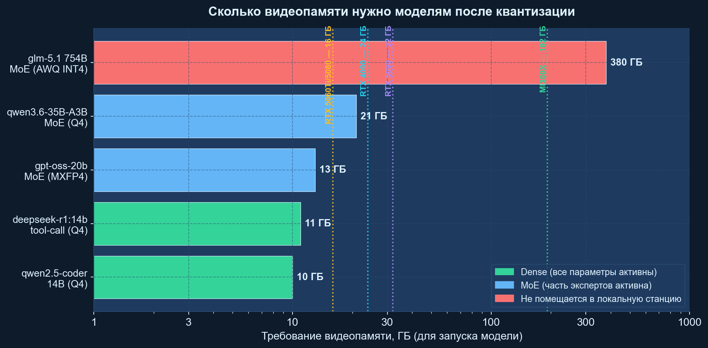
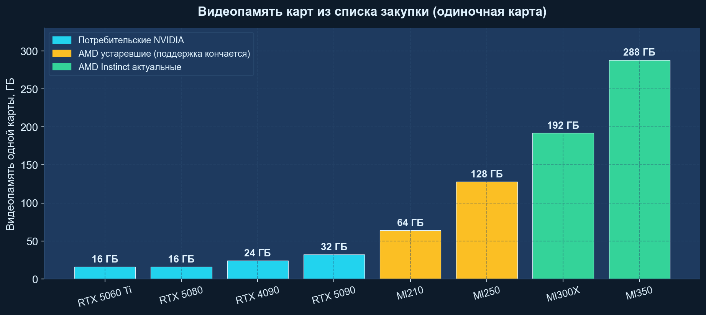
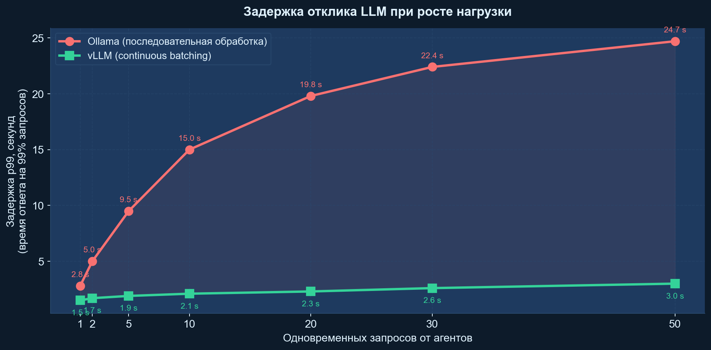
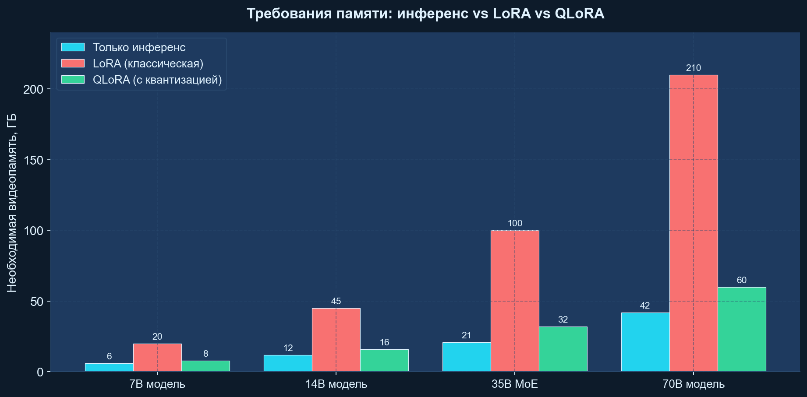
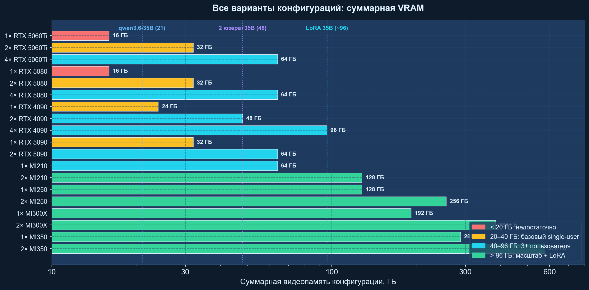
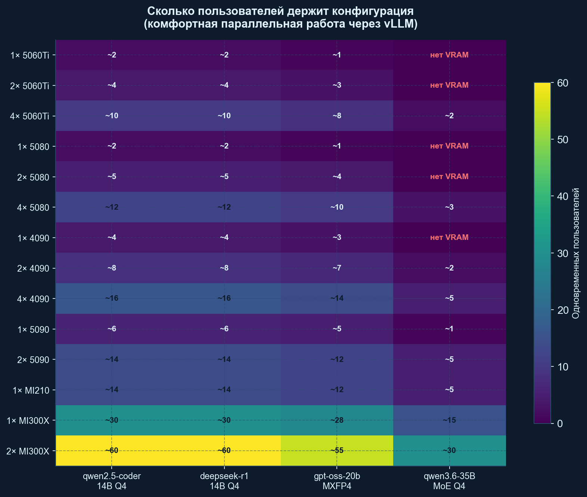
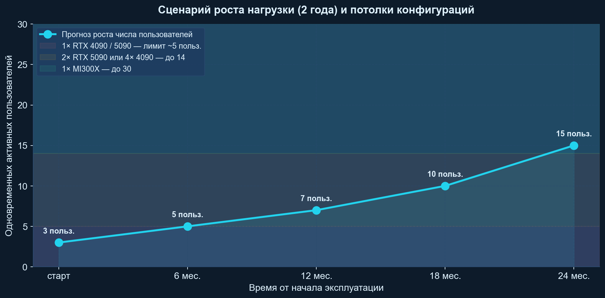

# Выбор оборудования для локального сервера LLM: исполнительное резюме

**Дата:** 22 апреля 2026
**Автор:** Отдел НИОКР
**Аудитория:** руководство, финансовый блок, IT-директор
**Документы-спутники:**
- `LLM_Hardware_Brief_2026-04-22` — сухая справка
- `LLM_Hardware_Technical_Deep_Dive_2026-04-22` — технический разбор

---

## 1. Цель документа

Обосновать выбор серверной конфигурации для размещения **локальных больших языковых моделей**, обеспечивающих работу **не менее трёх разработчиков одновременно** с программными агентами, с возможностью периодического дообучения моделей 7–14 B.

Документ не обсуждает стоимость. Он отвечает на вопрос:

> Какая минимальная и какая оптимальная конфигурация даёт плавную работу трёх специалистов с локальной моделью, не уступающей по скорости облачным сервисам?

---

## 2. Краткий вывод

| # | Сценарий | Рекомендуемая конфигурация | Обоснование |
|---|----------|----------------------------|-------------|
| 1 | **Минимально-достаточно.** 1–3 разработчика, пиковые нагрузки редкие. | **2 × RTX 5090 (32 ГБ)** | 64 ГБ суммарной VRAM, умещает все тестируемые модели кроме GLM-5.1. Для инференса сравнима с 1 × H100 по практической пропускной способности. |
| 2 | **Рекомендуемо.** Три разработчика одновременно, возможность QLoRA-дообучения 7–14 B. | **1 × AMD Instinct MI300X (192 ГБ)** | Серверный класс, 192 ГБ HBM3, нативная поддержка vLLM/ROCm 7. Одна карта — одна машина. |
| 3 | **С запасом на будущее.** Рост до 5–10 пользователей, регулярное дообучение. | **1–2 × MI300X** или **4 × RTX 4090 (96 ГБ)** | Две MI300X → 384 ГБ HBM3 — поместится даже GLM-5.1 в AWQ INT4. Альтернатива — четыре RTX 4090. |

**Не рекомендуется к закупке** (см. п. 6):
- AMD MI210 и MI250 — сняты с основного пути поддержки AMD.
- RTX 5060 Ti и RTX 5080 (16 ГБ) — недостаточно памяти для надёжной работы трёх пользователей.
- AMD MI350 — избыточная мощность для заявленной задачи.

---

## 3. Ключевые ограничения, которые необходимо понимать

### 3.1. Видеопамять — главный параметр GPU

Модель LLM — это файл с весовыми коэффициентами. Чтобы модель работала, **весь этот файл должен быть загружен в видеопамять карты**. Если памяти не хватает, часть модели хранится в оперативной памяти компьютера, что замедляет работу в десятки раз.

Модель `glm-5.1` — публичная, но очень требовательная к железу. В обычном виде занимает около 1.5 ТБ, после сжатия AWQ INT4 — 380 ГБ. **Физически не помещается** ни в одну из заявленных карт. Её запуск требует кластера из 4–8 серверных GPU.

### 3.2. Видеопамять разных карт

### 3.3. Почему при работе трёх пользователей возникает торможение

Типичный запрос — «напиши функцию», «покажи ошибку», «найди все места использования» — порождает десятки подзапросов, которые агент отправляет модели. Три пользователя порождают **шторм из 30–150 параллельных запросов**.

Программы-серверы LLM делятся на два типа:

- **Простые (Ollama, LM Studio).** Обрабатывают запросы по очереди. Первый получает ответ, остальные ждут. Пользователи видят это как «программа зависла».
- **Серверные (vLLM, SGLang).** Используют «непрерывную пакетную обработку» (continuous batching). Обрабатывают десятки запросов одновременно в одном GPU-проходе.

Измерения 2026 года: при 50 одновременных запросах Ollama даёт задержку 99-й перцентили **24.7 секунды**, vLLM на том же железе — **менее 3 секунд** при шестикратно большей пропускной способности.

Выбор **серверной программы** столь же важен, как выбор карты.

### 3.4. Дообучение (LoRA, QLoRA) — отдельное требование по памяти

- **LoRA.** Добавляет к модели «адаптер» (1–5 % от размера). Требует памяти примерно на 30 % больше обычного использования.
- **QLoRA.** То же, но модель хранится в сжатом виде. Требование к памяти снижается до уровня обычного использования.

Для заявленной задачи — «периодическое QLoRA над моделями 7–14 B» — достаточно любой конфигурации с 16 ГБ+ на одной карте.

---

## 4. Все варианты конфигураций: суммарная видеопамять

Цветовая кодировка:
- **Красное.** Менее 20 ГБ — недостаточно для 3 пользователей даже на 14 B моделях.
- **Оранжевое.** 20–40 ГБ — работает с одним пользователем или минимальным контекстом.
- **Голубое.** 40–96 ГБ — комфортная работа 3–10 пользователей.
- **Зелёное.** Более 96 ГБ — масштаб плюс дообучение больших моделей.

---

## 5. Сколько пользователей держит каждая конфигурация

Значения — оценочные, при использовании vLLM с continuous batching, контекст 16К токенов, агентная нагрузка. «нет VRAM» означает что модель физически не помещается в суммарную память конфигурации.

---

## 6. Разбор предложенных GPU

### 6.1. Группа «Слабые потребительские 16 ГБ» — RTX 5060 Ti и RTX 5080

| Количество карт | Суммарная VRAM | 14 B dense | gpt-oss-20b | 35 B MoE | 3 пользователя | LoRA 14 B | Итог |
|:---:|:---:|:---:|:---:|:---:|:---:|:---:|----|
| 1 | 16 | Впритык | Впритык | Нет | Нет | Нет | Single-user экспериментарий |
| 2 | 32 | Да | Да | Нет | 2–3 | Нет | Минимально серверная, ограничено 20 B |
| 4 | 64 | Да | Да | Через TP | 8–12 (только инференс) | 1 карта | Работает с оговорками — см. раздел 7.4 |

**Оба варианта (5060 Ti и 5080) имеют одну проблему — 16 ГБ не хватает.** RTX 5080 быстрее за счёт более быстрой памяти (960 ГБ/с против 448 у 5060 Ti), но потолок тот же. Для серверного использования с тремя пользователями эти карты **не подходят в одиночной конфигурации**.

**Сценарий «4 × RTX 5060 Ti или 4 × RTX 5080» рассмотрен отдельно** в разделе 7.4 документа `Technical_Deep_Dive` — суммарных 64 ГБ теоретически хватает, но без NVLink появляются существенные ограничения.

### 6.2. Группа «Средние потребительские» — RTX 4090 и RTX 5090

| Конфигурация | VRAM | 3 пользователя | 35 B MoE | 70 B | LoRA 14 B | LoRA 35 B | Итог |
|--------------|:----:|:-------------:|:---------:|:-----:|:---------:|:---------:|-------|
| 1 × RTX 4090 | 24 | Да (до 4) | Да | Нет | Да | Нет | Минимум для small team |
| 2 × RTX 4090 | 48 | Да (до 8) | Да | Q4 через TP | Да | Нет | Расширенный single-user / малая команда |
| 3 × RTX 4090 | 72 | Да (до 12) | Да | Да (Q4) | Да | Да | Специальная конфигурация; многие платы не поддерживают 3 карт симметрично |
| 4 × RTX 4090 | 96 | Да (до 16) | Да | Да (Q4) | Да | Да (QLoRA) | **Классический AI-workstation** |
| 1 × RTX 5090 | 32 | Да (до 6) | Да | Нет | Да | Нет | Лучшая одиночная потребительская карта |
| 2 × RTX 5090 | 64 | Да (до 14) | Да | Q4 | Да | Ограниченно | **Оптимум для рабочей станции** |

**Ключевые наблюдения:**

- 4 × RTX 4090 и 2 × RTX 5090 имеют одинаковую суммарную VRAM (96 и 64 ГБ соответственно), но:
  - Две RTX 5090 проще в сборке (один блок питания 1500 Вт, стандартный Threadripper).
  - Четыре RTX 4090 дают больший запас памяти и лучше масштабируются.
- Производство RTX 4090 завершено в 2025 г., поэтому возможны сложности с закупкой одновременно четырёх одинаковых карт.
- RTX 5090 — новейшее поколение, доступны в продаже.

### 6.3. Группа «Устаревшие серверные» — MI210 и MI250

| Конфигурация | VRAM | Статус поддержки | Prebuilt vLLM/ROCm | Итог |
|--------------|:----:|:-----------------|:-----------------:|-------|
| 1 × MI210 | 64 | Завершается (CDNA 2, 2021) | Нет (требует ручной сборки) | Не рекомендуется |
| 2 × MI210 | 128 | То же | Нет, плюс баги multi-GPU (vLLM issue #2942) | Не рекомендуется |
| 1 × MI250 | 128 (2 × 64) | То же | Нет | Не рекомендуется |
| 2 × MI250 | 256 | То же | Нет | Не рекомендуется |

**Обоснование непригодности:**
- Prebuilt Docker-образы AMD для vLLM (`rocm/vllm`) **исключают** MI210/MI250 из списка поддержки начиная с версий ROCm 7.0.
- Требуется самостоятельная сборка стека — риск, что через 6–12 месяцев не будет актуальной версии.
- MI250 — двухчиповая архитектура, требующая специального распределения нагрузки; современные фреймворки оптимизированы под MI300 единой памятью.

**Единственный сценарий покупки:** если организация уже владеет картой MI210/MI250 и имеет собственную экспертизу ROCm. Новая закупка в 2026 году не оправдана.

### 6.4. Группа «Современные серверные» — MI300X

| Конфигурация | VRAM | 3 пользователя | 35 B MoE | GLM-5.1 | Масштаб до N польз. | Итог |
|--------------|:----:|:-------------:|:---------:|:--------:|:------------------:|-------|
| 1 × MI300X | 192 | Да, с запасом | Да | Нет | 25–30 | **Оптимум** |
| 2 × MI300X | 384 | Да, большой запас | Да | Да (INT4) | 50–60 | **С запасом на GLM и рост** |

**Преимущества:**
- 192 ГБ HBM3 в одной карте — помещает модель плюс KV-кеши 20+ пользователей.
- Полная поддержка ROCm 7.0 + vLLM (официальный prebuilt Docker от AMD).
- Оптимизации ROCM_AITER_FA дают 2.8–4.6x TPOT speedup против предыдущих поколений.
- Активная поддержка производителем до 2028–2029 гг.
- Пропускная способность памяти — 5.3 ТБ/с (против 1.8 у RTX 5090).

### 6.5. Группа «Флагманские серверные» — MI350

| Конфигурация | VRAM | Для чего | Итог |
|--------------|:----:|----------|-------|
| 1 × MI350 | ~288 | Модели 100 B+, 50+ пользователей, будущие MoE-монстры | Избыточно для задачи |
| 2 × MI350 | ~576 | Кластерные применения | Избыточно |

Для заявленной задачи (3 разработчика, модели до 35 B, QLoRA над 7–14 B) флагман нового поколения — избыточная инвестиция. Имеет смысл только при планах на расширение до уровня собственного AI-департамента с 50+ пользователями.

---

## 7. Операционная система

**Сервер должен работать под Linux.** Ни одна из программ промышленного уровня (vLLM, SGLang, TensorRT-LLM, свежие версии ROCm) не имеет полноценной поддержки Windows для серверных режимов.

| Оборудование | Рекомендуемая ОС |
|--------------|-------------------|
| NVIDIA RTX серии 40/50 | Ubuntu 24.04 LTS (первичный выбор) или Ubuntu 22.04 LTS |
| AMD MI210 / MI250 | Ubuntu 22.04 LTS или RHEL 9 |
| AMD MI300X / MI350 | Ubuntu 24.04 LTS или RHEL 9 |

Windows рассматривается только как среда для разработки клиентской части (IDE разработчика, инструменты). Сам сервер LLM — Linux.

---

## 8. Параметры серверного компьютера

| Компонент | Вариант A (4 × RTX 4090 / 2 × RTX 5090) | Вариант B (1 × MI300X) |
|-----------|----------------------------------------|-------------------------|
| Процессор | AMD Threadripper Pro 7965WX (24 ядра) | 2 × AMD EPYC 9354 (64 ядра суммарно) |
| Оперативная память | 256 ГБ DDR5 ECC | 512 ГБ DDR5 ECC |
| Материнская плата | WRX90, 7 слотов PCIe 5.0 x16 | Сертифицированная OEM (Dell XE9680, Supermicro AS-8125GS-TNMR2) |
| Системный диск | 2 × 2 ТБ NVMe Gen5 (RAID 1) | 2 × 3.84 ТБ NVMe (RAID 1) |
| Диск для моделей | 4 × 4 ТБ NVMe Gen5 (RAID 10) | 4 × 7.68 ТБ NVMe (RAID 10) |
| Сеть | 10 GbE | 2 × 25 GbE |
| Блок питания | 2 × 1600 Вт Titanium | 4 × 2000 Вт Platinum (серверный N+N) |
| Корпус | Full-tower рабочая станция | 4U rack-mount |
| Охлаждение | Воздушное, 8+ вентиляторов | Серверное, стойка 22 °C |
| Операционная система | Ubuntu 24.04 LTS | Ubuntu 24.04 LTS |

---

## 9. Сценарий роста нагрузки

Прогноз за два года:
- Старт: 3 разработчика.
- 6 месяцев: 5 (подключение тестировщиков).
- 12 месяцев: 7 (расширение команды).
- 18 месяцев: 10 (фоновые процессы: review-агенты, тесты).
- 24 месяца: 15 (интеграция с внутренними инструментами).

Потолки конфигураций:
- **1 × RTX 4090 / RTX 5090** — до 5–6 пользователей. Хватит на 3–6 месяцев.
- **4 × RTX 4090 или 2 × RTX 5090** — до 12–14 пользователей. Хватит на 18–24 месяцев.
- **1 × MI300X** — до 25–30 пользователей. Хватит на 3+ года, плюс запас на крупные модели.

---

## 10. Финальная рекомендация

Оптимальный выбор — **AMD Instinct MI300X в серверном исполнении**. Это решение:

- не накладывает компромиссов по видеопамяти,
- официально поддерживается производителем на 3–5 лет вперёд,
- работает со всеми заявленными моделями кроме GLM-5.1,
- масштабируется добавлением второй карты до 384 ГБ (тогда GLM-5.1 становится доступна в квантизации INT4),
- обеспечивает плавную работу трёх разработчиков с запасом на рост до 15 человек,
- поддерживает весь стек vLLM / SGLang через официальные контейнеры AMD.

Если формат серверного рэка не подходит по инфраструктурным причинам — замена на **4 × NVIDIA RTX 4090 в рабочей станции Threadripper Pro** покрывает 80 % задач при форм-факторе «большой компьютер под столом».

Технические обоснования, бенчмарки, подробные конфигурации, разбор гибридных сценариев и сценарий многокарточной работы на 4 × RTX 5060 Ti приведены в документе-спутнике `LLM_Hardware_Technical_Deep_Dive_2026-04-22`.

---

*Документ подготовлен 22 апреля 2026 г. Версия 2.0 (с детализацией по всем вариантам количества GPU).*
