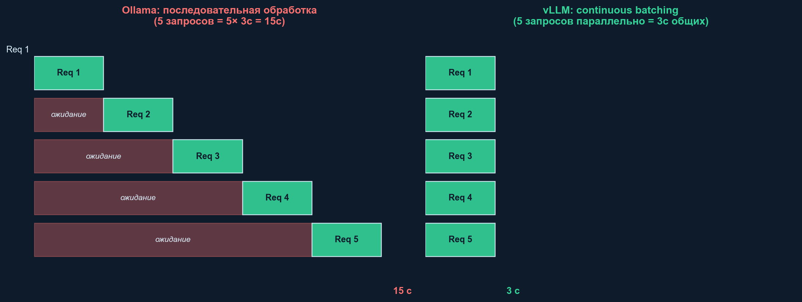
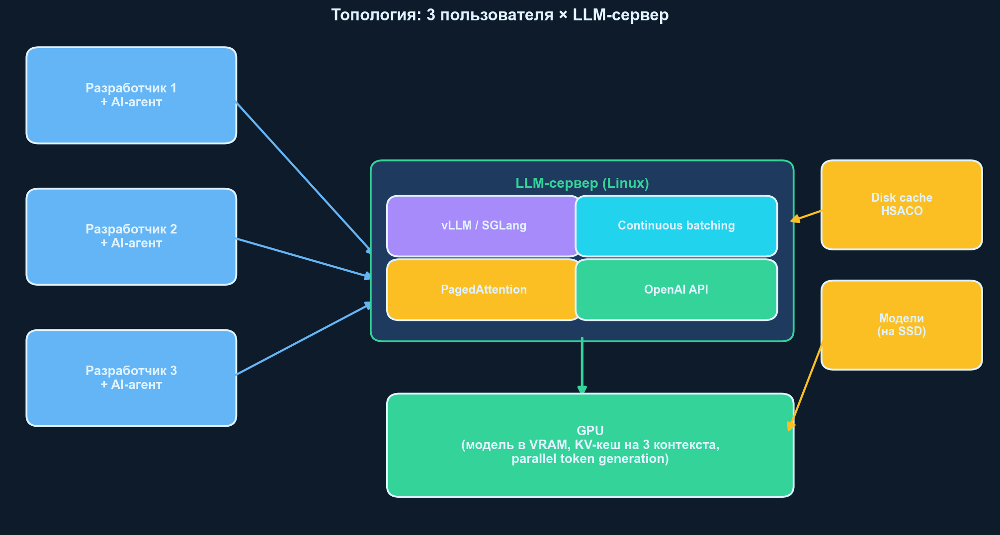
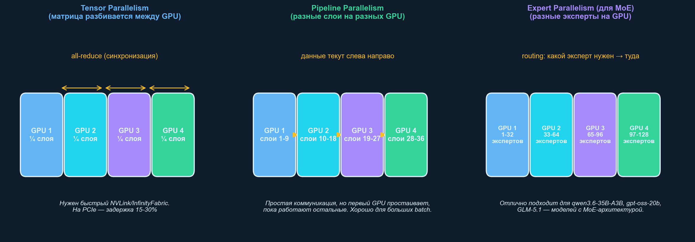

# Выбор оборудования для локального сервера LLM: техническое обоснование

**Дата:** 22 апреля 2026
**Автор:** Отдел НИОКР
**Аудитория:** руководство, IT-администраторы, архитекторы систем
**Документы-спутники:**
- `LLM_Hardware_Brief_2026-04-22` — сухая справка
- `LLM_Hardware_Executive_Summary_2026-04-22` — исполнительное резюме

---

## Оглавление

1. [Задача и ограничения](#1-задача-и-ограничения)
2. [Модели, заявленные к тестированию](#2-модели-заявленные-к-тестированию)
3. [Почему при нагрузке от нескольких пользователей возникает торможение](#3-почему-при-нагрузке-от-нескольких-пользователей-возникает-торможение)
4. [Программные платформы-серверы LLM](#4-программные-платформы-серверы-llm)
5. [Топология серверной части](#5-топология-серверной-части)
6. [Расчёт видеопамяти под рабочую нагрузку](#6-расчёт-видеопамяти-под-рабочую-нагрузку)
7. [Анализ предложенных GPU по группам](#7-анализ-предложенных-gpu-по-группам)
8. [Multi-GPU: три типа параллелизма](#8-multi-gpu-три-типа-параллелизма)
9. [Операционная система](#9-операционная-система)
10. [Дообучение моделей: LoRA и QLoRA](#10-дообучение-моделей-lora-и-qlora)
11. [Сценарий роста нагрузки](#11-сценарий-роста-нагрузки)
12. [Рекомендуемые конфигурации серверов](#12-рекомендуемые-конфигурации-серверов)
13. [Гибридные сценарии](#13-гибридные-сценарии)
14. [Глоссарий](#14-глоссарий)
15. [Список источников](#15-список-источников)

---

## 1. Задача и ограничения

### 1.1. Постановка

Подобрать аппаратную конфигурацию сервера, способного:

- размещать в памяти графических процессоров (GPU) модели: `qwen3.6-35B-A3B`, `gpt-oss:20b`, `glm-5.1`, `deepseek-r1-tool-calling:14b-qwen-distill-q4_K_M`, `qwen2.5-coder:14b`;
- обеспечивать параллельную работу **не менее трёх пользователей** через программных агентов;
- предоставлять ресурсы для периодического дообучения моделей 7–14 B методом LoRA или QLoRA.

### 1.2. Ограничения окружения

- Рабочая среда — Linux. Серверные реализации vLLM, SGLang, TensorRT-LLM работают преимущественно под Linux.
- Сервер размещается в корпоративной серверной или в виде рабочей станции.
- Рост нагрузки в течение 1–2 лет — до 5–10 пользователей.

### 1.3. Что не рассматривается

- Стоимость оборудования.
- Обучение моделей с нуля (pre-training).
- Полное дообучение (full fine-tuning) моделей свыше 14 B.

---

## 2. Модели, заявленные к тестированию


### 2.1. Сводная таблица

| Модель | Архитектура | Параметров, всего | Параметров, активных | Размер файла (Q4) | VRAM практический |
|--------|-------------|-------------------:|----------------------:|--------------------:|--------------------:|
| `qwen2.5-coder:14b` | Dense Transformer | 14 B | 14 B | ~8.9 ГБ | 10–12 ГБ |
| `deepseek-r1:14b-qwen-distill` | Dense (дистилляция R1) | 14 B | 14 B | ~9 ГБ | 12–14 ГБ |
| `gpt-oss-20b` | MoE | 21 B | 3.6 B | ~13 ГБ (MXFP4) | 15–16 ГБ |
| `qwen3.6-35B-A3B` | MoE (Gated Delta Net) | 35 B | 3 B | ~21 ГБ (Q4_K_M) | 23–26 ГБ |
| `glm-5.1` | MoE (Z.ai) | 754 B | 40 B | ~380 ГБ (AWQ INT4) | требует 8 × H100 или 4–8 × MI300X |

### 2.2. Комментарии по моделям

**Qwen3.6-35B-A3B.** Выпущена 16 апреля 2026 г. Apache 2.0. Скорость инференса сопоставима с плотными моделями 7 B за счёт MoE-архитектуры (активны только 3 B параметров). Требует ~21 ГБ VRAM в Q4-квантизации.

**GPT-OSS-20B.** OpenAI, август 2025. Нативная MXFP4-квантизация (4.25 бита на параметр) — заложена разработчиком, не применена пост-фактум. Помещается в 16 ГБ VRAM потребительских карт.

**GLM-5.1.** Z.ai (бывш. Zhipu), открытая версия от 7 апреля 2026. Сопоставима с GPT-5.4 и Claude по кодингу. Однако 754 B параметров делают её **непригодной для локальной рабочей станции**. Требует кластер серверного класса (8 × H200 либо 4–8 × MI300X).

**DeepSeek-R1-14B-Qwen-Distill.** Дистиллированная версия большой DeepSeek-R1 (671 B) через Qwen2.5-14B. Поддерживает tool calling. Работает как обычная 14 B модель, но генерирует «цепочку рассуждений», то есть выдаёт вдвое-втрое больше токенов на запрос.

**Qwen2.5-Coder-14B.** Классическая плотная модель, специализированная под кодогенерацию.

---

## 3. Почему при нагрузке от нескольких пользователей возникает торможение

### 3.1. Как работает LLM при одиночном запросе

Один запрос — это цикл «прочитать текст, сгенерировать следующий токен, прочитать снова, сгенерировать ещё». Для 500-токенного ответа GPU выполняет 500 проходов через миллиарды весов модели.

**Ключевые понятия:**

- **Prefill (загрузка).** Первая фаза — модель читает весь присланный текст. Время пропорционально длине запроса.
- **Decode (декодирование).** Последовательная генерация токенов. Время ограничено **пропускной способностью памяти GPU**. Поэтому важна скорость памяти (HBM3 у серверных карт, GDDR7 у потребительских).
- **KV-cache.** Промежуточная память внимания. Растёт линейно с длиной контекста. Для контекста 32 000 токенов на модели 14 B — около 1–2 ГБ на один запрос.

### 3.2. Агентская нагрузка

Три пользователя через AI-агента порождают **не три запроса, а шторм из 30–150**. Одна команда «найди и исправь ошибку» = 20–50 обращений к модели.

### 3.3. Простые серверы (Ollama) — очередь

Классические простые серверы обрабатывают запросы последовательно. Настройка `OLLAMA_NUM_PARALLEL` позволяет некоторую параллельность, но:
- модель копируется в VRAM N раз,
- на одном GPU конкурируют несколько экземпляров за память,
- начиная с 4–5 параллельных запросов появляется эффект «head-of-line blocking» — медленный запрос блокирует всю партию.

### 3.4. Правильный подход: continuous batching

Серверные реализации (vLLM, SGLang, TensorRT-LLM) объединяют разные запросы в **одну общую матрицу** и одновременно генерируют для них следующий токен.



**Технологии, обеспечивающие continuous batching:**

- **PagedAttention.** KV-кеш разбит на «страницы» — память не фрагментируется.
- **Continuous batching.** Запросы «вливаются» в партию не дожидаясь окончания предыдущей.
- **Chunked prefill.** Длинные prefill-фазы нарезаются, чтобы не блокировать decode коротких запросов.

### 3.5. Численные различия (бенчмарки 2026)


На GPT-OSS-120B, 2 × H100:
- vLLM при 100 одновременных запросах: **4741 токенов/сек**, лучший TTFT (time-to-first-token) на всех уровнях концуррентности.

На среднем стенде (1 × RTX 4090), 14 B модель:
- Ollama, 1 пользователь: 70–90 токенов/сек.
- Ollama, 10 агентных запросов параллельно: среднее 8–15 токенов/сек на пользователя, p99 > 20 с.
- vLLM, 10 параллельных запросов: 60–80 токенов/сек на пользователя, p99 1–3 с.

**Вывод.** При переходе от одного пользователя к трём с агентами нельзя оставаться на Ollama. Серверная программа (vLLM) не просто ускоряет — она делает нагрузку принципиально переносимой.

---

## 4. Программные платформы-серверы LLM

### 4.1. Сравнительная таблица

| Платформа | Continuous batching | Поддержка AMD ROCm | Многопользователь ≥ 10 | Сложность установки |
|-----------|:---:|:---:|:---:|:---:|
| Ollama | Ограниченно | Да | Нет | Очень низкая |
| LM Studio | Нет | Да | Нет | Очень низкая (GUI) |
| llama.cpp | Частично | Да | Ограниченно | Средняя |
| **vLLM** | **Да** | **Да (ROCm 7)** | **Да (100+)** | Средняя |
| SGLang | Да | Да (ROCm 7) | Да (100+) | Средняя |
| TensorRT-LLM | Да | Нет | Да | Высокая |

### 4.2. Рекомендация: vLLM

Причины:
1. Полноценный continuous batching.
2. Нативная поддержка ROCm 7 (официальные Docker-образы AMD для MI300X, MI325X, MI350, MI355X).
3. Поддерживает MXFP4-квантизацию gpt-oss-20b, AWQ, GPTQ, FP8.
4. OpenAI-совместимый API — агенты не требуют специальной адаптации.
5. Активное сообщество, ежемесячные релизы.

---

## 5. Топология серверной части



Компоненты:
- **Пользователи с AI-агентами.** Клиенты (IDE-плагины, CLI, web).
- **vLLM / SGLang.** Серверная программа, принимает HTTP-запросы по OpenAI-совместимому API.
- **Continuous batching.** Объединяет запросы в батчи на лету.
- **PagedAttention.** Эффективно использует VRAM, разбивая KV-кеш на страницы.
- **GPU.** Модель в VRAM, KV-кеши для всех активных пользователей.
- **Disk cache HSACO.** Скомпилированные GPU-ядра для ROCm (через KernelCacheService v2).
- **Модели.** NVMe-диск с исходными файлами моделей (Hugging Face format).

---

## 6. Расчёт видеопамяти под рабочую нагрузку

### 6.1. Формула

```
VRAM_total = VRAM_weights  +  VRAM_kv_cache × N_users  +  VRAM_activation  +  VRAM_overhead
```

Где:
- `VRAM_weights` — размер весов после квантизации.
- `VRAM_kv_cache` — память на один активный контекст.
- `N_users` — число одновременных контекстов.
- `VRAM_activation` — временные буферы (~1–2 ГБ для 14–35 B).
- `VRAM_overhead` — память драйвера, CUDA context, vLLM structures (~1–3 ГБ).

### 6.2. KV-cache

| Модель | Слоёв | Hidden dim | KV на 1 токен (FP16) | KV на 32К токенов |
|--------|:-----:|:----------:|:---------------------:|:--------------------:|
| qwen2.5-coder:14b | 48 | 5120 | ~200 КБ | ~6.5 ГБ |
| deepseek-r1:14b | 48 | 5120 | ~200 КБ | ~6.5 ГБ |
| gpt-oss-20b | 32 | 2880 | ~40 КБ | ~1.3 ГБ |
| qwen3.6-35B-A3B | 62 | 4096 | ~180 КБ | ~5.8 ГБ |

С FP8/INT8 KV-кешем (vLLM поддерживает) память сокращается вдвое-вчетверо.

### 6.3. Практические сценарии

**Три пользователя, 32К контекста, qwen3.6-35B-A3B, Q4_K_M:**

| Компонент | Размер |
|-----------|--------|
| Веса модели (Q4_K_M) | 21 ГБ |
| KV-кеш × 3 × 32К (FP8) | ~9 ГБ |
| Буферы активации | 2 ГБ |
| Overhead vLLM + CUDA/ROCm | 3 ГБ |
| **Итого** | **~35 ГБ** |

- RTX 4090 (24 ГБ) — не хватает.
- RTX 5090 (32 ГБ) — впритык, работает при сокращении контекста или FP8 KV.
- 2 × RTX 5090 (64 ГБ) — с комфортным запасом.
- MI300X (192 ГБ) — запас в 5 раз.

**Пять пользователей, 16К контекста, gpt-oss-20b, MXFP4:**

| Компонент | Размер |
|-----------|--------|
| Веса (MXFP4) | 13 ГБ |
| KV × 5 × 16К (FP8) | ~1.5 ГБ |
| Буферы | 2 ГБ |
| Overhead | 2 ГБ |
| **Итого** | **~18.5 ГБ** |

- RTX 4090 — работает с запасом.
- RTX 5080 (16 ГБ) — не хватает 2 ГБ.

---

## 7. Анализ предложенных GPU по группам

### 7.1. Все варианты конфигураций: суммарная VRAM


### 7.2. RTX 5060 Ti (16 ГБ) — группа слабых потребительских

**Архитектура:** Blackwell GB206, GDDR7, 448 ГБ/с. Это бюджетная карта текущего поколения.

**Одиночная карта.** Минимальная для single-user экспериментов. После размещения модели 14 B (12 ГБ) остаётся 4 ГБ на KV-кеши. При 3 одновременных контекстах по 16К токенов каждый требует 1.5–2 ГБ — память кончается.

**Две карты (32 ГБ суммарно).** Работают с 14 B моделями через tensor parallelism, но: копирование одного слоя на две карты стоит ~30 % производительности без NVLink. 20 B модель впритую, 35 B — нет.

**Четыре карты (64 ГБ суммарно).** Теоретически хватает на qwen3.6-35B-A3B и серверную нагрузку. Ограничения:
- На consumer-материнских платах нет 4 × PCIe 5.0 x16 одновременно (делится как x8/x8/x8/x8 максимум).
- Tensor parallelism на 4 картах без NVLink даёт падение производительности 25–40 % по сравнению с эквивалентной одиночной картой на 64 ГБ.
- Требует Threadripper Pro платформу, двойной БП, спец. корпус.

**Вердикт.** Для серверной нагрузки не рекомендуется. RTX 5060 Ti существует как бюджетный вариант для персональной разработчицкой станции с 1 пользователем.

### 7.3. RTX 5080 (16 ГБ) — группа слабых потребительских

**Архитектура:** Blackwell GB203, GDDR7, 960 ГБ/с (вдвое быстрее 5060 Ti).

Профиль по количеству карт идентичен 5060 Ti — те же 16 ГБ на карту. Более высокая пропускная способность памяти даёт ~30 % прирост на одном пользователе, но потолок «16 ГБ на одну модель» остаётся.

**Вердикт.** Те же ограничения, что у 5060 Ti. Не рекомендуется для серверной нагрузки.

### 7.4. Глубокий разбор: 4 × RTX 5060 Ti или 4 × RTX 5080 (64 ГБ суммарно)

Этот сценарий заслуживает отдельного разбора, так как он выглядит привлекательно — четыре небольшие карты дают 64 ГБ совокупной видеопамяти.

**Что работает:**

- **Инференс 14 B моделей** (qwen2.5-coder, deepseek-r1:14b) — комфортно, модель помещается на одну карту, остальные 3 держат KV-кеши для параллельных пользователей через pipeline parallelism.
- **Инференс gpt-oss-20b** (MoE, MXFP4) — модель на одну карту, остальные на expert parallelism. Отлично ложится на MoE.
- **Инференс qwen3.6-35B-A3B** — модель занимает две карты через tensor parallelism (по 10.5 ГБ на каждой), остальные две — для KV-кешей. Работает при ограничении контекста до 16К.
- **QLoRA над 7 B моделью** — одна карта, 8 ГБ, без проблем.

**Что не работает или работает с оговорками:**

- **Инференс 70 B моделей** — нужно минимум 48 ГБ под веса, 64 ГБ хватает, но tensor parallelism на 4 картах без NVLink режет производительность.
- **Инференс GLM-5.1** — физически невозможно (нужно 380 ГБ).
- **LoRA над 14 B** — нужно 45 ГБ, не помещается на одну карту, а 4-карт tensor parallel для обучения добавляет 2x overhead на коммуникации.
- **QLoRA над 35 B** — нужно 32 ГБ; одна карта мала, распределение между двумя возможно но сложно.
- **Full fine-tuning** — невозможно ни в каком варианте.

**Проблемы связности:**
- У этих карт **нет NVLink**. Для tensor parallelism используется PCIe — на порядок медленнее.
- Пропускная способность PCIe 5.0 x16 = 64 ГБ/с. NVLink 4.0 = 900 ГБ/с.
- Tensor parallelism «в лоб» на PCIe теряет 15–30 % производительности при двух картах, 25–40 % при четырёх.

**Инфраструктурные сложности:**
- Материнская плата с четырьмя PCIe 5.0 x16 слотами: только WRX90 / TRX50 на AMD Threadripper Pro. Intel Xeon-платформы не дают 4 слота с полными 16 линиями.
- Блок питания: 4 × 300 Вт (5060 Ti) = 1200 Вт + CPU 350 Вт + обвязка = 1600–1800 Вт. Для 5080 — 4 × 360 Вт = 1440 Вт + обвязка ~2000 Вт. Нужны два блока питания.
- Корпус: под четыре двухслотовых карты 30 см длиной. Стандартные full-tower корпуса (Fractal Define 7 XL) подходят. Или готовая сборка (Bizon, Exxact).
- Охлаждение: с учётом четырёх выдувающих воздух потоков, нужны 8+ вентиляторов.

**Резюме по этому сценарию:**

Конфигурация «4 × RTX 5060 Ti или 4 × RTX 5080» пригодна для:
- **инференса**: 8–12 одновременных пользователей на моделях 14–20 B и MoE-моделях до 35 B,
- **QLoRA над моделями до 14 B** на одной из четырёх карт,
- **экспериментов и пилотов** без production-нагрузки.

Непригодна для:
- полноценного дообучения,
- работы с GLM-5.1,
- серверов, где важна предсказуемая latency (PCIe-коммуникации дают jitter).

Прямое сравнение с альтернативами на ту же суммарную VRAM:

| Конфигурация | VRAM | Реальная прод. (14 B инференс) | Сложность сборки | Итог |
|--------------|:----:|:-----------------------------:|:----------------:|-------|
| 4 × RTX 5060 Ti | 64 | Базовая (слабая PCIe-связь) | Высокая | Бюджетный серверный вариант |
| 4 × RTX 5080 | 64 | На 30 % выше | Высокая | Средний серверный вариант |
| 2 × RTX 5090 | 64 | На 80 % выше | Средняя | **Лучший потребительский** |
| 1 × AMD MI210 | 64 | На 20 % выше | Средняя | Не рекоменд. (поддержка) |

Двух RTX 5090 (32 × 2 = 64 ГБ) достаточно для того же результата при **вдвое меньшем количестве карт**, без проблем с PCIe-связностью и в более простой сборке.

### 7.5. RTX 4090 (24 ГБ) — группа средних потребительских

**Архитектура:** Ada Lovelace AD102, GDDR6X, 1008 ГБ/с. Выпуск 2022, производство завершено в 2025.

**Одиночная карта.** 24 ГБ хватает на все модели до 35 B в Q4. Для 3 пользователей — впритую, комфортно для 1–2.

**Две карты (48 ГБ).** 2–3 пользователя на 35 B, 3–5 пользователей на 14 B. Для 70 B требуется tensor parallelism и квантизация Q4.

**Три карты (72 ГБ).** Редкая конфигурация — многие материнские платы не дают трёх полноценных PCIe x16 слотов. Если удаётся собрать — перекрывает потребности «рекомендуемого» варианта, но обычно проще сделать 2 или 4.

**Четыре карты (96 ГБ).** Классическая «AI-workstation» конфигурация. 3–5 пользователей, все модели кроме GLM-5.1. Требования к платформе:
- Материнская плата WRX90 / TRX50.
- Процессор AMD Threadripper Pro 7965WX+ (128 PCIe lanes).
- Два блока питания 1500 Вт.
- Корпус с расширенным форматом.

**PCIe-ограничения:** Как и потребительские 5060/5080, RTX 4090 не имеет NVLink (был убран в 40-й серии). Все коммуникации через PCIe 5.0.

**Закупка:** RTX 4090 снята с производства — в 2026 г. остатки на складах дистрибьюторов. При заказе четырёх карт одновременно возможны задержки поставки.

### 7.6. RTX 5090 (32 ГБ) — группа средних потребительских

**Архитектура:** Blackwell GB202, GDDR7, 1792 ГБ/с. Флагман потребительской серии 2025 года.

**Одиночная карта.** 32 ГБ хватает на все модели до 35 B с комфортным запасом. 3–5 пользователей на 14 B, 2–3 на 35 B.

**Две карты (64 ГБ).** **Лучший потребительский вариант.** Суммарная VRAM = 4 × RTX 4090 (96 vs 64 ГБ), но меньше карт даёт:
- меньше PCIe-коммуникаций,
- проще сборку (хватает одного БП 1500 Вт),
- свежая архитектура Blackwell с поддержкой FP8.

Бенчмарки: 2 × RTX 5090 на Llama 70B в Q4 — ~27 токенов/сек, сопоставимо с 1 × H100 (~30–35 tok/sec).

### 7.7. AMD Instinct MI210 (64 ГБ) — группа устаревших серверных

**Архитектура:** CDNA 2, HBM2e, 1638 ГБ/с. Выпущена 2021.

**Ключевая проблема:** prebuilt Docker-контейнеры AMD (`rocm/vllm`, `rocm/sglang`) в серии ROCm 7.0 **исключают** MI210. Основной поток поддержки — MI300/MI325/MI350/MI355.

**Возможности:**
- 1 × MI210 — физически работает, запускает все модели до 35 B в Q4, но требует ручной сборки vLLM из исходников.
- 2 × MI210 — зафиксированы баги multi-GPU (vLLM issue #2942), не все устранены.

**Вердикт:** Не рекомендуется. Риск остаться без поддержки программного стека через 12–18 месяцев.

### 7.8. AMD Instinct MI250 — группа устаревших серверных

**Архитектура:** CDNA 2, 128 ГБ HBM2e (2 × 64 ГБ в одной карте OAM), 3276 ГБ/с на чип.

**Особенность:** двухчиповая архитектура. Для ПО это «два GPU в одной карте». Требует специальной настройки inter-chip коммуникации (xGMI). Современные prebuilt решения AMD оптимизированы под MI300 с единой памятью.

**Вердикт:** Не рекомендуется. То же сочетание факторов, что у MI210: заканчивается активная поддержка, сложная двухчиповая архитектура.

### 7.9. AMD Instinct MI300X (192 ГБ HBM3) — группа актуальных серверных

**Архитектура:** CDNA 3, 192 ГБ HBM3, 5.3 ТБ/с. Массово доступна с 2024.

**Ключевые преимущества:**
- **192 ГБ в одной карте** — помещается модель плюс 20+ одновременных контекстов.
- **Полная поддержка ROCm 7.0 + vLLM** (prebuilt Docker от AMD).
- **ROCM_AITER_FA optimizations** — 2.8–4.6x ускорение TPOT.
- **Активная поддержка** до 2028–2029 гг.

**Спецификации:**

| Параметр | Значение |
|----------|----------|
| Память | 192 ГБ HBM3 |
| Bandwidth памяти | 5.3 ТБ/с |
| FP16 производительность | 1307 TFLOPS |
| BF16 производительность | 1307 TFLOPS |
| FP8 производительность | 2614 TFLOPS |
| TDP | 750 Вт |

**Конфигурации:**
- **1 × MI300X.** 3 пользователя с огромным запасом, до 25–30 пользователей.
- **2 × MI300X** (в OAM-шасси). 384 ГБ суммарно — поднимает GLM-5.1 в AWQ INT4 и 70 B в FP16.

### 7.10. AMD Instinct MI350 — группа флагманских

**Архитектура:** CDNA 4, HBM3e, до 288 ГБ. Выпуск середина 2025.

**Преимущества (для справки):**
- Нативный MXFP4 и FP4.
- +80 % FP8 производительности против MI300X.

**Вердикт:** Избыточно для задачи «3 пользователя, модели до 35 B». Оправдано при планах на 50+ пользователей или работе с моделями уровня GLM-5.1.

---

## 8. Multi-GPU: три типа параллелизма



При использовании нескольких GPU существует три способа разделения работы. Каждый имеет свои плюсы и минусы.

### 8.1. Tensor Parallelism (TP)

Каждый слой модели разбивается на несколько частей. Все GPU одновременно обрабатывают один запрос, выполняя свою часть вычислений, затем **синхронизируются** через операцию all-reduce.

**Плюсы:** Самый быстрый при достаточной пропускной способности связи.
**Минусы:** Требует быстрой связи (NVLink, InfinityFabric). На PCIe — потери 15–30 %.

**Когда использовать:** Серверные карты с NVLink. Не применять на 4 × RTX 4090 без NVLink.

### 8.2. Pipeline Parallelism (PP)

Модель делится по слоям: первые N слоёв на GPU 1, следующие N — на GPU 2 и т. д. Данные текут через GPU как через конвейер.

**Плюсы:** Простая коммуникация (только между соседними GPU). Хорошо работает на PCIe.
**Минусы:** Пока работает GPU 2, GPU 1 простаивает. Нужен большой батч, чтобы все GPU были нагружены.

**Когда использовать:** Потребительские карты на PCIe, большой batch size.

### 8.3. Expert Parallelism (EP) — для MoE

Подходит только для MoE-моделей (gpt-oss, qwen3.6, glm-5.1). Разные «эксперты» модели размещаются на разных GPU. Router направляет запрос к нужному эксперту.

**Плюсы:** Хорошо масштабируется, не требует синхронизации all-reduce.
**Минусы:** Балансировка нагрузки зависит от распределения запросов.

**Когда использовать:** Для MoE-моделей как замена tensor parallelism.

### 8.4. Выбор в зависимости от железа

| Железо | Рекомендуемый тип parallelism |
|--------|-------------------------------|
| 1 GPU | Не применяется |
| 2–4 × RTX (PCIe, нет NVLink) | Pipeline Parallelism либо Expert (для MoE) |
| 2–8 × MI300X (InfinityFabric) | Tensor Parallelism |
| 2 × RTX 5090 с NVLink (если есть) | Tensor Parallelism |

Для всех потребительских мультикарт-конфигураций (4 × RTX 5060 Ti, 4 × RTX 5080, 4 × RTX 4090, 2 × RTX 5090 без NVLink) — предпочтителен Pipeline Parallelism для dense моделей и Expert Parallelism для MoE.

---

## 9. Операционная система

### 9.1. Таблица совместимости

| ОС | Поддержка NVIDIA | Поддержка ROCm | Серверная зрелость | Рекомендация |
|----|:---:|:---:|:---:|--------------|
| Ubuntu 24.04 LTS | Полная | Полная (7.0) | Высокая | **Основной выбор** |
| Ubuntu 22.04 LTS | Полная | Полная (7.0) | Высокая | Резервный вариант |
| RHEL 9 | Полная | Полная (7.0) | Очень высокая | Выбор при стандартизации на Red Hat |
| Debian 12 | Полная | Частичная | Средняя | Только опытным администраторам |
| Windows 11 / Server | Полная (CUDA) | Нет серверной | Низкая для LLM | Не рекомендуется |

### 9.2. Требования к ядру и пакетам

**NVIDIA RTX 50-й серии:**
- CUDA Toolkit ≥ 12.6
- Драйвер ≥ 560
- Ядро Linux ≥ 6.6

**AMD MI300X / MI350:**
- Ядро Linux ≥ 6.8 (для MI350 — ≥ 6.10)
- amdgpu-dkms ≥ 6.10.5
- glibc ≥ 2.35

Ubuntu 24.04 удовлетворяет из коробки. Ubuntu 22.04 требует HWE-ядра.

### 9.3. Контейнеризация

Настоятельно рекомендуется Docker:
- AMD: `rocm/vllm:rocm7.0_vllm_mi300x`.
- NVIDIA: `nvcr.io/nvidia/pytorch:25.01-py3` + `vllm`.
- Контейнер изолирует версии CUDA/ROCm от системы.
- Обновление vLLM = подмена тега контейнера.

---

## 10. Дообучение моделей: LoRA и QLoRA


### 10.1. Суть технологий

**LoRA (Low-Rank Adaptation).** Добавляет к модели «адаптер» (0.1–5 % от размера). Исходная модель остаётся в памяти в полной точности; адаптер обучается.

**QLoRA.** То же самое, но базовая модель хранится в квантизованном виде (4-бит). Экономит 2–4 раза памяти.

### 10.2. Практические требования

Для заявленной задачи (**периодическое QLoRA над 7–14 B моделями**) достаточно:
- RTX 4090 (24 ГБ) — покрывает с запасом.
- RTX 5090 (32 ГБ) — ещё комфортнее.
- MI300X (192 ГБ) — огромный запас, возможно QLoRA на 35–70 B.

### 10.3. Фреймворки

- **Unsloth** — самый быстрый (2–5x против стандартного), поддержка AMD ROCm.
- **Axolotl** — классический YAML-конфигурируемый.
- **TRL (Hugging Face)** — базовый, работает везде.
- **PEFT (Hugging Face)** — низкоуровневая библиотека-обёртка.

---

## 11. Сценарий роста нагрузки


Прогноз за два года:

| Время | Пользователей | Причина роста |
|-------|:-------------:|----------------|
| Старт | 3 | Начальная команда |
| 6 мес. | 5 | Подключение тестировщиков |
| 12 мес. | 7 | Расширение команды |
| 18 мес. | 10 | Фоновые процессы: review-агенты, тесты |
| 24 мес. | 15 | Интеграция с корпоративными инструментами |

**Потолки конфигураций:**
- 1 × RTX 4090 / 5090 — до 5–6 пользователей (хватит на 3–6 месяцев).
- 4 × RTX 4090 / 2 × RTX 5090 — до 12–14 (хватит на 18–24 месяца).
- 1 × MI300X — до 25–30 (хватит на 3+ года).

---

## 12. Рекомендуемые конфигурации серверов

### 12.1. Сколько пользователей на какой конфигурации


### 12.2. Вариант A: рабочая станция на NVIDIA

**GPU:** 4 × RTX 4090 24 ГБ (суммарно 96 ГБ) или 2 × RTX 5090 32 ГБ (суммарно 64 ГБ).

| Компонент | Характеристика |
|-----------|----------------|
| Процессор | AMD Threadripper Pro 7965WX (24 ядра, 128 PCIe 5.0 lanes) |
| ОЗУ | 256 ГБ DDR5 ECC RDIMM |
| Материнская плата | ASUS WRX90 (7 × PCIe 5.0 x16) |
| Системный диск | 2 × 2 ТБ Samsung 990 Pro (RAID 1) |
| Диск для моделей | 4 × 4 ТБ WD Black SN850X (RAID 10, 8 ТБ полезно) |
| Сеть | 10 GbE |
| Блок питания | 2 × Corsair AX1600i (суммарно 3200 Вт) |
| Корпус | Fractal Design Define 7 XL или готовая сборка (Bizon, Exxact) |
| Охлаждение | Воздушное, 8+ вентиляторов |
| ОС | Ubuntu 24.04 LTS |
| Драйвер/CUDA | NVIDIA 560.xx + CUDA 12.6 |
| Контейнер | `nvcr.io/nvidia/pytorch:25.01-py3` + vLLM 0.9+ |

### 12.3. Вариант B: серверное решение на AMD Instinct

**GPU:** 1 × AMD Instinct MI300X 192 ГБ (расширение до 2 × MI300X в OAM-шасси).

| Компонент | Характеристика |
|-----------|----------------|
| Платформа | Dell PowerEdge XE9680 / Supermicro AS-8125GS-TNMR2 / HPE Cray XD675 |
| Процессор | 2 × AMD EPYC 9354 (32 ядра × 2) |
| ОЗУ | 512 ГБ DDR5 ECC RDIMM |
| Системный диск | 2 × 3.84 ТБ Samsung PM9A3 (RAID 1) |
| Диск для моделей | 4 × 7.68 ТБ Samsung PM9A3 (RAID 10, 15.36 ТБ полезно) |
| Сеть | 2 × Mellanox ConnectX-6 25 GbE |
| Блок питания | 4 × 2000 Вт 80+ Platinum (N+N) |
| Корпус | 4U rack-mount |
| Охлаждение | Серверное стоечное, холодный коридор ≤ 22 °C |
| ОС | Ubuntu 24.04 LTS |
| Драйвер/ROCm | amdgpu-dkms + ROCm 7.0 |
| Контейнер | `rocm/vllm:rocm7.0_vllm_0.9.x_mi300x` |

### 12.4. Сводная сравнительная таблица

| Параметр | Вариант A (4 × RTX 4090) | Вариант B (1 × MI300X) |
|----------|--------------------------|-------------------------|
| Суммарная VRAM | 96 ГБ GDDR6X | 192 ГБ HBM3 |
| Суммарная bandwidth памяти | 4032 ГБ/с | 5300 ГБ/с |
| Модели до 35 B (MoE) | Да, с запасом | Да, с большим запасом |
| Модели 70 B в Q4 | Да, TP | Да, одна карта |
| GLM-5.1 | Невозможно | Только при 2 картах, INT4 |
| 3 пользователя | Комфортно | Очень комфортно |
| 10 пользователей | Ограниченно | Комфортно |
| Форм-фактор | Рабочая станция | Серверный рэк |
| Сборка | Средняя сложность | OEM-платформа, простая |
| Срок активной поддержки | 3–4 года | 4–5 лет |
| Путь расширения | Замена карт на новые | Добавление второй MI300X |

---

## 13. Гибридные сценарии

Помимо «чистых» вариантов A и B, возможны гибриды, дающие больше гибкости.

### 13.1. Inference-сервер + dev-станция

- **Серверный узел:** 1 × MI300X для production-инференса (3+ пользователей, vLLM).
- **Dev-станция:** 1 × RTX 5090 у разработчика-лидера для экспериментов с моделями, debugging, QLoRA.

**Плюсы:** Разделение production/research, dev-станция не нагружает production.
**Минусы:** Две машины, две ОС-конфигурации.

### 13.2. Разделение по задачам на 4 × RTX 4090

- **Карты 1–2:** vLLM + qwen3.6-35B-A3B для 3 пользователей (48 ГБ).
- **Карты 3–4:** отдельный процесс vLLM с qwen2.5-coder:14b для специализированных задач кодинга (24 ГБ), или QLoRA-обучение на одной из карт.

**Плюсы:** Одновременная работа с двумя моделями, возможность дообучения без остановки production.
**Минусы:** Сложнее оркестрация, нужен L7-балансировщик перед vLLM.

### 13.3. Inference + QLoRA в один момент

Карта MI300X имеет 192 ГБ, что позволяет:
- Запустить vLLM с qwen3.6-35B-A3B (~45 ГБ с 5 контекстами).
- Параллельно запустить QLoRA-обучение над deepseek-r1:14b (~16 ГБ).
- Остаётся ~130 ГБ резерва для роста нагрузки или второго вида работы.

---

## 14. Глоссарий

- **BF16 / bfloat16** — 16-битный формат с плавающей точкой для нейросетей.
- **Continuous batching** — технология группировки запросов в один GPU-проход без простоев.
- **CUDA** — программная платформа NVIDIA для вычислений на GPU.
- **FP8** — 8-битный формат с плавающей точкой, даёт 2× ускорение против FP16.
- **GDDR7** — память потребительских видеокарт поколения 2024–2026.
- **HBM3 / HBM3e** — память серверных GPU, в 4–5 раз быстрее GDDR.
- **Hiprtc** — runtime-компилятор HIP (аналог nvrtc у NVIDIA).
- **KV-cache** — промежуточный кеш внимания трансформера, растёт с длиной контекста.
- **LoRA** — Low-Rank Adaptation, дообучение через малые матрицы-адаптеры.
- **MoE** — Mixture of Experts, архитектура с несколькими «экспертами»; активна подмножество.
- **MXFP4** — 4.25-битный формат OpenAI для нативной квантизации весов gpt-oss.
- **NVLink** — быстрое межкарточное соединение NVIDIA (H100/B200). Отсутствует на RTX.
- **PagedAttention** — разбиение KV-кеша на страницы для эффективного использования памяти.
- **Prefill** — фаза обработки исходного контекста перед генерацией.
- **QLoRA** — Quantized LoRA, дообучение с квантизованной базовой моделью.
- **Q4_K_M** — 4-битная квантизация GGUF/llama.cpp.
- **ROCm** — программная платформа AMD для вычислений на GPU.
- **SGLang** — альтернативный vLLM сервер от команды Беркли.
- **Tensor parallelism** — разбиение модели между GPU вдоль «тензорной» оси.
- **Pipeline parallelism** — разбиение модели по слоям между GPU.
- **Expert parallelism** — разбиение MoE-экспертов между GPU.
- **TGI** — Text Generation Inference, HuggingFace-сервер.
- **TPOT** — Time Per Output Token.
- **TTFT** — Time To First Token.
- **vLLM** — серверная программа для LLM-инференса с continuous batching.
- **xGMI** — межчиповое соединение AMD.

---

## 15. Список источников

### Спецификации моделей
- Qwen3.6-35B-A3B на Hugging Face — https://huggingface.co/Qwen/Qwen3.6-35B-A3B
- Qwen 3.6 VRAM & Hardware Requirements — https://willitrunai.com/blog/qwen-3-6-vram-requirements
- Qwen3.6 GitHub — https://github.com/QwenLM/Qwen3.6
- gpt-oss-20b на Hugging Face — https://huggingface.co/openai/gpt-oss-20b
- GPT-OSS 20B VRAM Requirements — https://apxml.com/models/gpt-oss-20b
- GLM-5.1 Specifications — https://apxml.com/models/glm-51
- Deploy GLM-5.1 on GPU Cloud — https://www.spheron.network/blog/deploy-glm-5-1-gpu-cloud/
- deepseek-r1-tool-calling на Ollama — https://ollama.com/MFDoom/deepseek-r1-tool-calling:14b-qwen-distill-q4_K_M
- qwen2.5-coder:14b на Ollama — https://ollama.com/library/qwen2.5-coder:14b
- Qwen 2.5 Coder 14B VRAM — https://canitrun.net/models/qwen-2.5-coder-14b/

### Программные платформы
- vLLM — https://vllm.ai/
- vLLM Benchmarks 2026 — https://www.morphllm.com/vllm-benchmarks
- How Continuous Batching Works — https://dasroot.net/posts/2026/04/how-continuous-batching-works-vllm-fast/
- Ollama vs vLLM Benchmark 2026 — https://www.sitepoint.com/ollama-vs-vllm-performance-benchmark-2026/
- Red Hat: Ollama vs vLLM — https://developers.redhat.com/articles/2025/08/08/ollama-vs-vllm-deep-dive-performance-benchmarking
- How Ollama Handles Parallel Requests — https://www.glukhov.org/llm-performance/ollama/how-ollama-handles-parallel-requests/
- vLLM vs SGLang vs TensorRT-LLM 2026 — https://leetllm.com/blog/llm-inference-engine-comparison-2026

### AMD ROCm
- AMD ROCm 7.0 — https://www.amd.com/en/developer/resources/technical-articles/2025/amd-rocm-7-built-for-developers-ready-for-enterprises.html
- vLLM on ROCm — https://rocm.docs.amd.com/en/latest/how-to/rocm-for-ai/inference/benchmark-docker/vllm.html
- Beyond Porting: vLLM on AMD — https://blog.vllm.ai/2026/02/27/rocm-attention-backend.html
- LLM inference validation on MI300X — https://rocm.docs.amd.com/en/latest/how-to/performance-validation/mi300x/vllm-benchmark.html

### NVIDIA бенчмарки
- RTX 5090 LLM Benchmarks — https://www.runpod.io/blog/rtx-5090-llm-benchmarks
- RTX 5090 LLM Benchmark Results — https://www.hardware-corner.net/rtx-5090-llm-benchmarks/
- RTX 4090 vs RTX 5090 vs RTX PRO 6000 — https://www.cloudrift.ai/blog/benchmarking-rtx-gpus-for-llm-inference

### Multi-GPU конфигурации
- 4x 4090 GPUs to Train Your Own Model — https://sabareesh.com/posts/llm-rig/
- Multi-GPU LLM Setup 2026 — https://www.compute-market.com/blog/multi-gpu-local-llm-setup-guide-2026
- BIZON X5500 G2 — https://bizon-tech.com/bizon-x5500.html

---

*Документ подготовлен 22 апреля 2026 г. Версия 2.0 (расширенная детализация GPU-конфигураций, multi-GPU parallelism, гибридные сценарии).*
