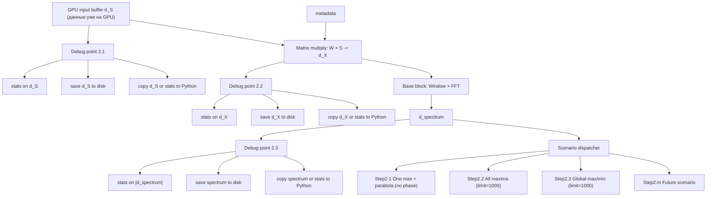
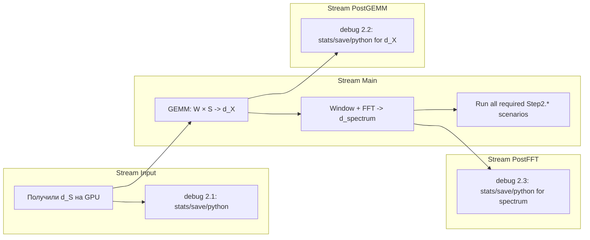
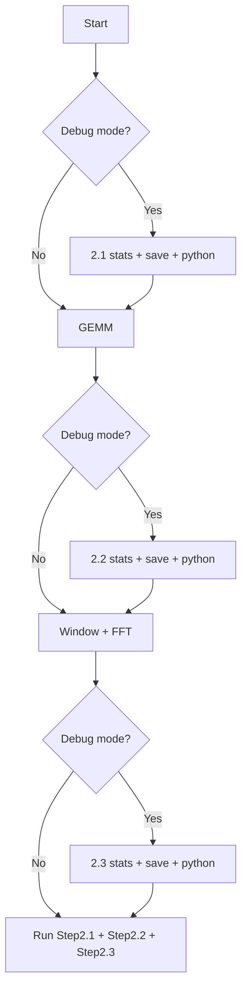

# Strategies: Test Architecture и ответы на вопросы

> Скопировано из плана Cursor. Дата: 2026-03-07
> ROCm-only, AMD 9070 / MI100, rocm 7.2 / 7.5

---

## 1. Точка передачи данных GPU → CPU для Python

**Вопрос**: "Данные лежат на GPU, передаём метаданные. В нашем блоке должны получить данные и передать на CPU Python для контроля. Где эта точка?"

**Ответ**: Точка — это **граница каждого Step** в пошаговом API. После выполнения шага вызывается `hipMemcpyDtoH` (Device-to-Host), результат возвращается в Python.

**Реализация**: Каждый метод `step_N_*()` в `AntennaProcessorTest` по завершении GPU-работы делает `hipMemcpyDtoH` для нужного буфера и возвращает `py::array_t` (или `std::vector`) в Python. Для `5×8000` размер всё ещё малый и удобный для debug-копирования.

---

## 2. Базовый вычислительный блок и post-FFT сценарии

**Зафиксированная архитектура**:

- `Window + FFT` — это **один общий reusable блок**
- после него на одном `d_spectrum` запускаются **все 3 обязательных сценария по ТЗ**
- post-FFT статистика считается отдельно по `|spectrum|` и относится к debug/analysis pipeline
- новые post-FFT решения добавляются в профильные модули:
  - спектральный поиск → `modules/fft_maxima/`
  - статистика → `modules/statistics/`

**Итоговая схема шагов**:

| Step | Название | Kernel/API |
| ---- | -------- | ---------- |
| 0 | Input on GPU | `d_S` уже лежит на GPU, в модуль передаются pointer + metadata |
| 1 | Debug point `2.1` | stats/save/python по `d_S` |
| 2 | GEMM | `hipblasCgemm`, `X = W × S` |
| 3 | Debug point `2.2` | stats/save/python по `d_X` |
| 4 | Base block | `Window + FFT` |
| 5 | Debug point `2.3` | stats/save/python по `|d_spectrum|` |
| 6.1 | Scenario 1 | `OneMax + 3-point parabola`, ROCm-only, без фазы |
| 6.2 | Scenario 2 | `AllMaxima`, лимит по умолчанию `1000` |
| 6.3 | Scenario 3 | `GlobalMinMax`, лимит по умолчанию `1000`, рабочий случай обычно `<= 20` |

**Ключевой вывод по времени**:

- делать `Window + FFT` **один раз**
- затем запускать все 3 post-FFT сценария на одном `d_spectrum`
- это быстрее, чем трижды повторять `Window + FFT` для каждого сценария отдельно

---

## 3. antenna_processor_pipeline.md — лишний?

**Ответ**: Да, в текущем виде — **лишний** в `Doc/Modules/strategies/`.

**Рекомендация**: Перенести в `Doc_Addition/PLAN/` с пометкой "Alternative design (element-wise weights)" — как исторический референс.

---

## 4. AntennaProcessorTest: наследование от AntennaProcessor_v1

```
AntennaProcessor (abstract)
    └── AntennaProcessor_v1 (concrete, production)
            └── AntennaProcessorTest (concrete, testing)
```

`AntennaProcessorTest` наследует `AntennaProcessor_v1`, добавляет `step_0_load_data()`, `step_1_stats_pre()`, ... — вызывает protected методы родителя: `do_dma()`, `do_stats_pre()`, `do_gemm()`, `do_stats_post_hamming()`, `do_fft()`, `do_fold()`, `do_branch()`.

---

## 5. Генерация тестовых данных: FormSignalGeneratorROCm

**FormParams** для `5 × 8000`, линейная задержка:

```cpp
FormParams p;
p.antennas = 5;
p.points = 8000;
p.fs = 12.0e6;
p.f0 = 2.0e6;
p.amplitude = 1.0;
p.noise_amplitude = 0.0;
p.tau_base = 0.0;
p.tau_step = 100e-6;   // 100 us на антенну: 0, 100, 200, 300, 400 us
```

**Проверка `tau_step`**:

- длительность сигнала: `T = 8000 / 12e6 = 666.7 us`
- задержки: `0, 100, 200, 300, 400 us`
- все задержки укладываются в длительность сигнала

**Вывод**: `tau_step = 100e-6` подходит.

---

## 6. Матрица W[N_ant × N_ant] для 5×5

**Зафиксированный вариант**: **Delay-and-sum**.

Матрица должна формироваться **автоматически**, исходя из параметров сигнала и геометрии теста, и иметь два режима подачи:

### C++

- `AutoGenerateDelayAndSumWeights(signal_params, array_params)`
- `LoadExternalWeights(std::vector<std::vector<std::complex<float>>>)`

### Python

- `generate_delay_and_sum_weights(...)`
- `set_external_weights(np.ndarray | list[list[complex]])`

### Формула

```cpp
W[beam][ant] = exp(-j * 2*pi * f0 * tau_ant) / sqrt(N_ant)
```

где `tau_ant` вычисляется автоматически из известных параметров сигнала / решётки.

---

## 7. Ограничения

- ROCm only: все kernel — `.hip`, hipBLAS, hipFFT
- AMD 9070 / MI100, rocm 7.2, 7.5
- Переиспользование: FormSignalGeneratorROCm, StatisticsProcessor, FFTProcessor, fft_maxima
- Минимум сущностей: не вводить новые модули

---

## 8. Итоговая схема Step

```
FormSignalGeneratorROCm (5 ant, 8000 pts, fs=12e6, f0=2e6, tau_step=100us) → d_S
GenerateDelayAndSumWeights(5×5) → d_W

AntennaProcessorTest:
  step_0: metadata
  step_1: pre_stats → CPU
  step_2: gemm → get_X_host()
  step_3: post_stats → CPU
  step_4: window + fft → get_spectrum_host()
  step_5: post_fft_stats(|spectrum|) → CPU
  step_6_1: one_max + parabola (без фазы)
  step_6_2: all_maxima
  step_6_3: global_minmax

Python: np.allclose(gpu, ref) на каждом шаге
```

---

## 9. Обновлённая диаграмма для обсуждения

Новая договорённость:

- базовый вычислительный блок: `Window + FFT`
- после него **всегда доступны все 3 post-FFT сценария**
- в `debug`-режиме считаем все статистики, сохраняем данные и передаём их в Python
- статистики считаются в трёх точках:
  - `2.1` после получения данных
  - `2.2` после умножения на матрицу
  - `2.3` после `Window + FFT` по `|spectrum|`

### 9.1. Общая схема обработки



### 9.2. Схема потоков



### 9.3. Production и Debug режимы



### 9.4. Что закладываем в план сейчас

- `Window + FFT` — общий базовый этап
- `Step2.1/2.2/2.3` — обязательные post-FFT сценарии
- `Step2.1` и `Step2.2` реализуются в `modules/fft_maxima/`
- post-FFT статистика по `|spectrum|` реализуется в `modules/statistics/`
- `strategies` только оркестрирует: `d_S -> d_X -> d_spectrum -> consumers`
- копирование в Python делаем через `hipMemcpyDtoH` на границе нужного debug-step
