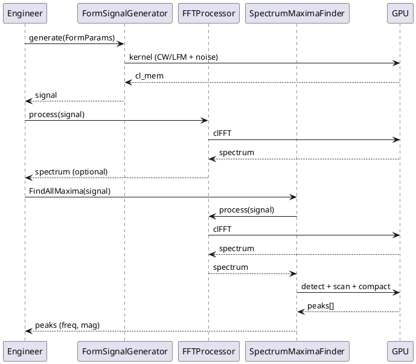
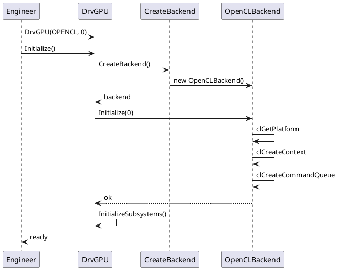

# GPUWorkLib — C4 Model (полный проект)

> **Дата**: 2026-02-23  
> **Источник**: По образцу [Disane C4.md](Disane%20C4.md), [DrvGPU_Design_C4.md](DrvGPU_Design_C4.md)  
> **Референс**: [c4model.com](https://c4model.com)

**Содержание**: C1–C4 | **DFD** (потоки данных) | **Seq** (диаграммы последовательности)

---

## C1: Context (Системный контекст)

**Система GPUWorkLib** — библиотека GPU-вычислений для ЦОС (FFT, фильтры, генерация сигналов, stretch-processing).

```
                    ┌─────────────────────────────────────────────────────────┐
                    │                                                         │
  Engineer ────────►│              GPUWorkLib System                           │
  (C++/Python)      │  ЦОС на GPU: FFT, фильтры, генераторы, гетеродин,       │
                    │  LCH Farrow, поиск максимумов спектра                    │
                    │                                                         │
                    └──────────────┬──────────────────────┬───────────────────┘
                                   │                      │
                                   ▼                      ▼
                    ┌──────────────────────┐   ┌──────────────────────┐
                    │   GPU Hardware       │   │   Внешние ресурсы     │
                    │   (AMD/NVIDIA/Intel) │   │   configGPU.json      │
                    │   OpenCL / ROCm     │   │   Logs/DRVGPU_XX/      │
                    └─────────────────────┘   │   Results/Plots/      │
                                              └───────────────────────┘
```

| Актор / Система | Описание |
|-----------------|----------|
| **Engineer** | Разработчик или инженер — использует C++ приложение или Python-скрипт |
| **GPUWorkLib System** | Принимает данные, выполняет ЦОС на GPU, возвращает результаты |
| **GPU Hardware** | AMD/NVIDIA/Intel через OpenCL, ROCm (HIP) |
| **configGPU.json** | Конфигурация GPU, выбор устройств |
| **Logs/** | Per-GPU логи (plog) |
| **Results/** | Графики, JSON, отчёты профилирования |

---

## C2: Containers (Контейнеры)

Внутри GPUWorkLib System:

```
┌─────────────────────────────────────────────────────────────────────────────────┐
│                        GPUWorkLib System                                         │
├─────────────────────────────────────────────────────────────────────────────────┤
│                                                                                  │
│  ┌──────────────────┐  ┌──────────────────┐  ┌──────────────────┐             │
│  │   DrvGPU Core    │  │ Compute Modules  │  │  Python Bindings  │             │
│  │   (C++ lib)      │  │   (C++ libs)     │  │   (pybind11)      │             │
│  │                  │  │                  │  │                   │             │
│  │ Backend, Memory, │  │ SignalGen, FFT, │  │ gpuworklib.pyd    │             │
│  │ GPUManager,      │  │ Filters, LchFar, │  │ GPUContext,       │             │
│  │ Services         │  │ Heterodyne,     │  │ SignalGenerator,  │             │
│  │                  │  │ SpectrumMaxima   │  │ FFTProcessor...   │             │
│  └────────┬─────────┘  └────────┬─────────┘  └────────┬──────────┘             │
│           │                     │                      │                         │
│           └─────────────────────┼──────────────────────┘                         │
│                                 │                                               │
│  ┌──────────────────────────────┴──────────────────────────────────────────┐    │
│  │                    Main Application (C++ exe)                           │    │
│  │  Точка входа, тесты (all_test.hpp), примеры, бенчмарки                  │    │
│  └─────────────────────────────────────────────────────────────────────────┘    │
│                                                                                  │
└─────────────────────────────────────────────────────────────────────────────────┘
```

| Контейнер | Технология | Назначение |
|-----------|------------|------------|
| **DrvGPU Core** | C++ | Драйвер GPU, бэкенды (OpenCL/ROCm), память, очереди, GPUManager, сервисы |
| **Compute Modules** | C++ | Signal Generators, FFT Processor, FFT Maxima, Filters, LchFarrow, Heterodyne, Statistics |
| **Python Bindings** | pybind11 | Python API (gpuworklib) — GPUContext, SignalGenerator, FFTProcessor, FirFilter и др. |
| **Main Application** | C++ exe | Точка входа, вызов тестов, примеры |

---

## C3: Components (Компоненты по контейнерам)

### 3.1 DrvGPU Core

| Компонент | Файлы | Назначение |
|-----------|-------|------------|
| **DrvGPU** | drv_gpu.hpp/cpp | Фасад, единая точка входа |
| **GPUManager** | gpu_manager.hpp | Multi-GPU, балансировка нагрузки |
| **Backend Layer** | IBackend, OpenCLBackend, ROCmBackend | Абстракция GPU API (Bridge) |
| **MemoryManager** | memory_manager.hpp/cpp | GPUBuffer, SVMBuffer |
| **ModuleRegistry** | module_registry.hpp/cpp | Регистр compute-модулей |
| **Services** | GPUProfiler, BatchManager, KernelCacheService, FilterConfigService | Профилирование, batch, кеш ядер |
| **Logger** | logger.hpp, config_logger | plog, per-GPU логи |

### 3.2 Compute Modules

| Модуль | Основные классы | Назначение |
|--------|-----------------|------------|
| **signal_generators** | SignalGenerator, FormSignalGenerator, ScriptGenerator, DelayedFormSignalGenerator | CW, LFM, Noise, Script, FormSignal (getX), дробная задержка |
| **fft_processor** | FFTProcessor | FFT/IFFT (clFFT), режимы Complex/MagPhase |
| **fft_maxima** | SpectrumMaximaFinder, AllMaximaPipeline | Поиск 1/2/всех максимумов спектра |
| **filters** | FirFilter, IirFilter | FIR (direct-form), IIR (biquad cascade) |
| **lch_farrow** | LchFarrow | Дробная задержка (Lagrange 48×5) |
| **heterodyne** | HeterodyneDechirp | Stretch-processing ЛЧМ-радара |
| **statistics** | StatisticsProcessor | mean, median, variance, std (planned) |

### 3.3 Python Bindings

| Компонент | Класс Python | C++ источник |
|-----------|--------------|--------------|
| **Context** | GPUContext | DrvGPU |
| **Signal** | SignalGenerator, FormSignalGenerator, ScriptGenerator | signal_generators |
| **FFT** | FFTProcessor | fft_processor |
| **Spectrum** | SpectrumMaximaFinder | fft_maxima |
| **Filters** | FirFilter, IirFilter | filters |
| **LCH** | LchFarrow | lch_farrow |
| **Heterodyne** | HeterodyneDechirp | heterodyne |

### 3.4 Main Application

| Компонент | Файлы | Назначение |
|-----------|-------|------------|
| **main** | src/main.cpp | Точка входа |
| **Tests** | modules/*/tests/all_test.hpp | C++ тесты модулей |
| **Python Tests** | Python_test/test_*.py | тесты |

---

## C4: Code (Уровень кода — ключевые примеры)

### 4.1 DrvGPU (фасад)

См. [DrvGPU_Design_C4.md](DrvGPU_Design_C4.md) — полная C4 для DrvGPU.

### 4.2 Pipeline: Signal → FFT → Maxima

```
Caller     FormSignalGenerator    FFTProcessor    SpectrumMaximaFinder
  │                 │                   │                    │
  │──generate()────►│                   │                    │
  │                 │──GPU kernel──────►│                    │
  │                 │◄──cl_mem──────────│                    │
  │◄────────────────│                   │                    │
  │                 │                   │                    │
  │──process()─────────────────────────►│                    │
  │                 │                   │──clFFT────────────►│
  │                 │                   │◄───────────────────│
  │                 │                   │──FindAllMaxima()──►│
  │                 │                   │◄───────────────────│
  │◄────────────────────────────────────────────────────────│
```

### 4.3 HeterodyneDechirp (C4)

```cpp
class HeterodyneDechirp {
public:
    HeterodyneResult process(const InputData& input);
    // Вход: complex<float>[antennas × samples]
    // Выход: f_beat, R (дальность), SNR per antenna

private:
    void dechirp_multiply();   // s_rx × conj(s_tx) → GPU kernel
    void dechirp_correct();    // коррекция фазы
    // Использует: LfmConjugateGenerator, SpectrumMaximaFinder (FFT + peak)
};

struct HeterodyneResult {
    std::vector<float> f_beat;
    std::vector<float> range_m;
    std::vector<float> snr_db;
};
```

### 4.4 FirFilter (C4)

```cpp
class FirFilter {
public:
    void set_coefficients(const std::vector<float>& h);
    void process(const GPUBuffer& input, GPUBuffer& output);
    // Direct-form convolution, 2D NDRange (channels × samples)

private:
    // Kernel: fir_direct.cl
    // Параллелизм: (num_channels, num_samples)
};
```

### 4.5 LchFarrow (C4)

```cpp
class LchFarrow {
public:
    void process(const GPUBuffer& input, const std::vector<float>& delays_us, GPUBuffer& output);
    // Lagrange 48×5, задержки в микросекундах per-antenna

private:
    // Таблица коэффициентов 48×5 (предвычислена)
    // Kernel: lch_farrow.cl
};
```

### 4.6 Зависимости модулей (C4)

```
                    DrvGPU (IBackend*)
                           │
    ┌──────────────────────┼──────────────────────┐
    │                      │                      │
    ▼                      ▼                      ▼
signal_generators    fft_processor          filters
    │                      │                      │
    │                      │                      │
    └──────────┬───────────┘                      │
               │                                  │
               ▼                                  │
         fft_maxima (SpectrumMaximaFinder)        │
               │                                  │
               └──────────────┬───────────────────┘
                              │
                              ▼
                        heterodyne
                    (LfmConjugateGenerator +
                     SpectrumMaximaFinder)
```

---

## DFD: Data Flow Diagrams (Диаграммы потоков данных)

### DFD Level 0 — Контекст системы

```
                    ┌─────────────────────────────────────────────────────────────┐
                    │                    GPUWorkLib System                         │
                    │                                                              │
  FormParams ──────►│                                                              │
  (freq, fs, ...)   │   ┌─────────────┐    complex[]    ┌─────────────┐           │
                    │   │  SignalGen  │────────────────►│  FFT /      │           │
  Coefficients ─────►│   │  FormSignal │                 │  Filters    │           │
  (h[], SOS)        │   └─────────────┘                 │  Heterodyne  │           │
                    │          │                        └──────┬──────┘           │
  configGPU.json ──►│          │ complex[]                   │                   │
                    │          ▼                             │ spectrum, peaks   │
                    │   ┌─────────────┐                      │                   │
                    │   │  LchFarrow   │─────────────────────►│ Results           │
                    │   │  (delays)   │                      │ (f_beat, R, SNR)   │
                    │   └─────────────┘                      └─────────┬─────────┘
                    │                                                  │
                    └──────────────────────────────────────────────────┼──────────┘
                                                                       │
                                                                       ▼
                                                              Engineer (numpy, plots)
```

### DFD Level 1 — Основные процессы и хранилища

```
  ┌──────────────┐
  │ configGPU    │
  │ .json       │
  └──────┬───────┘
         │ config
         ▼
┌────────────────┐     cl_mem / GPUBuffer     ┌────────────────┐
│ 1.0 DrvGPU     │◄──────────────────────────│ 2.0 SignalGen  │
│ Initialize     │                           │ (FormParams)   │
│ (Backend, Mem)  │──────────────────────────►│                │
└────────┬───────┘     IBackend*              └───────┬────────┘
         │                                             │ complex[]
         │                                             ▼
         │                                    ┌────────────────┐
         │                                    │ 3.0 LchFarrow  │
         │                                    │ (delays_us)    │
         │                                    └───────┬────────┘
         │                                            │ delayed[]
         │                                            ▼
         │     coefficients                    ┌────────────────┐
         │◄───────────────────────────────────│ 4.0 Filters    │
         │                                    │ (Fir/Iir)      │
         │                                    └───────┬────────┘
         │                                            │ filtered[]
         │                                            ▼
         │                                    ┌────────────────┐
         │                                    │ 5.0 FFT        │
         │                                    │ (clFFT)        │
         │                                    └───────┬────────┘
         │                                            │ spectrum[]
         │                                            ▼
         │                                    ┌────────────────┐
         │                                    │ 6.0 Spectrum   │
         │                                    │ MaximaFinder   │
         │                                    └───────┬────────┘
         │                                            │ peaks[]
         │                                            ▼
         │                                    ┌────────────────┐
         │                                    │ D1 Results     │
         │                                    │ (freq, R, SNR) │
         └───────────────────────────────────►└────────────────┘
```

### DFD Level 2 — Pipeline Heterodyne (stretch-processing)

```
  s_rx[antennas×samples]     HeterodyneParams
         │                            │
         ▼                            ▼
┌─────────────────┐          ┌─────────────────┐
│ P1 LfmConjugate │          │ ref chirp       │
│ Generator       │◄─────────│ (f0, B, T)      │
└────────┬────────┘          └─────────────────┘
         │ s_tx_conj[]
         ▼
┌─────────────────┐
│ P2 dechirp_     │  s_rx × conj(s_tx) → s_beat
│ multiply kernel │
└────────┬────────┘
         │ s_beat[]
         ▼
┌─────────────────┐
│ P3 FFT          │  clFFT
│ (SpectrumMaxima)│
└────────┬────────┘
         │ spectrum[]
         ▼
┌─────────────────┐
│ P4 FindPeak     │  parabolic interpolation
│ (f_beat, mag)   │
└────────┬────────┘
         │ f_beat, magnitude
         ▼
┌─────────────────┐
│ P5 RangeCalc    │  R = c·T·f_beat / (2·B)
│ (HeterodyneResult)│
└────────┬────────┘
         │
         ▼
  HeterodyneResult { f_beat[], range_m[], snr_db[] }
```

### DFD Level 2 — Pipeline Filter (FIR)

```
  coefficients h[]          input[channels×samples]
         │                            │
         ▼                            ▼
┌─────────────────┐          ┌─────────────────┐
│ D1 Host         │          │ D2 GPU Buffer    │
│ (scipy/JSON)    │──Memcpy──►│ (cl_mem)        │
└─────────────────┘          └────────┬────────┘
                                       │
                                       ▼
                              ┌─────────────────┐
                              │ P1 fir_direct   │
                              │ kernel         │
                              │ 2D NDRange     │
                              └────────┬────────┘
                                       │
                                       ▼
                              ┌─────────────────┐
                              │ D3 Output       │
                              │ filtered[]      │
                              └─────────────────┘
```

---

## Seq: Sequence Diagrams (Диаграммы последовательности)

### Seq-1: DrvGPU::Initialize()

```
Engineer       main.cpp        DrvGPU         CreateBackend()    OpenCLBackend
   │               │               │                 │                  │
   │──new DrvGPU──►│               │                 │                  │
   │               │──Initialize()►│                 │                  │
   │               │               │──CreateBackend()►│                  │
   │               │               │                 │──new OpenCL───►  │
   │               │               │                 │◄─────────────────│
   │               │               │                 │                  │
   │               │               │──Initialize(0)────────────────────►│
   │               │               │                 │  clGetPlatform   │
   │               │               │                 │  clCreateContext │
   │               │               │                 │  clCreateQueue   │
   │               │               │◄────────────────────────────────────│
   │               │               │──InitializeSubsystems()            │
   │               │               │  (MemoryManager, ModuleRegistry)    │
   │               │               │                                    │
   │               │◄──────────────│                                    │
   │◄──────────────│               │                                    │
```

### Seq-2: GPUManager Multi-GPU (Round-Robin)

```
Engineer       GPUManager      DrvGPU[0]     DrvGPU[1]     GPU Hardware
   │               │               │               │               │
   │──InitializeAll│               │               │               │
   │   (OPENCL)   ►│               │               │               │
   │               │──DiscoverGPUs()──────────────►│               │
   │               │               │  OpenCLCore   │               │
   │               │──InitializeGPU(0)────────────►│               │
   │               │               │  clCreateContext              │
   │               │──InitializeGPU(1)────────────────────────────►│
   │               │               │               │  clCreateContext
   │               │◄──────────────│               │               │
   │               │               │               │               │
   │──GetNextGPU()►│               │               │               │
   │               │──round_robin++►│               │               │
   │               │──return &gpus_[0]►│           │               │
   │◄──────────────│               │               │               │
   │──GetNextGPU()►│               │               │               │
   │               │──return &gpus_[1]────────────────────────────►│
   │◄──────────────│               │               │               │
```

### Seq-3: HeterodyneDechirp::process()

```
Caller      HeterodyneDechirp   LfmConjugateGen   SpectrumMaximaFinder   GPU
   │               │                   │                    │
   │──process()────►│                   │                    │
   │               │──generate_ref()───►│                    │
   │               │                   │──kernel────────────►│
   │               │◄──s_tx_conj───────│                    │
   │               │                   │                    │
   │               │──dechirp_multiply()────────────────────►│
   │               │   s_rx × conj(s_tx)                     │
   │               │◄───────────────────────────────────────│
   │               │                   │                    │
   │               │──process()────────────────────────────►│
   │               │                   │                    │
   │               │                   │  FFT + FindPeak     │
   │               │◄──f_beat, mag──────────────────────────│
   │               │                   │                    │
   │               │──compute_range()  │                    │
   │               │   R = c·T·f/(2B)  │                    │
   │               │                   │                    │
   │◄──HeterodyneResult────────────────│                    │
```

### Seq-4: Python API — генерация и FFT

```
Python      GPUContext       SignalGenerator    FFTProcessor
  │               │                   │               │
  │──GPUContext()►│                   │               │
  │               │──DrvGPU(OPENCL,0) │               │
  │               │──Initialize()     │               │
  │◄──────────────│                   │               │
  │               │                   │               │
  │──SignalGenerator(ctx)─────────────►│               │
  │               │──DrvGPU&          │               │
  │◄──────────────│                   │               │
  │               │                   │               │
  │──generate_lfm()───────────────────►│               │
  │               │                   │──kernel       │
  │◄──numpy array─────────────────────│               │
  │               │                   │               │
  │──FFTProcessor(ctx)────────────────────────────────►│
  │◄──────────────────────────────────────────────────│
  │               │                   │               │
  │──process(data)───────────────────────────────────►│
  │               │                   │  clFFT        │
  │◄──spectrum────────────────────────────────────────│
```

### PlantUML: Sequence — Signal → FFT → Maxima



### PlantUML: Sequence — DrvGPU Init



---

## Связь уровней C1–C4

| Уровень | Объект |
|---------|--------|
| **C1** | GPUWorkLib System — ЦОС на GPU для Engineer |
| **C2** | DrvGPU Core, Compute Modules, Python Bindings, Main App |
| **C3** | DrvGPU, GPUManager, SignalGenerator, FFTProcessor, FirFilter, HeterodyneDechirp и др. |
| **C4** | Классы, методы, kernel pipelines |
| **DFD** | Потоки данных: Level 0 (контекст), Level 1 (процессы), Level 2 (Heterodyne, Filter) |
| **Seq** | DrvGPU Init, GPUManager Multi-GPU, Heterodyne, Python API, Signal→FFT→Maxima |

---

## PlantUML: C2 Containers

```plantuml
@startuml GPUWorkLib_C2
!include https://raw.githubusercontent.com/plantuml-stdlib/C4-PlantUML/master/C4_Context.puml
!include https://raw.githubusercontent.com/plantuml-stdlib/C4-PlantUML/master/C4_Container.puml

Person(engineer, "Engineer", "C++/Python developer")
System_Boundary(gpuworklib, "GPUWorkLib System") {
    Container(drvgpu, "DrvGPU Core", "C++", "Backend, Memory, GPUManager")
    Container(modules, "Compute Modules", "C++", "SignalGen, FFT, Filters, Heterodyne, LchFarrow")
    Container(python, "Python Bindings", "pybind11", "gpuworklib")
    Container(main, "Main Application", "C++ exe", "Tests, Examples")
}
System_Ext(gpu, "GPU Hardware", "AMD/NVIDIA/Intel")
System_Ext(config, "configGPU.json", "Config")

Rel(engineer, drvgpu, "Uses")
Rel(engineer, modules, "Uses")
Rel(engineer, python, "Uses")
Rel(engineer, main, "Runs")
Rel(drvgpu, gpu, "Runs on")
Rel(modules, drvgpu, "IBackend*")
Rel(python, drvgpu, "GPUContext")
Rel(python, modules, "Wraps")
Rel(main, drvgpu, "Uses")
Rel(main, modules, "Tests")
Rel(drvgpu, config, "Reads")
@enduml
```

---

## Ссылки

- [MemoryBank/MASTER_INDEX.md](../MemoryBank/MASTER_INDEX.md) — индекс проекта
- [Doc/DrvGPU/Architecture.md](../Doc/DrvGPU/Architecture.md) — архитектура DrvGPU
- [DrvGPU_Design_C4.md](DrvGPU_Design_C4.md) — C4 только для DrvGPU
- [Disane C4.md](Disane%20C4.md) — исходный пример C4
- [c4model.com](https://c4model.com) — C4 Model
