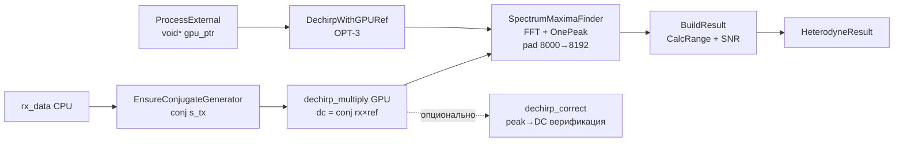

# Heterodyne — Полная документация

> Stretch-processing (дечирп) ЛЧМ-радара на GPU

**Namespace**: `drv_gpu_lib`
**Каталог**: `modules/heterodyne/`
**Зависимости**: DrvGPU (`IBackend*`), signal_generators (LfmConjugateGenerator), fft_maxima (SpectrumMaximaFinder), OpenCL / ROCm (HIP)

---

## Содержание

1. [Обзор и назначение](#1-обзор-и-назначение)
2. [Зачем нужен дечирп в ЛЧМ-радаре](#2-зачем-нужен-дечирп)
3. [Математика алгоритма](#3-математика-алгоритма)
4. [Пошаговый pipeline](#4-пошаговый-pipeline)
5. [Kernels (dechirp_multiply, dechirp_correct)](#5-kernels)
6. [C4 Диаграммы](#6-c4-диаграммы)
7. [API (C++ и Python)](#7-api)
8. [Тесты — что читать и где смотреть](#8-тесты)
9. [Бенчмарки](#9-бенчмарки)
10. [Ссылки и файловое дерево](#10-ссылки)

---

## 1. Обзор и назначение

HeterodyneDechirp — процессор **stretch-processing** для ЛЧМ-радара. Принимает комплексный сигнал с антенн, умножает на сопряжённый опорный ЛЧМ, находит частоту биений и вычисляет дальность.

**Метод**: умножение s_rx × conj(s_tx) превращает квадратичную фазу чирпа в линейную (чистый тон). Частота тона пропорциональна дальности.

**Вход**: плоский вектор `complex<float>[num_antennas × num_samples]` — принятый сигнал с антенн.
**Выход**: `HeterodyneResult` — f_beat, дальность R, SNR по каждой антенне.

**Реализации**:
- `HeterodyneProcessorOpenCL` — OpenCL backend (Windows + Linux)
- `HeterodyneProcessorROCm` — ROCm/HIP backend (Linux + AMD GPU, `ENABLE_ROCM=1`)
- `HeterodyneDechirp` — фасад, автоматически выбирает backend по `BackendType`

**Python классы**:
- `gpuworklib.HeterodyneDechirp` — полный пайплайн (OpenCL или ROCm), возвращает f_beat + range
- `gpuworklib.HeterodyneROCm` — низкоуровневый ROCm-only: `dechirp()` + `correct()` без FFT

---

## 2. Зачем нужен дечирп

### Проблема: дальность закодирована в задержке

Принятый сигнал — задержанная копия передающего ЛЧМ:

$$
s_{rx}(t) = A \cdot \exp\!\Big(j\big[\pi \mu (t-\tau)^2 + 2\pi f_0(t-\tau)\big]\Big) + n(t)
$$

где τ = 2R/c — задержка, μ = B/T — скорость перестройки частоты.

**Прямое измерение τ** требует очень высокой частоты дискретизации. При fs = 12 МГц один сэмпл ≈ 83 нс → грубое разрешение по дальности.

### Решение: stretch-processing

Умножение на сопряжённый опорный ЛЧМ **сокращает квадратичную фазу**:

$$
s_{dc}(t) = s_{rx}(t) \cdot s_{tx}^*(t) = A \cdot \exp\!\Big(j\big[-2\pi \mu \tau \cdot t + \text{const}\big]\Big)
$$

Остаётся **чистый тон** с частотой:

$$
f_{beat} = \mu \cdot \tau = \frac{B}{T} \cdot \frac{2R}{c}
$$

Дальность:

$$
R = \frac{c \cdot T \cdot f_{beat}}{2 \cdot B}
$$

FFT даёт f_beat с разрешением fs/N — при N=8000 и fs=12 МГц это ≈1500 Гц на бин. Для B=2 МГц и T=666.67 мкс разрешение по дальности ≈ 50 м (1 бин ≈ 50 м).

---

## 3. Математика алгоритма

### Опорный сигнал (conj(s_tx))

Передающий ЛЧМ:

$$
s_{tx}(t) = \exp\!\Big(j\big[\pi \mu t^2 + 2\pi f_0 t\big]\Big)
$$

Сопряжённый (ref):

$$
\text{ref}(t) = s_{tx}^*(t) = \exp\!\Big(-j\big[\pi \mu t^2 + 2\pi f_0 t\big]\Big)
$$

Генерируется `LfmConjugateGenerator` (OpenCL) или CPU-функцией `GenerateConjugateLfmCpu()` (ROCm fallback) — один вектор на N точек, общий для всех антенн.

### Дечирп: conj(rx × ref)

В реализации используется **conj от произведения** (не просто rx × ref):

$$
\text{dc} = \text{conj}(s_{rx} \cdot s_{tx}^*) = \text{conj}(s_{rx}) \cdot s_{tx}
$$

**Зачем conj?** Прямое s_rx × conj(s_tx) даёт тон на **отрицательной** частоте −μτ. Conj от результата даёт **положительную** f_beat = +μτ. Это нужно, чтобы:
- пик FFT был в нижней половине спектра [0, N/2);
- коррекция exp(−j·2π·f·t) в `dechirp_correct` корректно сдвигала к DC.

### Формула дальности

$$
R = \frac{c \cdot T \cdot f_{beat}}{2 \cdot B}
$$

где c = 3×10⁸ м/с, T = N/fs, B = f_end − f_start.

Реализовано в `HeterodyneResult::CalcRange()`:
```cpp
float T = num_samples / sample_rate;
return (3e8f * T * f_beat) / (2.0f * bandwidth);
```

### SNR

$$
\text{SNR}_{dB} = 20 \cdot \log_{10}\frac{\text{peak}}{\text{noise\_est}}
$$

noise_est — среднее амплитуд соседних бинов (left + right) / 2.

### Производные параметры (HeterodyneParams)

```
T         = num_samples / sample_rate      // длительность чирпа [с]
mu        = (f_end - f_start) / T         // chirp rate [Гц/с]
bin_width = sample_rate / num_samples     // [Гц/бин]
```

### Ожидаемые f_beat для типовых параметров

(fs=12 МГц, B=2 МГц, N=8000, T=666.67 мкс, μ=3·10⁹ Гц/с)

| Антенна | Delay мкс | f_beat = μ·τ | Бин (N_FFT=8192) | R [м] |
|---------|-----------|-------------|-----------------|-------|
| 0 | 100 | 300 кГц | ~205 | 15 000 |
| 1 | 200 | 600 кГц | ~410 | 30 000 |
| 2 | 300 | 900 кГц | ~614 | 45 000 |
| 3 | 400 | 1200 кГц | ~819 | 60 000 |
| 4 | 500 | 1500 кГц | ~1024 | 75 000 |

> R = c·T·f_beat/(2·B). Bin = round(f_beat·N_FFT/fs).
> SpectrumMaximaFinder паддирует N=8000 до N_FFT=8192 (ближайшая степень 2).

---

## 4. Пошаговый pipeline

```
rx_data (CPU, flat complex<float>[antennas × N])
    │
    ▼
┌─────────────────────────────────────────────┐
│ 1. EnsureConjugateGenerator (OPT-4)        │  → ref = conj(s_tx), размер N
│    OpenCL: LfmConjugateGenerator            │    кешируется при SetParams
│    ROCm:   GenerateConjugateLfmCpu()        │    при изменении params пересчитывается
└─────────────────────────────────────────────┘
    │
    ▼
┌─────────────────────────────────────────────┐
│ 2. dechirp_multiply (GPU kernel)           │  dc = conj(rx[gid] × ref[n])
│    OpenCL: 1D kernel, global = ant×N        │  ref broadcast на все антенны
│    ROCm: 2D grid (blockX=samples/256,       │
│           blockY=antennas), OPT-7/8/9/10   │
└─────────────────────────────────────────────┘
    │
    ▼
┌─────────────────────────────────────────────┐
│ 3. SpectrumMaximaFinder (GPU)              │  FFT (clFFT/hipFFT) + OnePeak
│    fft_maxima модуль                        │  FFT pad: N=8000 → N_FFT=8192
│    search_range=5000 (half=2500)            │  параболическая интерполяция
│    OpenCL: FindOnePeak()                    │  → f_beat [Гц], bin, magnitude
│    ROCm: SpectrumProcessorFactory           │
└─────────────────────────────────────────────┘
    │
    ▼
┌─────────────────────────────────────────────┐
│ 4. BuildResult + CalcRange + SNR (CPU)     │  R = c·T·f_beat / (2·B)
│    HeterodyneResult построен здесь          │  SNR = 20·log10(peak/noise)
│                                             │  noise = avg(left_bin, right_bin)
└─────────────────────────────────────────────┘
    │
    ▼
HeterodyneResult {
  antennas[i].f_beat_hz
  antennas[i].f_beat_bin
  antennas[i].range_m
  antennas[i].peak_amplitude
  antennas[i].peak_snr_db
}
```

### Опциональный этап: dechirp_correct

Для верификации: умножение на exp(−j·2π·f_beat·t) сдвигает пик к DC. После FFT corrected-сигнала пик должен быть на bin 0. Используется в Test 3 (C++) и `correct()` метод в Python HeterodyneROCm.

### Диаграмма pipeline



---

## 5. Kernels

### dechirp_multiply.cl (OpenCL)

**Файл**: `kernels/opencl/dechirp_multiply.cl`
**Назначение**: dc_out = conj(rx × ref)

| Параметр | Тип | Описание |
|----------|-----|----------|
| rx | `__global float2*` | [antennas × N], принятый сигнал |
| ref | `__global float2*` | [N], conj(s_tx), broadcast на все антенны |
| dc_out | `__global float2*` | [antennas × N], результат дечирпа |
| num_samples | `int` | N точек на антенну |

**Launch**: 1D, global_size = antennas × N. `gid = get_global_id(0)`, `n = gid % num_samples`, `ant = gid / num_samples`.

```c
// conj(rx × ref)
dc_out[gid].x =  rx_v.x * re_v.x - rx_v.y * re_v.y;   // Re(rx*ref)
dc_out[gid].y = -(rx_v.x * re_v.y + rx_v.y * re_v.x); // -Im(rx*ref) = conj
```

Компилируется с флагом `-cl-fast-relaxed-math`.

### dechirp_correct.cl (OpenCL)

**Файл**: `kernels/opencl/dechirp_correct.cl`
**Назначение**: сдвиг спектра к DC — верификация корректности дечирпа.

| Параметр | Тип | Описание |
|----------|-----|----------|
| dc_in | `__global float2*` | дечирпнутый сигнал |
| phase_step | `__global float*` | [antennas], предвычислено на CPU: −2π·f_beat/fs (OPT-6) |
| corrected | `__global float2*` | output |
| num_samples | `int` | N |

```c
float phase = phase_step[ant] * (float)n;
corrected[gid] = dc_in[gid] * (native_cos(phase), native_sin(phase));
```

**Почему phase_step предвычислен на CPU (OPT-6)**: константа per-antenna, вычисляется один раз, передаётся в kernel — избегает дублирования вычислений на GPU.

### Ядро ROCm (hiprtc)

**Файл**: `include/kernels/heterodyne_kernels_rocm.hpp`
**Компиляция**: hiprtc runtime, результат кешируется как HSACO-бинарь на диске (`KernelCacheService`).

**OPT-7**: `__launch_bounds__(256)` — подсказка компилятору для регистрового планирования.
**OPT-8**: `aligned(8) float2_t` — векторный доступ, 64-битные загрузки.
**OPT-9**: `sincosf` вместо двух вызовов sin/cos.
**OPT-10**: один hiprtc модуль содержит оба ядра (dechirp_multiply + dechirp_correct) — единственная компиляция на старте.

**Launch ROCm** (2D grid):
```
grid_x  = (N + 255) / 256   // сэмплы
grid_y  = num_antennas       // антенны (одна строка на антенну)
block   = (256, 1, 1)
```

**Arch-specific**: при компиляции определяется архитектура (`hipGetDeviceProperties`). Для gfx9xx warp_size=64.

**Дисковый кеш HSACO** (`KernelCacheService`): загрузка кеша ~1-5 мс vs hiprtc компиляция ~200 мс. При первом запуске кеш создаётся автоматически.

---

## 6. C4 Диаграммы

### C1 — Контекст системы

```
┌──────────────────────────────────────────────────────────┐
│  ЛЧМ-радар / ФАР-система                                │
│                                                           │
│  ┌──────────────┐  flat complex[A×N]  ┌─────────────┐   │
│  │ Антенная     │ ──────────────────► │Heterodyne   │   │
│  │ решётка      │                     │Dechirp      │   │
│  └──────────────┘                     └──────┬──────┘   │
│                                              │           │
│                                    HeterodyneResult      │
│                                {f_beat, range, SNR}      │
└──────────────────────────────────────────────────────────┘
```

### C2 — Контейнеры

```
┌────────────────────────────────────────────────────────────┐
│  modules/heterodyne/                                       │
│                                                             │
│  ┌──────────────────────┐                                  │
│  │  HeterodyneDechirp   │ ← Facade                        │
│  │  heterodyne_dechirp  │   BackendType::OPENCL / ::ROCm  │
│  │  .hpp/.cpp           │                                  │
│  └───────────┬──────────┘                                  │
│              │ owns (unique_ptr<IHeterodyneProcessor>)     │
│     ┌────────┴────────┐                                    │
│     │                 │                                    │
│   [OpenCL]          [ROCm]                                 │
│   HeterodyneProc-   HeterodyneProc-                       │
│   essorOpenCL       essorROCm                             │
│   (.hpp/.cpp)       (.hpp/.cpp, ENABLE_ROCM=1)            │
│     │                 │                                    │
│  .cl files         heterodyne_kernels_rocm.hpp             │
│  (dechirp_         (hiprtc compiled,                      │
│  multiply.cl,      HSACO disk cache)                       │
│  dechirp_                                                  │
│  correct.cl)                                               │
│                                                             │
│  Зависимости:                                              │
│  ├── LfmConjugateGenerator (signal_generators) [OpenCL]   │
│  ├── GenerateConjugateLfmCpu() [ROCm — CPU fallback]      │
│  └── SpectrumMaximaFinder  (fft_maxima)                   │
└────────────────────────────────────────────────────────────┘
```

### C3 — Компоненты (Facade)

```
  HeterodyneDechirp
    ├── SetParams(HeterodyneParams)
    │     └── params_dirty_ = true → ref_dirty_ = true
    │
    ├── Process(flat complex[A×N]) → HeterodyneResult
    │     ├── EnsureConjugateGenerator()   [OPT-4: lazy-init, rebuild при изменении params]
    │     ├── processor_->Dechirp()        [дечирп kernel]
    │     ├── SpectrumMaximaFinder::Find() [FFT pad 8000→8192 + OnePeak, search_range=5000]
    │     └── BuildResult()               [R = c·T·f_beat/(2B), SNR по соседним бинам]
    │
    ├── ProcessExternal(void* gpu_ptr, params) → HeterodyneResult
    │     ├── OpenCL path: DechirpWithGPURef() [OPT-3: оба буфера уже на GPU]
    │     └── ROCm path:   DechirpFromGPU()    [rx на GPU, ref загружается]
    │
    └── GetLastResult() / GetParams()
```

### C4 — Kernel (dechirp_multiply)

```
  Thread: gid = [0 .. num_antennas * num_samples)
    ant = gid / num_samples
    n   = gid % num_samples
    │
    rx_v = rx[gid]      (принятый сигнал, антенна ant, сэмпл n)
    re_v = ref[n]       (conj(s_tx)[n], broadcast по антеннам)
    │
    dc.x =  rx_v.x * re_v.x - rx_v.y * re_v.y    // Re(rx*ref)
    dc.y = -(rx_v.x * re_v.y + rx_v.y * re_v.x)  // -Im = conj(rx*ref)
    │
    dc_out[gid] = dc
```

---

## 7. API

> Полный API-справочник: [API.md](API.md)

### C++ — фасад HeterodyneDechirp

```cpp
#include "heterodyne_dechirp.hpp"

// OpenCL (по умолчанию)
drv_gpu_lib::HeterodyneDechirp het(backend);

// ROCm (ENABLE_ROCM=1, Linux + AMD GPU)
drv_gpu_lib::HeterodyneDechirp het_rocm(backend, BackendType::ROCm);

// Параметры (реальные тестовые значения)
het.SetParams({
    .f_start      = 0.0f,
    .f_end        = 2e6f,      // B = 2 МГц
    .sample_rate  = 12e6f,     // fs = 12 МГц
    .num_samples  = 8000,      // N
    .num_antennas = 5
});

// Из CPU данных
std::vector<std::complex<float>> rx_data(5 * 8000);
auto result = het.Process(rx_data);   // rx_data: flat [antennas × N]

// Из внешнего GPU буфера (OPT-3: rx уже на GPU, без PCIe round-trip)
// Для OpenCL: передать cl_mem как void*
// Для ROCm: передать hipDeviceptr_t как void*
auto result = het.ProcessExternal(static_cast<void*>(cl_mem_ptr), params);
// NOT freed by HeterodyneDechirp

// Результат
if (result.success) {
    for (const auto& a : result.antennas) {
        // a.antenna_idx, a.f_beat_hz, a.f_beat_bin
        // a.range_m, a.peak_amplitude, a.peak_snr_db
    }
}
```

### Типы данных

```cpp
struct HeterodyneParams {
    float f_start      = 0.0f;    // Hz
    float f_end        = 2e6f;    // Hz  (B = f_end - f_start)
    float sample_rate  = 12e6f;   // Hz
    int   num_samples  = 8000;    // N
    int   num_antennas = 5;

    float GetBandwidth() const;   // f_end - f_start
    float GetDuration()  const;   // num_samples / sample_rate
    float GetChirpRate() const;   // (f_end - f_start) / GetDuration()
    float GetBinWidth()  const;   // sample_rate / num_samples
};

struct AntennaDechirpResult {
    int   antenna_idx;
    float f_beat_hz;        // частота биений [Гц]
    float f_beat_bin;       // бин (дробный, параболическая интерп.)
    float range_m;          // дальность [м]
    float peak_amplitude;
    float peak_snr_db;
};

struct HeterodyneResult {
    bool success;
    std::vector<AntennaDechirpResult> antennas;
    std::vector<float> max_positions;  // все найденные максимумы (контроль)
    std::string error_message;

    static float CalcRange(float f_beat, float fs, int N, float B);
};
```

### C++ — низкоуровневый HeterodyneProcessorOpenCL

Для прямого вызова без фасада (например, из тестов или benchmark):

```cpp
#include "processors/heterodyne_processor_opencl.hpp"

drv_gpu_lib::HeterodyneProcessorOpenCL proc(backend);

// Дечирп
auto dc = proc.Dechirp(rx_data, ref_data, params);

// Коррекция фазы (верификация: сдвинуть пик в DC)
std::vector<float> f_beats = {300e3f, 600e3f, ...};
auto corrected = proc.Correct(dc, f_beats, params);

// С профилированием
HeterodyneOCLProfEvents pe;
auto dc = proc.Dechirp(rx_data, ref_data, params, &pe);
// pe содержит cl_event для каждого этапа
```

### Python — HeterodyneDechirp (полный пайплайн)

```python
import gpuworklib
import numpy as np

# OpenCL
ctx = gpuworklib.GPUContext(0)
het = gpuworklib.HeterodyneDechirp(ctx)

# Параметры — позиционно: f_start, f_end, sample_rate, num_samples, num_antennas
het.set_params(0.0, 2e6, 12e6, 8000, 5)

# Генерация тестового сигнала
t = np.arange(8000) / 12e6
mu = 2e6 / (8000 / 12e6)     # 3e9 Hz/s
rx_flat = np.zeros(5 * 8000, dtype=np.complex64)
for ant in range(5):
    tau = (ant + 1) * 100e-6
    phase = 2 * np.pi * (0.5 * mu * (t - tau)**2)
    rx_flat[ant * 8000 : (ant + 1) * 8000] = np.exp(1j * phase).astype(np.complex64)

# Обработка
result = het.process(rx_flat)

# Результат — dict
assert result['success']
for ant in result['antennas']:
    print(f"Ant {ant['antenna_idx']}: "
          f"f_beat={ant['f_beat_hz']:.0f} Hz, "
          f"range={ant['range_m']:.1f} m, "
          f"SNR={ant['peak_snr_db']:.1f} dB")

# Получить обратно параметры
p = het.get_params()
print(p['bandwidth'], p['chirp_rate'])
```

### Python — HeterodyneROCm (низкоуровневый ROCm-only)

Возвращает только dc-сигнал (numpy), без FFT и без дальности. Для встраивания в собственный пайплайн.

```python
import gpuworklib
import numpy as np

ctx = gpuworklib.ROCmGPUContext(0)
het = gpuworklib.HeterodyneROCm(ctx)

het.set_params(
    f_start=0.0, f_end=2e6,
    sample_rate=12e6,
    num_samples=8000,
    num_antennas=5
)

rx  = np.random.randn(5 * 8000).astype(np.float32).view(np.complex64)
ref = np.random.randn(8000).astype(np.float32).view(np.complex64)

# Дечирп: conj(rx * ref)
dc = het.dechirp(rx, ref)   # → ndarray[complex64], shape (5*8000,)

# Коррекция фазы (сдвиг к DC)
f_beats = [300e3, 600e3, 900e3, 1200e3, 1500e3]
corrected = het.correct(dc, f_beats)   # → ndarray[complex64]

# Параметры
p = het.params   # dict: f_start, f_end, sample_rate, num_samples, num_antennas,
                 #       bandwidth, chirp_rate
```

---

## 8. Тесты — что читать и где смотреть

**Параметры всех тестов**:
```
fs        = 12 МГц
B         = 2 МГц (f_start=0, f_end=2e6)
N         = 8000 точек
T         = 666.67 мкс
mu        = 3e9 Гц/с
antennas  = 5
delays    = [100, 200, 300, 400, 500] мкс  (линейные)
tolerance = ±5 кГц (F_BEAT_TOL_HZ = 5000.f)
```

**Сигнал**: `LfmGeneratorAnalyticalDelay` — идеальная задержка без интерполяции, даёт точную f_beat = μ·τ. ROCm тесты используют CPU-генератор `GenerateRxFlatCPU`.

---

### C++ тесты — OpenCL

**Файлы**: `tests/test_heterodyne_basic.hpp` (тесты 1–3, 6), `tests/test_heterodyne_pipeline.hpp` (тесты 4, 5, 7)

| # | Функция | Входные данные | Ожидаемый результат | Что ловит | Порог |
|---|---------|----------------|---------------------|-----------|-------|
| 1 | `run_test_single_antenna` | LFM 1 антенна, delay=100 мкс | f_beat = 300 кГц | Базовую работу kernel на минимальном случае | ±5 кГц |
| 2 | `run_test_5_antennas_linear` | 5 антенн, delays=[100..500] мкс | f_beat=[300..1500] кГц | Broadcast ref на все антенны, изоляцию каналов | ±5 кГц |
| 3 | `run_test_correction` | dc-сигнал + f_beat → correct | Пик FFT на бинах 0..3 (≈DC) | Корректность phase_step=−2π·f_beat/fs, ошибку знака фазы | peak_bin ≤ 3 |
| 4 | `run_test_full_pipeline` | rx_data flat [5×8000] | f_beat + range для всех антенн | Интеграцию всех этапов (LfmConjGen + kernel + FFT + CalcRange) | ±5 кГц |
| 5 | `run_test_process_external` | rx как cl_mem (уже на GPU) | f_beat совпадает с Process(), cl_mem читаем после обработки | OPT-3: DechirpWithGPURef без PCIe round-trip; буфер НЕ освобождается фасадом | ±5 кГц |
| 6 | `run_test_random_delays` | 5 антенн, случайные задержки seed=42 | f_beat = μ·τ для каждой | Произвольные задержки, нет перекрёстного влияния каналов | ±5 кГц |
| 7 | `run_test_all_maxima` | rx_data → Process() + FindAllMaxima | Ближайший максимум из AllMaxima совпадает с Process() f_beat | Совместимость SpectrumMaximaFinder::FindAllMaxima с дечирпом | ±5 кГц |

**Почему delay=100 мкс для теста 1?**
- Даёт f_beat = μ·τ = 3·10⁹ · 100·10⁻⁶ = 300 кГц — легко проверить аналитически
- delay << T (666 мкс) — гарантированное перекрытие сигналов
- Бин ≈ 205 при N_FFT=8192 — хорошо видно без граничных эффектов

**Почему delays=[100..500] мкс линейные для теста 2?**
- Линейная прогрессия → линейные f_beat → легко автоматически проверить
- 5 антенн покрывают диапазон [300..1500] кГц — проверяет весь диапазон search_range=5000

**Почему порог ±5 кГц?**
- Разрешение SpectrumMaximaFinder: fs/N = 12МГц/8000 = 1500 Гц/бин
- Параболическая интерполяция даёт суб-бинную точность ≈ ±0.1 бина ≈ ±150 Гц
- Порог 5000 Гц = ±3.3 бина — защита от edge-кейсов при генерации сигнала

---

### C++ тесты — ROCm

**Файл**: `tests/test_heterodyne_rocm.hpp`
**Namespace**: `test_heterodyne_rocm`
**Платформа**: Linux + AMD GPU (`ENABLE_ROCM=1`). На Windows — compile-only (stub).

Сигналы генерируются на CPU (`GenerateRxFlatCPU`, `GenerateConjRefCPU`). Пиковая частота находится через `CpuFindPeakFrequency` (брутфорс DFT).

| # | Тест | Что проверяет | Порог |
|---|------|---------------|-------|
| 1 | Single antenna | Базовый HIP dechirp_multiply, delay=100 мкс → 300 кГц | ±5 кГц |
| 2 | RMS GPU vs CPU | RMS дечирпнутого сигнала на GPU равен CPU-эталону (`ref_dechirp`) | ATOL≈1e-4 |
| 3 | Dechirp correction | ROCm correct kernel: пик после коррекции → DC | peak_bin ≤ 3 |
| 4 | Full pipeline (Facade) | `HeterodyneDechirp(backend, BackendType::ROCm)` — полный пайплайн | ±5 кГц |
| 5 | DechirpFromGPU | ProcessExternal с hipDeviceptr_t: rx на GPU | ±5 кГц |
| 6 | Random delays | seed=42, delays [10..500] мкс: f_beat = μ·τ для каждой антенны | ±5 кГц |

**Почему RMS-тест (тест 2) с порогом ATOL=1e-4?**
- Сравнивает GPU-вычисления с CPU double-precision эталоном
- float32 ошибки округления при N=8000 сэмплов: теоретически ≈ N·eps_f32 ≈ 8000·1.2e-7 ≈ 1e-3
- На практике kernel использует native_sin/cos → ошибка выше, чем fma. Порог 1e-4 — эмпирически проверен
- Тест ловит баги типа «неверный индекс ref[gid] вместо ref[n]» — дают большой RMS

---

### Python тесты

| Файл | Тесты | Параметры | Порог |
|------|-------|-----------|-------|
| `Python_test/heterodyne/test_heterodyne.py` | `test_basic_dechirp_single_antenna` — 1 ant, delay=100мкс; `test_multiple_antennas_range` — 5 ant + range; `test_snr_positive` — SNR>0dB; `test_plot_f_beat_vs_delay` — 6-panel plot | fs=12МГц, B=2МГц, N=8000 | ±5 кГц |
| `Python_test/heterodyne/test_heterodyne_rocm.py` | `test_dechirp_vs_numpy`, `test_dechirp_multi_antenna`, `test_correct_zero_beat`, `test_correct_vs_numpy`, `test_params_dict`, `test_dechirp_correct_chain` | N=1024/2048/8000; random signals | ATOL=1e-4 |

**Plot output**: `Results/Plots/heterodyne/comparison_gpu_vs_cpu.png`

---

### Что смотреть при отладке

| Вопрос | Где искать |
|--------|------------|
| Как устроен эталон? | `LfmGeneratorAnalyticalDelay` + NumPy FFT в Python |
| Откуда conj? | `kernels/opencl/dechirp_multiply.cl` строки Re/Im |
| Какой search_range? | `BuildResult()` в `heterodyne_dechirp.cpp` — `search_range=5000` |
| ROCm kernel source? | `include/kernels/heterodyne_kernels_rocm.hpp` |
| Почему ref генерируется на CPU в ROCm? | `EnsureConjugateGenerator()` в `heterodyne_dechirp.cpp` — ROCm path вызывает `GenerateConjugateLfmCpu()`, не `LfmConjugateGenerator` |
| Результаты C++? | Консоль (ConsoleOutput) |

---

## 9. Бенчмарки

### OpenCL — 2 benchmark класса

**Файл**: `tests/heterodyne_benchmark.hpp`, namespace `test_heterodyne_opencl`
**Test runner**: `tests/test_heterodyne_benchmark.hpp`, namespace `test_heterodyne_benchmark`

```cpp
test_heterodyne_benchmark::run();
```

| Класс | Метод | Стейджи | output_dir |
|-------|-------|---------|-----------|
| `HeterodyneDechirpBenchmark` | `Dechirp()` | `Upload_Rx`, `Upload_Ref`, `Kernel_Multiply`, `Download` | `Results/Profiler/GPU_00_Heterodyne/` |
| `HeterodyneCorrectBenchmark` | `Correct()` | `Upload_DC`, `Upload_PhaseStep`, `Kernel_Correct`, `Download` | `Results/Profiler/GPU_00_Heterodyne/` |

**Параметры**:
```
num_antennas = 5
num_samples  = 8000
sample_rate  = 12 МГц
n_warmup = 5,  n_runs = 20
```

**Паттерн** (GpuBenchmarkBase):
- `ExecuteKernel()` — warmup без `HeterodyneOCLProfEvents`
- `ExecuteKernelTimed()` — с events → `CollectOrRelease()` → GPUProfiler

---

### ROCm — 2 benchmark класса

**Файл**: `tests/heterodyne_benchmark_rocm.hpp`
**Test runner**: `tests/test_heterodyne_benchmark_rocm.hpp`

```cpp
#if ENABLE_ROCM
test_heterodyne_benchmark_rocm::run();
#endif
```

| Класс | Метод | Стейджи | output_dir |
|-------|-------|---------|-----------|
| `HeterodyneDechirpBenchmarkROCm` | `Dechirp()` | `Upload_Rx`, `Upload_Ref`, `Kernel_Multiply`, `Download` | `Results/Profiler/GPU_00_Heterodyne_ROCm/` |
| `HeterodyneCorrectBenchmarkROCm` | `Correct()` | `Upload_DC`, `Upload_PhaseStep`, `Kernel_Correct`, `Download` | `Results/Profiler/GPU_00_Heterodyne_ROCm/` |

---

### Как запустить бенчмарк

1. В `configGPU.json` установить `"is_prof": true`
2. Раскомментировать в `tests/all_test.hpp`:

```cpp
test_heterodyne_benchmark::run();

#if ENABLE_ROCM
test_heterodyne_benchmark_rocm::run();
#endif
```

> OpenCL queue создаётся с `CL_QUEUE_PROFILING_ENABLE` — без этого `cl_event` timing не работает.

### Результаты

| Файл | Backend |
|------|---------|
| `Results/Profiler/GPU_00_Heterodyne/report.md` | OpenCL |
| `Results/Profiler/GPU_00_Heterodyne/report.json` | OpenCL |
| `Results/Profiler/GPU_00_Heterodyne_ROCm/report.md` | ROCm |
| `Results/Profiler/GPU_00_Heterodyne_ROCm/report.json` | ROCm |

---

## 10. Ссылки и файловое дерево

### Алгоритм и stretch-processing

| Источник | Описание |
|----------|----------|
| [Алгоритм гетероди.md](Алгоритм%20гетероди.md) | Пошаговый разбор: IQ vs вещественный, f_beat, R |
| [Doc_Addition/Info_ROCm_HIP_Optimization_Guide.md](../../../Doc_Addition/Info_ROCm_HIP_Optimization_Guide.md) | Оптимизация HIP/ROCm ядер — теория и проверенные паттерны GPUWorkLib |
| [API.md](API.md) | Краткий API-справочник по всем классам и методам |
| [Quick.md](Quick.md) | Краткий справочник — концепция, быстрый старт |

### Оптимизации (OPT-1..OPT-10)

| OPT | Где | Описание |
|-----|-----|----------|
| OPT-1 | OpenCL + ROCm | Кеширование cl_kernel / hipModule |
| OPT-2 | OpenCL + ROCm | Кеширование GPU буферов (EnsureBuffers) |
| OPT-3 | ProcessExternal | rx уже на GPU → без PCIe round-trip (DechirpWithGPURef / DechirpFromGPU) |
| OPT-4 | Facade | Кеширование ref-сигнала (lazy-init, rebuild при SetParams) |
| OPT-5 | OpenCL kernel | 1D kernel вместо 2D (gid = ant×N + n) |
| OPT-6 | Correct kernel | phase_step предвычислен на CPU, передаётся как константа |
| OPT-7 | ROCm kernel | `__launch_bounds__(256)` — регистровое планирование |
| OPT-8 | ROCm kernel | `aligned(8) float2_t` — векторные 64-битные загрузки |
| OPT-9 | ROCm kernel | `sincosf` вместо sin/cos — единственный вызов |
| OPT-10 | ROCm | Один hiprtc модуль с обоими ядрами + HSACO дисковый кеш |

### Файловое дерево

```
modules/heterodyne/
├── CMakeLists.txt
├── include/
│   ├── heterodyne_dechirp.hpp          # Facade: SetParams/Process/ProcessExternal
│   ├── heterodyne_params.hpp           # HeterodyneParams, AntennaDechirpResult, HeterodyneResult
│   ├── i_heterodyne_processor.hpp      # Strategy interface (Dechirp/Correct/DechirpWithGPURef)
│   ├── processors/
│   │   ├── heterodyne_processor_opencl.hpp
│   │   └── heterodyne_processor_rocm.hpp   # stub при !ENABLE_ROCM
│   └── kernels/
│       └── heterodyne_kernels_rocm.hpp     # HIP kernel source (hiprtc строка)
├── src/
│   ├── heterodyne_dechirp.cpp          # Facade + BuildResult + EnsureConjugateGenerator
│   ├── heterodyne_processor_opencl.cpp # Dechirp/Correct/DechirpWithGPURef (CollectOrRelease)
│   └── heterodyne_processor_rocm.cpp   # ROCm/HIP: Dechirp/Correct/DechirpFromGPU (MakeROCmDataFromEvents)
├── kernels/opencl/
│   ├── dechirp_multiply.cl             # conj(rx × ref) → dc_out
│   └── dechirp_correct.cl              # частотная коррекция → DC
└── tests/
    ├── all_test.hpp                          # Точка входа (из main.cpp)
    ├── README.md                             # Параметры, ожидаемые результаты, бенчмарки
    ├── test_heterodyne_basic.hpp             # OpenCL: тесты 1-3, 6
    ├── test_heterodyne_pipeline.hpp          # OpenCL: тесты 4-5, 7
    ├── test_heterodyne_rocm.hpp              # ROCm: тесты 1-6 (Linux + AMD)
    ├── heterodyne_benchmark.hpp              # OpenCL: DechirpBenchmark + CorrectBenchmark
    ├── heterodyne_benchmark_rocm.hpp         # ROCm: аналоги для HIP
    ├── test_heterodyne_benchmark.hpp         # OpenCL: test runner
    └── test_heterodyne_benchmark_rocm.hpp    # ROCm: test runner

python/
├── py_heterodyne.hpp                   # pybind11: HeterodyneDechirp (OpenCL + ROCm)
└── py_heterodyne_rocm.hpp              # pybind11: HeterodyneROCm (ROCm-only)

Python_test/heterodyne/
├── conftest.py                         # DechirpParams, fixtures: het_proc, dechirp_params
├── heterodyne_test_base.py             # HeterodyneTestBase: dechirp_numpy, validate_beat_frequency
├── test_heterodyne.py                  # 4 теста + plot
└── test_heterodyne_rocm.py             # 6 тестов HeterodyneROCm vs NumPy

Doc/Modules/heterodyne/
├── Full.md                             # этот файл
├── Quick.md                            # краткий справочник
├── API.md                              # API-справочник
└── Алгоритм гетероди.md               # теоретический разбор алгоритма
```

---

## Важные нюансы

1. **BackendType::ROCm** — строчная `m`. `BackendType::ROCM` не компилируется.

2. **Задержки > T** — при delay > T (длительность чирпа 666.67 мкс) сигнал пустой (нет перекрытия rx с ref), f_beat = 0. Все тестовые задержки [100..500] мкс < T.

3. **conj от произведения** — без него f_beat отрицательная, пик в верхней половине FFT → неверная дальность. Это ключевая особенность реализации (не очевидна из формулы stretch-processing).

4. **FFT pad**: SpectrumMaximaFinder паддирует N=8000 до N_FFT=8192. Bin ≠ round(f_beat·N/fs) — используй N_FFT=8192.

5. **search_range=5000** — FindOnePeak ищет в диапазоне ±2500 бинов от DC. Покрывает частоты [0, 2500·fs/N_FFT] ≈ [0, 3.66 МГц]. f_beat=1.5 МГц (antenna 4) входит в диапазон.

6. **OPT-3** — `DechirpWithGPURef()` вызывается только из `ProcessExternal()` (OpenCL path). Фасад НЕ освобождает переданный буфер — ответственность за освобождение остаётся у вызывающего кода.

7. **ROCm ref generation** — в ROCm path фасад (`heterodyne_dechirp.cpp`) использует `GenerateConjugateLfmCpu()`, а НЕ `LfmConjugateGenerator`. Причина: LfmConjugateGenerator компилирует OpenCL kernel; в ROCm контексте используется CPU fallback.

8. **HSACO кеш** — первый запуск ROCm медленнее (~200 мс на hiprtc компиляцию), последующие быстрые (~1-5 мс загрузка). Кеш привязан к архитектуре GPU (gfx-строка).

9. **HeterodyneROCm vs HeterodyneDechirp** — разные Python классы: `HeterodyneROCm.dechirp()` возвращает сырой dc-сигнал (ndarray), `HeterodyneDechirp.process()` — полный результат (dict с f_beat, range, SNR).

10. **tests/README.md устарел** — содержит N=4000 и B=1 МГц (старые параметры). Актуальные: N=8000, B=2 МГц, tolerance=±5 кГц. Источник истины — `test_heterodyne_basic.hpp` (строки 48-66).

---

*Обновлено: 2026-03-09*

*См. также: [Quick.md](Quick.md) — краткий справочник | [API.md](API.md) — API-справочник*
